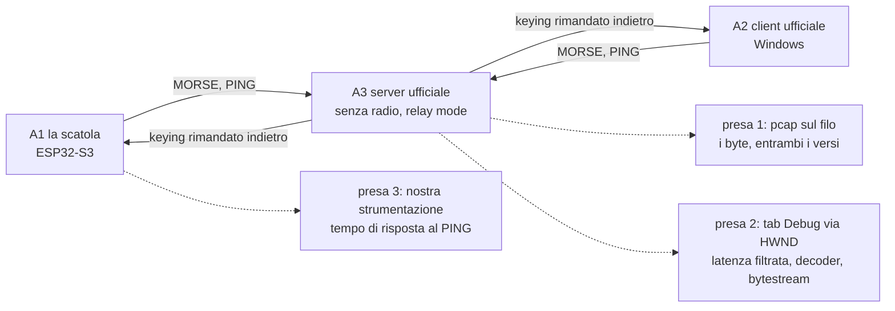

# Banco di prova CWNet - Plan

> **Reperto, non piano vivo (2026-09-11).** Questo documento ha fatto il suo
> lavoro: ha portato la conformità CWNet da impressione a metodo, e la sessione
> di cattura del 2026-09-05 ne ha chiuso le ipotesi. U1 e U2 sono in albero, U6
> non costruisce più nulla perché il capo RX del loop esiste.
>
> **Il lavoro che resta vive sul tracker, non qui**, in tre issue: il comparatore
> di replay ([#82](https://github.com/iu3qez/RemoteCWKeyer-esp32/issues/82)), la strumentazione del turnaround al PING
> ([#83](https://github.com/iu3qez/RemoteCWKeyer-esp32/issues/83)), e la sessione di cattura ([#84](https://github.com/iu3qez/RemoteCWKeyer-esp32/issues/84)). Questo file resta come registrazione dell'indagine, del
> perché le decisioni tecniche sono quelle e di cosa le sette ipotesi hanno
> insegnato. Non va più riallineato all'albero: quando divergerà, avrà ragione
> l'albero.
>
> Due punti del Product Contract sono noti disallineati e sono segnalati in fondo
> alle Key Technical Decisions.

## Goal Capsule

**Obiettivo.** Chi tocca CWNet sa in pochi secondi, senza montare niente, se il cambiamento è ancora conforme al Remote CW Keyer di DL4YHF; e ogni sessione di collaudo su ferro lascia nel repo una prova riutilizzabile invece che conoscenza che evapora.

**Autorità di prodotto.** [STRATEGY.md](../../STRATEGY.md), track "Banco di prova" e metrica "Conformità CWNet". Il riferimento è il software di DL4YHF in esecuzione; il suo sorgente pubblicato dice cosa guardare, non cosa è vero.

**Means.** Il pcap è l'archivio, non la fixture: il flusso TCP estratto una volta sulla macchina dell'operatore diventa un header C di byte, che la suite host legge senza I/O, senza parser pcap e senza dipendenze nuove in CI (KTD1).

**Blocchi risolti (2026-09-06).** Le due issue bloccanti sono chiuse con decisione del maintainer: [#7](https://github.com/iu3qez/RemoteCWKeyer-esp32/issues/7) — sorgente `text_keyer_send()`, uguaglianza byte-per-byte sul payload MORSE con tolleranza zero, sequenza a due WPM che attraversa le tre fasce del codec; [#8](https://github.com/iu3qez/RemoteCWKeyer-esp32/issues/8) — un `manifest.yaml` per sessione di cattura, con tutti i campi. **U5 e U6 non sono più bloccate.** Il piano è rimasto `requirements-only` fino al 2026-09-11 per un motivo diverso: la doc-review delle sezioni di implementazione non era mai stata fatta ([#19](https://github.com/iu3qez/RemoteCWKeyer-esp32/issues/19)), e la sessione del 2026-09-05 aveva cambiato il terreno sotto quelle sezioni — H6 smentita, H3 a 14 dot-time, frame MORSE multi-evento reali. Quella review è stata eseguita e i suoi esiti sono incorporati qui: il piano è `implementation-ready`.

**Stato al 2026-09-11, dopo la doc-review delle sezioni di implementazione.** U1 e U2 sono in albero: il dissector ha perso la registrazione postdissector (commit 7e670e4) e l'estrazione dal pcap vive in `tools/cwnet/pcap_to_stream.py` (commit a7cd8b0), con la sola libreria standard e senza `tshark`. Di U1 resta la sezione a occhio del README Wireshark; di U2 resta da dichiarare la regola che nessun atteso può venire da una cattura della nostra scatola. **Da aprire: U3, U4, U5.** U6 dipende da U5 e non costruisce più nulla, perché il capo RX del loop esiste già.

**Product Contract preservation.** Invariato da questo arricchimento: nessun R-ID rinumerato, nessun requisito riscritto. Le modifiche al Product Contract sono del passaggio `ce-doc-review` precedente, tracciate nel commit che le porta.

## Product Contract

### Summary

Un banco a tre livelli che rende la conformità CWNet una domanda a risposta binaria invece che un'impressione. Il primo passo è una sessione di cattura su ferro che trasforma sette ipotesi in fatti e lascia i pcap nel repo. Da quei pcap nascono gli oracoli automatici; le funzioni pure si provano su host in CI; il tempo di risposta al PING resta l'unica grandezza che vuole la scatola su un link vero.

### Problem Frame

Il protocollo non è mai stato chiuso al 100% e il progetto si è arenato due volte sullo stesso punto: non è mai esistito un metodo di test valido e veloce. Il lavoro di ricostruzione con Wireshark è stato fatto davvero, e bene, ma non ha lasciato nulla di riutilizzabile: nel repo restano un dissector e un documento di protocollo, nessuna cattura. Il README del dissector propone come metodo di confronto fra il nostro client e quello ufficiale l'apertura di due pcap nella GUI e il confronto a occhio.

Nel frattempo la suite host è verde su 189 test che asseriscono byte mai confrontati con il riferimento. La verifica misura l'implementazione contro sé stessa, quindi non può accorgersi di una divergenza dal protocollo vero.

Il costo si paga tutto insieme e in ritardo: ogni modifica a `components/keyer_cwnet/` è un atto di fede fino alla prossima sessione manuale, e ogni sessione manuale riparte da zero.

### Key Decisions

**La sessione zero precede la progettazione del banco.** Tutto quello che sappiamo del riferimento viene dalla lettura del sorgente, non dall'osservazione. Si misura prima, si progetta poi. *(session-settled: user-directed — scelto contro il progettare il banco dalle sole letture di sorgente: "ad ora sono supposizioni, dobbiamo passare per test su ferro e software e vedere con Wireshark".)* Governa R1, R2, R3, R4.

**Due oracoli distinti, che non si sostituiscono.** Lo scopo di CWNet è il determinismo di ciò che si invia: quello che arriva deve essere esattamente quello che è partito. Da qui due confronti diversi. Il **determinismo** mette la nostra sequenza inviata contro quella tornata dal loop di relay: è la prova più severa, perché il server rimanda indietro solo ciò che ha saputo interpretare, quindi un comando sbagliato non fa tornare niente e il test fallisce subito. Il **formato sul filo** mette i nostri frame contro quelli del client ufficiale, e serve per ciò che il loop non distingue: l'impacchettamento. Quanti eventi per frame, dove si taglia, con quale cadenza si mandano i PING sono scelte che possono essere tutte legali e tutte diverse dalle sue, e solo la cattura ufficiale dice se una differenza è legittima o sbagliata. *(session-settled: user-directed — "lo scopo di CWNet è il determinismo perfetto di quello che si invia meno il PTT"; "potremo vedere ping diversi e impacchettare diversamente".)* Governa R1, R5, R6, R7.

**La tolleranza è un risultato, non un parametro.** Quanto scarto fra inviato e ricevuto sia accettabile si misura nelle prime sessioni; nessun numero viene fissato qui. Il PTT sta fuori dall'uguaglianza e si tara dopo i primi giri. Governa R7, R13.

**Ogni sessione di collaudo lascia un file nel repo.** È la regola che separa questo tentativo dai precedenti: il prodotto di una sessione non è ciò che l'operatore ha capito, è una fixture che da domani gira senza di lui. Governa R1, R5.

**I tre livelli sono imposti dal problema, non scelti per comodità.** Le funzioni pure sono deterministiche e si provano ovunque; le sequenze di ping e keying nascono dallo scambio fra i due capi e non si possono fabbricare; il nostro tempo di risposta al PING entra nella misura dell'altro capo e vuole la scatola su un link vero. Governa R5, R9, R10, R12.

**Il banco misura, non modifica il client.** Dove una conformità richiede di cambiare il firmware — il formato TX del keying, il filtro sulla latenza — il lavoro appartiene alla track "CWNet client" di STRATEGY.md ed è subordinato all'esito dell'ipotesi che lo giustifica. Governa R9, R11.

**Nessuna patch al binario di riferimento.** La telemetria interna si legge da fuori: il tab Debug è un `TRichEdit` con un HWND, e i flag diagnostici che stampano ciò che ci serve sono già voci di menu. Governa R3.

**Il banco è strumento, non prodotto.** Il server CWNet che serve al loop esiste solo come capo RX della prova, coerentemente con le Boundaries di STRATEGY.md.

### Actors

A1. **La scatola.** Il nostro firmware su ESP32-S3, nel ruolo di client CWNet.
A2. **Il client ufficiale.** Il Remote CW Keyer di DL4YHF su Windows, nel ruolo di client. È il metro di paragone per il formato sul filo: ciò che fa lui è per definizione corretto.
A3. **Il server ufficiale.** Lo stesso programma in modalità server, senza radio collegata. In quella condizione rimanda indietro il keying ai client connessi, il che chiude il loop e rende misurabile il determinismo senza hardware radio.
A4. **Lo sviluppatore.** Conduce la sessione zero e i collaudi successivi; è l'unico utente del banco.

### Key Flows

F1. **Sessione zero.** L'operatore avvia il server ufficiale senza radio, accende i flag diagnostici, connette il client ufficiale, emette una sequenza nota da sorgente deterministico, e cattura. Ripete la stessa sequenza con la scatola al posto del client ufficiale, sullo stesso server e con la stessa cattura attiva. Le due catture e la telemetria raccolta finiscono nel repo. Ogni ipotesi H1-H7 riceve un esito scritto.

F2. **Giro quotidiano.** Chi modifica `components/keyer_cwnet/` lancia la suite host: le funzioni pure e le fixture da pcap rispondono in secondi, in CI a ogni push, senza Windows e senza scatola.

F3. **Collaudo di accettazione.** Prima di dichiarare chiusa una parte del protocollo, la scatola gira contro il server ufficiale in relay mode, anche con la simulazione di rete degradata attiva. Si confronta ciò che è stato inviato con ciò che è tornato. La sessione produce nuove fixture con la stessa procedura di F1.



### Requirements

**Sessione zero**

R1. Una sessione di cattura su hardware e software reali produce almeno un pcap per ciascun capo (client ufficiale, nostra scatola) contro lo stesso server. Le catture vivono in `test_host/fixtures/cwnet/reference/` e `test_host/fixtures/cwnet/ours/`: solo la prima porta valori attesi per il confronto di formato, la seconda è materiale diagnostico.
R2. La sequenza è emessa da un sorgente deterministico a entrambi i capi ed è scritta prima della sessione. La manipolazione a mano è esclusa: sotto i 32 ms il codec risolve a 1 ms, quindi due esecuzioni manuali non producono gli stessi byte e il confronto frame per frame non sarebbe ottenibile.
R3. Accanto a ogni cattura viene salvato il contenuto del tab Debug del programma di riferimento, con i flag `VERBOSE`, `SHOW_KEYING_BYTESTREAM` e `SHOW_DECODER_OUTPUT` attivi.
R4. Ognuna delle sette ipotesi elencate in Dependencies riceve un esito registrato: confermata, smentita, o non osservabile in questa sessione.

**Oracolo automatico**

R5. Le catture committate sono rigiocabili da un programma senza intervento manuale e senza Wireshark in modalità grafica.
R6. Il verdetto pass/fail del confronto di formato è sui byte grezzi, non sui campi decodificati: il dissector nasce dalla stessa lettura di sorgente che ha prodotto H1-H7, quindi decodificherebbe entrambe le catture con la stessa mappa e dichiarerebbe accordo anche sbagliando. Il dissector serve a localizzare e nominare il frame e il campo che divergono. Prima di essere usato perde la registrazione `register_postdissector`, che oggi lo fa girare su ogni pacchetto con l'intero frame e produce campi `cwnet.*` spuri.
R7. Il keying rimandato indietro dal server viene rigiocato nel percorso di decodifica della scatola, e ciò che ne esce è confrontato con la sequenza inviata. È la misura del determinismo: lo scarto ammesso è quello stabilito dalle prime sessioni, non un valore fissato adesso.
R8. Un confronto fallito indica quale frame diverge e in quale campo, non soltanto che la cattura non corrisponde.
R9. Le fixture girano in CI insieme alla suite host esistente.

**Funzioni pure su host**

R10. Le asserzioni della suite host su byte di protocollo derivano dalla cattura di riferimento, non da scelte dell'implementazione.

**Prova dal vivo**

R11. Il tempo che la scatola impiega a rispondere a un PING REQUEST è strumentato e registrato, perché entra nel numero che l'altro capo usa per dimensionare il buffer e la coda del PTT. Non è una soglia da rispettare: il protocollo non definisce latenze massime.
R12. Il collaudo di accettazione include almeno una sessione con la simulazione di rete degradata del programma di riferimento attiva.

**Subordinati a un'ipotesi, e non lavoro del banco**

Questi due appartengono alla track "CWNet client" di STRATEGY.md. Sono elencati qui perché il banco è ciò che li sblocca e ciò che li verifica, ma sono modifiche al firmware e non vanno pianificate come infrastruttura di test.

R13. Confermate H1 e H2, il percorso TX del keying passa dal frame `CW_DOWN`/`CW_UP` con timestamp assoluto a 4 byte al frame `MORSE 0x10` con stream a 7 bit, e il codec in `cwnet_timestamp.c` smette di essere codice morto rispetto al TX.
R14. Confermata H5, il filtro peak-hold sulla latenza viene implementato nel client — oggi non esiste, `cwnet_client.c` conserva il valore istantaneo — e ha un test che ne verifica l'evoluzione di stato campione per campione a partire da una sequenza estratta da una cattura reale.

### Acceptance Examples

AE1. **Copre R4, R10.** Quando la cattura del client ufficiale mostra i frame di keying su un command byte, quel valore diventa l'atteso della suite host, anche se differisce da quello attualmente implementato.

AE2. **Copre R4, R14.** Quando la telemetria mostra il numero di latenza in GUI e la cattura permette di ricalcolare il valore istantaneo dagli stessi frame, la differenza fra i due numeri conferma o smentisce che il valore mostrato sia filtrato.

AE3. **Copre R7.** Quando una sequenza nota viene inviata e torna indietro dal loop di relay, ciò che la scatola decodifica coincide con ciò che ha inviato entro la tolleranza stabilita. Se il server non riconosce i nostri frame non torna indietro nulla, e il confronto fallisce prima ancora di riguardare il timing.

AE4. **Copre R6.** Quando i nostri frame e quelli del client ufficiale trasportano gli stessi eventi ma li impacchettano diversamente — confini di frame diversi, cadenza dei PING diversa — il confronto sui byte grezzi diverge e l'esito nomina il punto, così che si possa decidere se la differenza è legittima o è un difetto.

AE5. **Copre R11.** Quando la stessa sequenza è eseguita prima dal client ufficiale e poi dalla scatola sullo stesso server, un valore di latenza sistematicamente più alto per la scatola indica quanto il nostro tempo di risposta contribuisce alla misura. È diagnostica, non un criterio di fallimento.

AE6. **Copre R8.** Quando una modifica al codice fa divergere una fixture, l'esito nomina il frame e il campo, così che la causa sia leggibile senza aprire la cattura a mano.

AE7. **Copre R1, R5.** Quando la sessione zero è conclusa, un collaboratore che non c'era può rilanciare gli stessi confronti dal solo repo, senza Windows e senza hardware.

### Scope Boundaries

- Nessun prodotto lato stazione. Il server serve al loop, non è cosa da consegnare.
- Nessuna taratura del PTT in questo lavoro: sta fuori dall'uguaglianza fra inviato e ricevuto e si affronta dopo i primi giri.
- Nessuna modifica al binario di riferimento. Niente patch, niente hooking, niente reverse engineering: la telemetria si legge da fuori o si chiede all'autore.
- Nessuna ricompilazione dell'applicazione di riferimento. Il progetto è Borland C++ Builder 6 del 2002 con VCL e ogg/vorbis: fuori portata e senza ritorno.
- Nessuna copertura degli altri comandi del protocollo (audio, CI-V, spettro, tunnel seriali) in questo lavoro.
- Il timing scope e il decoder del programma di riferimento restano oracoli per l'occhio: utili al collaudo, fuori dal giro automatico.
- Le catture contengono i frame CONNECT, quindi username e nominativo in chiaro. Il repo è pubblico: è una scelta consapevole, non una svista.

### Dependencies / Assumptions

Le sette ipotesi sotto vengono dalla lettura del sorgente pubblicato dall'autore e **non sono ancora state osservate sul filo**. Sono l'elenco di ciò che la sessione zero deve falsificare, e i requisiti che ne dipendono restano provvisori finché non hanno un esito.

| # | Ipotesi | Cosa la verifica | Governa | Se smentita |
|---|---|---|---|---|
| H1 | Il keying viaggia sul comando MORSE `0x10`; `0x14` e `0x15` sono CI-V e spettro | il command byte nei frame del client ufficiale | R10, R13 | l'atteso della suite host viene dalla cattura, non dalla spec; R13 decade o cambia bersaglio |
| H2 | Il payload è uno stream a 7 bit con bit 7 = stato del tasto e bit 6..0 = attesa prima di applicarlo, non un timestamp assoluto a 4 byte | i byte del payload di keying | R10, R13 | come sopra; il codec a 7 bit resta senza impiego e va deciso se tenerlo |
| H3 | Un secondo key-up marca la fine dell'over dopo circa dieci dot o 500 ms | la coda dopo l'ultimo elemento | R10 | un elemento in meno da riprodurre nel TX |
| H4 | Il PING porta la terna t0/t1/t2 e `t2-t0` è il giro completo, non la tratta di andata | i tre timestamp nei tre frame | R11, R14 | tocca il client già in produzione, non solo le attese dei test |
| H5 | Il numero di latenza mostrato è un peak-hold asimmetrico, non il valore istantaneo | il valore in GUI accanto a quello ricalcolato dalla cattura | R14 | R14 decade: il valore istantaneo che già calcoliamo è corretto |
| H6 | Il server senza radio rimanda indietro il keying ai client connessi | la presenza di frame di keying in ingresso dopo aver manipolato | A3, R7, F1, F3 | **portante**: senza relay il loop non si chiude e R7 perde il suo banco. Il ripiego va deciso nella sessione stessa: un secondo capo (client ufficiale in ascolto sullo stesso server) o un server nostro minimo che rimandi indietro |
| H7 | Il nostro tempo di risposta al PING entra nella latenza calcolata dall'altro capo | il confronto fra `t2-t0` col client ufficiale e con la scatola | R11 | R11 resta strumentazione utile, senza il nesso con l'altro capo |

**Esiti della sessione zero parziale (2026-09-05).** Cattura reale del client ufficiale DL4YHF (utente con permesso TRANSMIT) verso un server DL4YHF senza radio, tramite un tap TCP; più lettura del sorgente pubblicato. Metodo e strumenti in [docs/solutions/architecture-patterns/reference-source-as-differential-oracle.md](../solutions/architecture-patterns/reference-source-as-differential-oracle.md).

| # | Esito | Evidenza |
|---|---|---|
| H1 | **confermata** | keying su `MORSE 0x10` (wire `0x50`); `0x14`/`0x15` sono CI-V e spettro nel sorgente e non compaiono nel keying |
| H2 | **confermata** | payload stream a 7 bit come da ipotesi; il nostro `cwnet_timestamp.c` è identico byte per byte a `CwStreamEnc.c` su tutto il dominio (confronto esaustivo, UBSan pulito) |
| H3 | **confermata, precisata** | secondo key-up di fine over presente; la soglia è **14 dot-time**, non «10 dot o 500 ms» — il commento del sorgente è errato, il codice (`KeyerThread.c`) e i byte concordano |
| H4 | **confermata** | PING = byte di fase (00 REQUEST, 01 RESPONSE_1, 02 RESPONSE_2) + tre int32 LE; `t2-t0` sull'orologio dell'iniziatore |
| H5 | **confermata** | il valore mostrato è un peak-hold asimmetrico con un difetto di divisione intera che lo pianta a `istantaneo + <10 ms`; osservato nel log GUI (`pk` fermo a 7 ms per 90 s con istantaneo 1–5) e replicato dai byte |
| H6 | **smentita** | il server **non** rimanda indietro il keying: `MorseTxFifo` si riempie solo se `iFunctionality == CWNET_FUNC_CLIENT` (`KeyerThread.c`), e un'istanza server non emette mai `CWNET_CMD_MORSE`. Il loop di determinismo richiede un server-echo nostro (ripiego già previsto). |
| H7 | **non osservabile in questa sessione** | richiede la nostra scatola sul filo; il client ufficiale da solo non lo mostra |

Scoperte non previste: il PTT viaggia come stringa rigctld (`set_ptt 1/0`) in frame `0x06`, non come comando dedicato; il client **impacchetta** più eventi per frame quando ne trova in coda (a ≤40 WPM se ne vede uno solo perché il poll è ~20 ms), quindi il ricevitore deve accettare N eventi per frame; i permessi sono una bitmask (TALK 1, TRANSMIT 2, CTRL_RIG 4, ADMIN 8); l'app scrive `debug_run_log.txt` se lanciata con `/debug` (contrariamente all'assunzione «non scrive log su disco»).

Altre dipendenze:

- Serve una macchina Windows con il Remote CW Keyer per la sessione zero e per ogni collaudo di accettazione. Il giro quotidiano non ne ha bisogno.
- Il programma di riferimento non scrive log su disco: la telemetria interna va letta dal tab Debug o richiesta all'autore.
- Il sorgente pubblicato è aggiornato a ottobre 2025 e i moduli di protocollo sono C puro; la GUI è VCL e non entra in gioco.
- `tshark` diventa una dipendenza della CI e oggi il workflow installa solo cmake, ninja e gcc.
- Il turnaround al PING della scatola è pavimentato dal ciclo del bg_task, `vTaskDelay(pdMS_TO_TICKS(10))`. Contro i 293-420 µs che l'autore misura su localhost il nostro contributo domina, ma su un numero che serve a dimensionare un buffer la quantizzazione a 10 ms non è un problema.

### Outstanding Questions

Nessuna domanda blocca la pianificazione. Le due che dipendono da una risposta dell'autore hanno un default dichiarato, così il banco procede comunque; se la risposta arriva, migliora.

**Bloccanti — tracciate come issue**

- OQ1 → [#7](https://github.com/iu3qez/RemoteCWKeyer-esp32/issues/7). Cosa deve contenere la sequenza nota, cosa significa "identico" fra inviato e ricevuto, e quale tolleranza. Blocca U5 e U6.
- OQ2 → [#8](https://github.com/iu3qez/RemoteCWKeyer-esp32/issues/8). Cosa si registra accanto a una cattura perché fra un anno sia arbitrabile. Blocca il commit delle fixture in U5.

Finché sono aperte non si pianifica intorno, non si sostituiscono con assunzioni, non si procede marcando il lavoro provvisorio.

**Rimandate alla pianificazione**

- OQ3. Si compila `CwStreamEnc.c` dell'autore dentro `test_host` come oracolo differenziale? Coprirebbe le funzioni pure in modo più fitto di qualunque test scritto da noi, ma mette codice suo nel nostro repo e nel sorgente non c'è nessuna licenza né nota di copyright dichiarata. **Default: no**, si scrivono test nostri contro le catture; da riaprire solo se l'autore chiarisce la licenza.
- OQ4. Si chiede all'autore un'opzione per scrivere il contenuto del tab Debug su file? È un `fprintf` dentro la sua funzione di log e renderebbe la telemetria automatica per sempre. Ha già pubblicato i sorgenti su richiesta. **Default: si legge il `TRichEdit` da fuori** (R3), che non dipende da nessuno.
- OQ5. Come si estraggono i campi dal dissector per localizzare una divergenza, e quale forma prende l'esito.
- OQ6. Se convenga compilare il core di protocollo dell'autore headless su Linux come peer di riferimento in CI. `CwNet.c` è C puro e dipende da Windows solo per Winsock, quindi è fattibile, ma è lavoro che ha senso solo se la sessione zero mostra che le catture non bastano. Stessa questione di licenza di OQ3.

### Sources / Research

- Sorgente di riferimento: `Remote_CW_Keyer_Sources.zip` da qsl.net/dl4yhf, file datati fino al 2025-10-20. Moduli rilevanti: `CwNet.h` (comandi), `CwNet.c` (gestione PING e filtro latenza), `CwStreamEnc.h` e `CwStreamEnc.c` (formato dello stream di keying e codec a 7 bit).
- Modalità relay senza radio, dal manuale dell'autore: "If there is no remotely controlled radio connected to the server at all, the Morse code keying signal will be relayed back to all currently connected clients".
- Nel repo: [tools/wireshark/cwnet.lua](../../tools/wireshark/cwnet.lua) decodifica già i campi MORSE e PING; [tools/wireshark/README.md](../../tools/wireshark/README.md) descrive la procedura manuale che questo lavoro sostituisce; [docs/plans/2026-01-12-cwnet-protocol-implementation.md](2026-01-12-cwnet-protocol-implementation.md) è la spec ricostruita, coerente col dissector.
- Implementazione attuale: [components/keyer_cwnet/src/cwnet_client.c](../../components/keyer_cwnet/src/cwnet_client.c) per la costruzione dei frame di keying e il calcolo della latenza istantanea; [components/keyer_cwnet/src/cwnet_timestamp.c](../../components/keyer_cwnet/src/cwnet_timestamp.c) per il codec a 7 bit; [test_host/test_cwnet_client.c](../../test_host/test_cwnet_client.c) per le asserzioni attuali sui byte.

## Planning Contract

### Key Technical Decisions

KTD1. **Il pcap è l'archivio; la fixture è un header C generato.** L'estrazione del flusso TCP per direzione gira una volta sulla macchina dell'operatore, che ha già Wireshark perché sta catturando, e produce un header con array `static const uint8_t`. In repo finiscono entrambi. *Perché:* nel repo non esiste nessuna fixture su file e l'idioma consolidato sono array di byte inline nei test (`test_cwnet_frame_parser.c:144`, `:161`). Leggere un pcap a runtime imporrebbe un parser pcap più la riassemblatura TCP dentro `test_runner` sotto `-Werror -Wconversion`, più `tshark` come dipendenza di CI. Un header generato continua l'idioma esistente, tiene `test_runner` ermetico e non tocca il workflow. La terza opzione, quella poi adottata all'atto pratico, toglie `tshark` anche dal lato operatore: l'estrazione gira offline con la sola libreria standard, e `tools/cwnet/pcap_to_stream.py` la implementa già su pcap e pcapng. Governa R5, R9; realizza il Means del Goal Capsule.

KTD2. **Il replay entra dal livello puro, non dal socket.** I byte estratti vengono dati a `cwnet_frame_parse()` e al client via i callback iniettati, mai a `cwnet_socket.c`. *Perché:* `cwnet_socket.c` è già escluso da `CWNET_SOURCES` perché non host-safe, e `test_host/stubs/` non shimma né lwIP né FreeRTOS. Il parser è inoltre già progettato per essere alimentato in frammenti arbitrari ed è già esercitato così. Governa R5, R7.

KTD3. **Il verdetto è sulla successione di eventi; i confini di frame sono differenza legittima.** Il pass/fail riduce il payload MORSE alla sua successione di stato del tasto e attesa, e su quella decide: successione diversa, fallimento. A parità di successione, confini di frame diversi sono una differenza **legittima** e si riportano come informazione, non come fallimento. Il client di riferimento impacchetta N eventi per frame secondo il proprio poll a ~20 ms, il nostro emette un frame per transizione, e la decisione è di **non** adeguare il nostro impacchettamento al suo. I byte grezzi restano l'evidenza allegata a ogni esito, e nominare il campo che diverge resta compito del dissector, mai del verdetto. Cita la decisione di prodotto "Due oracoli distinti". Governa R6, R8.

KTD5. **Tre provenienze di fixture, tre pesi probatori diversi.** Ciò che viene dal **client ufficiale** è l'unica cosa che può portare un valore atteso di formato. Ciò che viene dalla **nostra scatola** è diagnostico: nessun atteso può derivarne. Ciò che è **costruito a mano** prova il comparatore, mai il protocollo — una fixture generata dal nostro stesso codice è tautologica, torna verde per costruzione e non dimostra nulla sulla conformità. Lo stesso vale per i byte che tornano dal nostro echo: vedi la nota in fondo a questa sezione. La provenienza è una proprietà **dichiarata nel commento** che accompagna ogni blocco di byte, non un albero di directory: le fixture vivono in `test_host/cwnet_fixtures.h`, dove il commento di testa già nomina sessione e capo. *Perché:* il rischio che un verde ottenuto su materiale nostro venga letto come conformità non si chiude col tempo. La cattura di riferimento esiste già, ma è un estratto e non copre ogni scenario del comparatore, quindi le fixture costruite a mano restano necessarie accanto a essa — ed è lo stesso errore dei 189 test che certificavano `0x15`. L'esito di ogni confronto dichiara la provenienza della fixture che lo ha prodotto. Governa R5, R8, R10.

KTD4. **La strumentazione del PING non tocca il path RT.** La misura vive su Core 1, dove il socket CWNet è già servito; nessun logging bloccante, nessuna allocazione. Governa R11.

**Cosa prova davvero il confronto di determinismo.** H6 è smentita: il server di riferimento non rimanda mai il keying, e il capo RX del loop è `tools/cwnet/cwnet_echo.py`, scritto da noi. Quell'echo rimanda il payload MORSE verbatim, senza validarlo — il suo stesso log annota quando il server vero scarterebbe la chiave, e lo rimanda comunque. Quindi il confronto di determinismo prova che il nostro decodificatore inverte il nostro codificatore e che il transito non altera i byte; **non** prova la conformità al riferimento. La conformità la prova il solo confronto di formato, contro la cattura del client ufficiale. È una limitazione accettata consapevolmente: non si risolve con altro codice, si scrive qui perché chi legge un verde sappia che cosa ha in mano. **Due disallineamenti col Product Contract, lasciati apposta.** La doc-review del 2026-09-11 copriva le sole sezioni di implementazione, quindi due punti del Product Contract restano indietro e vanno allineati da un passaggio suo. Primo: la decisione "Due oracoli distinti" motiva il confronto di determinismo con "il server rimanda indietro solo ciò che ha saputo interpretare", frase che descriveva il server ufficiale e che il capoverso qui sopra smentisce. Secondo: R1 fa vivere le catture in `test_host/fixtures/cwnet/reference/` e `.../ours/`, directory che non esistono; le fixture stanno in `test_host/cwnet_fixtures.h` e la provenienza è dichiarata nel commento (KTD5). In entrambi i casi il Planning Contract è aggiornato e il Product Contract no: chi legge segua questa sezione.

### High-Level Technical Design

```
sessione (macchina operatore, una volta)          repo                    CI (ogni push)
─────────────────────────────────────────         ────                    ──────────────
Wireshark cattura                  ──►  sessione-N-reference.pcap  ─┐    (archivio, non letto)
                                        sessione-N-ours.pcap       ─┘
pcap_to_stream.py (solo stdlib)    ──►  cwnet_fixtures.h           ──►  test_runner
                                        (static const uint8_t,           ├─ parser byte-a-byte
                                         provenienza nel commento)       ├─ confronto formato
tab Debug via HWND                 ──►  sessione-N-reference.log   ──►  └─ confronto determinismo
```

Il confronto di formato mette i byte della nostra scatola contro quelli del client ufficiale. Il confronto di determinismo mette la successione inviata contro quella che il nostro echo ha restituito, entrambe nostre. Il primo ha bisogno del riferimento, il secondo no — ed è esattamente per questo che il secondo non prova la conformità.

### Assumptions

- L'estrazione del flusso per direzione **non** dipende da `tshark`: `tools/cwnet/pcap_to_stream.py` legge pcap e pcapng con la sola libreria standard, su Ethernet, loopback, SLL e raw. L'assunzione originaria su `tshark -q -z follow,tcp,raw` è caduta, e la CI non guadagna dipendenze.
- La cattura si fa su una macchina dove girano sia il client sia il server, oppure su un segmento dove il traffico è visibile. In loopback su Windows serve un catturatore che veda l'interfaccia locale.
- L'header generato resta di dimensioni ragionevoli. Una sessione di keying a bassa banda produce pochi kB; se una sessione lunga producesse un header enorme, si taglia la sessione, non si cambia meccanismo.

### Sequencing

U1 e U2 sono in albero: restano i due residui di testo detti nel Goal Capsule, che non hanno dipendenze. U4 è indipendente da tutto e può partire subito. U3 dipende dal formato dei byte prodotti da `tools/cwnet/pcap_to_stream.py`; la sua metà determinismo consuma ciò che torna dal nostro echo (`tools/cwnet/cwnet_echo.py`, già in albero), non dal server di riferimento, che H6 dice non rimandare mai il keying. U5 non è più bloccata: #7 e #8 sono chiuse dal 2026-09-06. U6 dipende da U5, che produce le fixture; la tolleranza è già decisa in #7 e il capo RX del loop esiste.

## Implementation Units

### U1. Il README del dissector — FATTA

**Landata il 2026-09-06** (commit 7e670e4, chiude [#15](https://github.com/iu3qez/RemoteCWKeyer-esp32/issues/15)): `register_postdissector` è stato tolto da `cwnet.lua`, che oggi si registra solo sulla porta TCP 7355. R6 è soddisfatto, e `add_for_decode_as`, che una prima stesura di questa unità prescriveva, non serve.

**Goal.** Il README degli strumenti Wireshark smette di proporre come metodo il confronto a occhio fra due catture, che è ciò che questo piano sostituisce.

**Requirements.** R6.

**Files.**
- `tools/wireshark/README.md` — la sezione "Comparing Our Client vs Official Client" descrive ancora l'apertura di due pcap nella GUI e il confronto manuale dei timestamp; va sostituita dal rimando alla catena automatica di `tools/cwnet/`

**Approach.** Solo documentazione. Il dissector resta com'è: serve a nominare il frame e il campo che divergono, non a dare il verdetto (KTD3).

**Verification.** `tshark -r <cattura-non-cwnet> -T fields -e cwnet.cmd_type` non produce alcun valore. È una verifica di non regressione sul fix già in albero, e resta l'unica verifica manuale del piano.

### U2. La catena di estrazione — FATTA

**Landata il 2026-09-05** (commit a7cd8b0): `tools/cwnet/pcap_to_stream.py` legge pcap e pcapng con la sola libreria standard — Ethernet, loopback, SLL, raw — e scrive i byte grezzi di una direzione per file. `tshark` non è mai diventato una dipendenza, né della CI né dell'operatore, e `.gitattributes` marca già `*.pcap` e `*.pcapng` come binari.

**Goal.** Una cattura diventa un artefatto che la suite host legge senza I/O e senza dipendenze, e chi lo usa sa da quale capo vengono i byte.

**Requirements.** R1, R5.

**Files.**
- `test_host/cwnet_fixtures.h` — il commento di testa dichiara, per ogni blocco di byte, la sessione e il capo di provenienza, e la regola che **nessun valore atteso può derivare da una cattura della nostra scatola**. Quella regola oggi non è scritta da nessuna parte, ed è la più importante del banco
- `tools/cwnet/README.md` — la stessa regola accanto allo strumento che produce i byte

**Approach.** Solo documentazione: lo strumento esiste, funziona e non va riscritto. Ciò che manca è la regola probatoria di KTD5 messa dove la legge chi tocca le fixture, invece che sepolta in un piano.

**Verification.** `test_host/cwnet_fixtures.h` continua a compilare sotto i flag del progetto, e per ogni blocco di byte il commento nomina provenienza e regola.

### U3. Harness di replay nella suite host — sul tracker come [#82](https://github.com/iu3qez/RemoteCWKeyer-esp32/issues/82)

**Goal.** Un array di byte committato viene rigiocato attraverso il livello puro di CWNet, e una divergenza dice quale frame e quale campo.

**Requirements.** R5, R7, R8, R10.

**Files.**
- `test_host/cwnet_replay.c`, `test_host/cwnet_replay.h` — il motore di replay e il confronto
- `test_host/test_cwnet_replay.c` — i test dell'harness contro fixture costruite a mano
- `test_host/cwnet_fixtures.h` — le fixture costruite a mano si aggiungono qui, accanto ai byte reali già presenti, con la provenienza dichiarata nel commento (KTD5)
- `test_host/CMakeLists.txt` — aggiungere i sorgenti a `TEST_SOURCES`
- `test_host/test_main.c` — dichiarazioni in avanti e blocco `RUN_TEST` con banner, seguendo la convenzione esistente

**Approach.** Il motore alimenta `cwnet_frame_parse()` a frammenti, come già fanno `test_stream_parse_ping_byte_by_byte` e simili, e per il percorso client usa `cwnet_client_on_data()` con i callback iniettati. I frame MORSE in ingresso entrano da `handle_morse` attraverso il client, così il percorso RX viene esercitato davvero e non simulato. Un frame MORSE porta N eventi e non uno: il client di riferimento ne impacchetta quanti ne trova in coda.

Il confronto ha due livelli, secondo KTD3. Il pass/fail sta sulla successione di eventi ricavata dal payload — stato del tasto e attesa — e una successione diversa è un fallimento. A parità di successione, confini di frame diversi si riportano come differenza legittima. In entrambi i casi l'esito nomina offset assoluto, indice di frame e campo secondo la struttura ricavata dal parser, non dal dissector, e dichiara la provenienza della fixture che lo ha prodotto.

L'harness si sviluppa contro le fixture costruite a mano e contro l'estratto reale già in `test_host/cwnet_fixtures.h`: non aspetta il completamento di U5.

**Test Scenarios.** Tutti contro fixture costruite a mano, che provano il comparatore e non la conformità (KTD5).
- Due array identici: nessuna divergenza.
- Un byte diverso nel command byte del terzo frame: riporta frame 3, campo comando, offset corretto.
- Un byte diverso dentro il payload: riporta frame e offset nel payload.
- Lunghezza diversa a parità di prefisso: riporta troncamento, non un falso accordo.
- Alimentazione a frammenti di dimensione 1, 3 e tutta insieme: stesso esito.
- Array vuoto contro array non vuoto: divergenza al primo byte, nessun crash.
- Stessa successione di eventi impacchettata in frame diversi: esito di differenza legittima, non fallimento (KTD3).
- Un frame che porta più eventi: tutti gli eventi entrano nella successione, nessuno perso.

**Verification.** `cd test_host && cmake -B build -G Ninja && cmake --build build && ./build/test_runner`, e la stessa cosa con `-DCMAKE_C_FLAGS="-fsanitize=address,undefined"`. Entrambe verdi, zero report dai sanitizer.

### U4. Strumentazione del turnaround al PING — sul tracker come [#83](https://github.com/iu3qez/RemoteCWKeyer-esp32/issues/83)

**Goal.** Si sa quanto tempo la scatola impiega a rispondere a un PING REQUEST, perché quel tempo entra nel numero che l'altro capo usa per dimensionare il buffer e la coda del PTT.

**Requirements.** R11.

**Files.**
- `components/keyer_cwnet/src/cwnet_client.c` — marcare l'istante di ricezione del REQUEST e quello di accodamento della risposta
- `components/keyer_cwnet/include/cwnet_client.h` — esporre l'ultima misura e il massimo osservato
- `components/keyer_console/src/commands.c` — mostrarle nel comando di stato CWNet

**Approach.** La misura vive su Core 1, dove `cwnet_socket_process()` è già servito dal ciclo di `bg_task`. Nessun logging sul path, nessuna allocazione: due campi nella struttura del client e un massimo che si aggiorna.

Va documentato nel commento che la risoluzione è limitata dal ciclo del bg_task, `vTaskDelay(pdMS_TO_TICKS(10))`, quindi la misura è quantizzata a circa 10 ms. Per un numero che serve a dimensionare un buffer è adeguato; per confrontarsi con i 293-420 µs che l'autore misura su localhost non lo è, e non deve esserlo.

Non è un gate: nessuna soglia, nessun FAULT. Il protocollo non definisce latenze massime.

**Test Scenarios.**
- Ricevuto un REQUEST e accodata la risposta con il clock iniettato avanzato di N ms, la misura riporta N.
- Il massimo osservato non decresce.
- Nessun REQUEST ricevuto: la misura resta al suo valore iniziale e non è confondibile con zero.

**Verification.** Test host in `test_cwnet_ping.c` o in un nuovo gruppo, usando `esp_timer_set_time()` come già fa la suite. Suite verde in entrambe le varianti. Due confini da dire: la parte console si verifica a mano sul ferro, perché `components/keyer_console/src/commands.c` è escluso dalla suite host in quanto dipende dalla HAL, come il Lua di U1; e poiché `cwnet_client.h` è incluso anche dal server che il daemon di stazione compila, va verificata anche la build di `host/` sotto gli stessi flag.

### U5. Sessione zero — sul tracker come [#84](https://github.com/iu3qez/RemoteCWKeyer-esp32/issues/84)

**Sbloccata il 2026-09-06**, chiuse [#7](https://github.com/iu3qez/RemoteCWKeyer-esp32/issues/7) e [#8](https://github.com/iu3qez/RemoteCWKeyer-esp32/issues/8). Parte della sessione è già stata eseguita il 2026-09-05 in forma parziale: H1-H6 hanno un esito, e un estratto dei byte è già committato in `test_host/cwnet_fixtures.h`, dove regge gli attesi di `test_cwnet_play.c`, `test_cwnet_feed.c` e `test_cwnet_client.c`. Restano machine-local i pcap interi. Ciò che resta è rieseguirla con la sequenza nota decisa in #7, committare le catture col manifesto di #8, e chiudere il divario di [#33](https://github.com/iu3qez/RemoteCWKeyer-esp32/issues/33): oggi nessun job di CI tocca l'oracolo differenziale.

**Goal.** Le sette ipotesi H1-H7 smettono di essere ipotesi, e il repo guadagna le prime fixture reali.

**Requirements.** R1, R2, R3, R4.

**Cosa serve prima.** Nulla: entrambe le decisioni sono prese. La sequenza e la definizione di "identico" sono nel commento di chiusura di #7; il manifesto è `tools/cwnet/manifest.template.yaml`.

### U6. I due confronti reali — segue [#82](https://github.com/iu3qez/RemoteCWKeyer-esp32/issues/82) e [#84](https://github.com/iu3qez/RemoteCWKeyer-esp32/issues/84)

**Non più bloccata da [#7](https://github.com/iu3qez/RemoteCWKeyer-esp32/issues/7)**: la tolleranza è decisa — zero, PTT escluso, sulla successione di eventi del payload MORSE. **E il banco per il determinismo non va costruito: esiste.** H6 è smentita, il server di riferimento non rimanda mai il keying, e il ripiego previsto è stato realizzato come `tools/cwnet/cwnet_echo.py` ([#14](https://github.com/iu3qez/RemoteCWKeyer-esp32/issues/14), chiusa il 2026-09-08). Resta la sola dipendenza da U5, che produce le fixture.

**Goal.** Il confronto di formato dà una risposta binaria sulla conformità della successione di eventi, e nomina come legittima ogni differenza di solo impacchettamento (KTD3). Il confronto di determinismo dà una risposta binaria sul round trip attraverso il nostro echo, che per costruzione non è una prova di conformità: vedi la nota in fondo alle Key Technical Decisions.

**Requirements.** R6, R7, R10.

**Cosa serve prima.** Le fixture reali da U5. L'harness che le consuma è U3 e non è bloccato; il capo RX del loop è già in albero.

---

**Fuori da questo piano, e già fatti.** R13 e R14 — il passaggio del TX a `MORSE 0x10` con stream a 7 bit, e il filtro peak-hold sulla latenza — sono landati nella track "CWNet client" di STRATEGY.md dopo la conferma di H1, H2 e H5: `cwnet_client.c` costruisce frame `CWNET_CMD_MORSE`, e `cwnet_client.h` espone `latency_peak_ms` con i suoi test in `test_cwnet_ping.c`. Restano elencati qui perché è il banco che li verifica, non perché siano lavoro da fare.

## Verification Contract

Comandi del progetto, non generici:

```bash
cd test_host
cmake -B build -G Ninja && cmake --build build && ./build/test_runner
cmake -B build-asan -G Ninja -DCMAKE_C_FLAGS="-fsanitize=address,undefined -fno-omit-frame-pointer"
cmake --build build-asan && ./build-asan/test_runner
```

E, per ogni modifica che tocchi `components/keyer_cwnet/include/`, anche il daemon di stazione, che compila quel componente per path sotto gli stessi flag:

```bash
cd host
cmake -B build && cmake --build build && ctest --test-dir build --output-on-failure
```

Cancelli di qualità:

- La suite host è verde in entrambe le varianti, `315 Tests 0 Failures` più i nuovi. Nessun test skippato, disabilitato o messo in quarantena per arrivarci.
- Zero report da ASan e UBSan.
- La CI (`.github/workflows/host-tests.yml`) passa su tutte le voci dei suoi due job, `host-tests` e `host-build`. Nessuna modifica al workflow è prevista: se una unità la richiedesse, è il segnale che KTD1 è stata aggirata.
- Il codice nuovo compila sotto `-Werror -Wconversion -Wsign-conversion` senza soppressioni.
- Una modifica a `components/keyer_cwnet/include/` è verde anche su `host/`: `cwnetd` linka quel componente per path e usa gli stessi flag, quindi può rompersi mentre `test_host` resta verde.
- U1 si verifica a mano su una cattura, non c'è infrastruttura di test per il Lua.

## Definition of Done

Globale:

- Al momento di dichiarare fatta un'unità si verifica **sul tracker** che nessuna issue `blocking` aperta copra il lavoro dichiarato. È un controllo da eseguire, non una fotografia: #7 e #8, che bloccavano U5 e U6, sono chiuse dal 2026-09-06.
- Il Verification Contract passa per intero.
- Nessun codice di tentativi abbandonati resta nel diff: approcci che non hanno funzionato si rimuovono, non si commentano.
- La documentazione tocca solo ciò che è cambiato davvero.

Per unità:

- **U1** — il README non propone più il confronto a occhio; e, come non regressione sul fix già in albero, nessun campo `cwnet.*` su una cattura non-CWNet mentre i frame su 7355 decodificano come prima.
- **U2** — il commento di testa di `test_host/cwnet_fixtures.h` e il README di `tools/cwnet/` dichiarano, per ogni blocco di byte, la provenienza e la regola che nessun atteso può derivare da una cattura della nostra scatola.
- **U3** — gli scenari passano in entrambe le varianti; l'harness riporta frame e campo, non solo "diverso"; distingue una successione di eventi diversa da un diverso impacchettamento; ogni esito dichiara la provenienza della fixture, così un verde ottenuto su materiale nostro non è leggibile come conformità.
- **U4** — la misura è esposta, quantizzata a ~10 ms e documentata come tale; nessuna soglia, nessun FAULT, niente sul path RT; la build di `host/` resta verde.
- **U5** — le fixture reali dei due capi sono committate con il manifesto di #8, e ognuna delle sette ipotesi ha un esito scritto in questo piano.
- **U6** — almeno un confronto di formato gira sui byte del client ufficiale e dà un esito che distingue il fallimento dalla differenza legittima di impacchettamento; il confronto di determinismo chiude sulla successione di eventi con tolleranza zero, PTT escluso, e il suo esito dichiara che il capo RX è il nostro echo.
