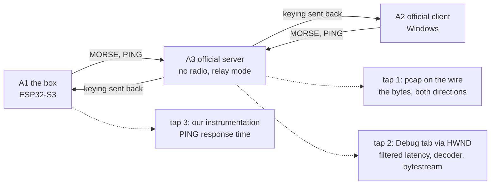

# CWNet Test Bench - Plan

> **Record, not a live plan (2026-09-11).** This document has done its
> job: it took CWNet conformance from impression to method, and the
> capture session of 2026-09-05 closed its hypotheses. U1 and U2 are in
> the tree, U6 no longer builds anything because the RX end of the loop
> exists.
>
> **The work that remains lives on the tracker, not here**, in three issues: the replay
> comparator ([#82](https://github.com/iu3qez/RemoteCWKeyer-esp32/issues/82)), the PING turnaround instrumentation
> ([#83](https://github.com/iu3qez/RemoteCWKeyer-esp32/issues/83)), and the capture session ([#84](https://github.com/iu3qez/RemoteCWKeyer-esp32/issues/84)). This file stays as a record of the investigation, of
> why the technical decisions are what they are, and of what the seven hypotheses
> taught. It no longer needs to be realigned with the tree: when it diverges,
> the tree will be right.
>
> Two points of the Product Contract are known to be misaligned and are flagged at the bottom
> of the Key Technical Decisions.

## Goal Capsule

**Goal.** Whoever touches CWNet knows within seconds, without setting up anything, whether the change is still conformant with DL4YHF's Remote CW Keyer; and every hardware acceptance session leaves a reusable proof in the repo instead of knowledge that evaporates.

**Product authority.** [STRATEGY.md](../../STRATEGY.md), track "Test bench" and metric "CWNet Conformance". The reference is DL4YHF's software running; its published source says what to look at, not what is true.

**Means.** The pcap is the archive, not the fixture: the TCP stream extracted once on the operator's machine becomes a C header of bytes, which the host suite reads without I/O, without a pcap parser and without new dependencies in CI (KTD1).

**Blockers resolved (2026-09-06).** The two blocking issues are closed by the maintainer's decision: [#7](https://github.com/iu3qez/RemoteCWKeyer-esp32/issues/7) - `text_keyer_send()` source, byte-for-byte equality on the MORSE payload with zero tolerance, a two-WPM sequence that crosses the codec's three bands; [#8](https://github.com/iu3qez/RemoteCWKeyer-esp32/issues/8) - a `manifest.yaml` per capture session, with all fields. **U5 and U6 are no longer blocked.** The plan stayed `requirements-only` until 2026-09-11 for a different reason: the doc-review of the implementation sections had never been done ([#19](https://github.com/iu3qez/RemoteCWKeyer-esp32/issues/19)), and the 2026-09-05 session had changed the ground under those sections - H6 disproven, H3 at 14 dot-time, real multi-event MORSE frames. That review was performed and its results are incorporated here: the plan is `implementation-ready`.

**Status as of 2026-09-11, after the doc-review of the implementation sections.** U1 and U2 are in the tree: the dissector lost the postdissector registration (commit 7e670e4) and the pcap extraction lives in `tools/cwnet/pcap_to_stream.py` (commit a7cd8b0), with only the standard library and without `tshark`. What remains of U1 is the by-eye section of the Wireshark README; what remains of U2 is to state the rule that no expected value can come from a capture of our box. **To open: U3, U4, U5.** U6 depends on U5 and no longer builds anything, because the RX end of the loop already exists.

**Product Contract preservation.** Unchanged by this enrichment: no R-ID renumbered, no requirement rewritten. The changes to the Product Contract are from the earlier `ce-doc-review` pass, tracked in the commit that carries them.

## Product Contract

### Summary

A three-tier bench that turns CWNet conformance into a binary question instead of an impression. The first step is a hardware capture session that turns seven hypotheses into facts and leaves the pcaps in the repo. From those pcaps come the automatic oracles; the pure functions are proven on host in CI; PING response time remains the only quantity that needs the box on a real link.

### Problem Frame

The protocol has never been closed 100%, and the project has stalled twice on the same point: a valid, fast test method never existed. The reconstruction work with Wireshark was done, and done well, but it left nothing reusable behind: what remains in the repo is a dissector and a protocol document, no captures. The dissector's README proposes, as the method for comparing our client against the official one, opening two pcaps in the GUI and comparing by eye.

Meanwhile the host suite is green on 189 tests that assert bytes never compared against the reference. The verification measures the implementation against itself, so it cannot notice a divergence from the real protocol.

The cost is paid all at once and late: every change to `components/keyer_cwnet/` is an act of faith until the next manual session, and every manual session starts over from zero.

### Key Decisions

**Session zero precedes the bench design.** Everything we know about the reference comes from reading the source, not from observation. Measure first, design later. *(session-settled: user-directed - chosen against designing the bench from source reading alone: "ad ora sono supposizioni, dobbiamo passare per test su ferro e software e vedere con Wireshark" [for now these are assumptions, we have to go through hardware and software tests and look with Wireshark].)* Governs R1, R2, R3, R4.

**Two distinct oracles, that don't replace each other.** The purpose of CWNet is the determinism of what is sent: what arrives must be exactly what left. Hence two different comparisons. **Determinism** puts our sent sequence against what came back from the relay loop: it is the strictest proof, because the server sends back only what it managed to interpret, so a wrong command makes nothing come back and the test fails immediately. **Wire format** puts our frames against the official client's, and serves what the loop cannot distinguish: packetization. How many events per frame, where it cuts, at what cadence the PINGs are sent are choices that can all be legal and all different from its own, and only the official capture says whether a difference is legitimate or wrong. *(session-settled: user-directed - "lo scopo di CWNet è il determinismo perfetto di quello che si invia meno il PTT" [the purpose of CWNet is the perfect determinism of what is sent, minus the PTT]; "potremo vedere ping diversi e impacchettare diversamente" [we may see different pings and pack differently].)* Governs R1, R5, R6, R7.

**Tolerance is a result, not a parameter.** How much deviation between sent and received is acceptable is measured in the first sessions; no number is fixed here. The PTT stays outside the equality check and is tuned after the first rounds. Governs R7, R13.

**Every acceptance session leaves a file in the repo.** It is the rule that separates this attempt from the previous ones: the product of a session is not what the operator understood, it is a fixture that from tomorrow runs without them. Governs R1, R5.

**The three tiers are imposed by the problem, not chosen for convenience.** Pure functions are deterministic and can be proven anywhere; ping and keying sequences arise from the exchange between the two ends and cannot be fabricated; our PING response time enters the other end's measurement and needs the box on a real link. Governs R5, R9, R10, R12.

**The bench measures, it does not modify the client.** Where a conformance issue requires changing the firmware - the keying TX format, the latency filter - the work belongs to the "CWNet client" track of STRATEGY.md and is subordinate to the outcome of the hypothesis that justifies it. Governs R9, R11.

**No patching the reference binary.** Internal telemetry is read from outside: the Debug tab is a `TRichEdit` with an HWND, and the diagnostic flags that print what we need are already menu entries. Governs R3.

**The bench is a tool, not a product.** The CWNet server that serves the loop exists only as the RX end of the test, consistent with the Boundaries of STRATEGY.md.

### Actors

A1. **The box.** Our firmware on the ESP32-S3, in the role of CWNet client.

A2. **The official client.** DL4YHF's Remote CW Keyer on Windows, in the role of client. It is the yardstick for the wire format: what it does is correct by definition.

A3. **The official server.** The same program in server mode, with no radio connected. In that condition it sends the keying back to the connected clients, which closes the loop and makes determinism measurable without radio hardware.

A4. **The developer.** Runs session zero and the subsequent acceptance sessions; is the bench's only user.

### Key Flows

F1. **Session zero.** The operator starts the official server with no radio, turns on the diagnostic flags, connects the official client, emits a known sequence from a deterministic source, and captures. It repeats the same sequence with the box in place of the official client, on the same server and with the same capture active. The two captures and the collected telemetry end up in the repo. Each hypothesis H1-H7 receives a written outcome.

F2. **Daily round.** Whoever changes `components/keyer_cwnet/` runs the host suite: the pure functions and the pcap-derived fixtures respond in seconds, in CI on every push, without Windows and without the box.

F3. **Acceptance test.** Before declaring a part of the protocol closed, the box runs against the official server in relay mode, also with the degraded-network simulation active. What was sent is compared with what came back. The session produces new fixtures with the same procedure as F1.



### Requirements

**Session zero**

R1. A capture session on real hardware and software produces at least one pcap per end (official client, our box) against the same server. The captures live in `test_host/fixtures/cwnet/reference/` and `test_host/fixtures/cwnet/ours/`: only the first carries expected values for the format comparison, the second is diagnostic material.
R2. The sequence is emitted by a deterministic source at both ends and is written before the session. Hand keying is excluded: below 32 ms the codec resolves to 1 ms, so two manual runs would not produce the same bytes, and a frame-by-frame comparison would not be achievable.
R3. Next to each capture, the content of the reference program's Debug tab is saved, with the `VERBOSE`, `SHOW_KEYING_BYTESTREAM`, and `SHOW_DECODER_OUTPUT` flags active.
R4. Each of the seven hypotheses listed in Dependencies receives a recorded outcome: confirmed, disproven, or not observable in this session.

**Automatic oracle**

R5. The committed captures are replayable by a program without manual intervention and without Wireshark in GUI mode.
R6. The pass/fail verdict of the format comparison is on the raw bytes, not on the decoded fields: the dissector comes from the same source reading that produced H1-H7, so it would decode both captures with the same map and would declare agreement even while being wrong. The dissector is used to locate and name the frame and field that diverge. Before it is used, it loses the `register_postdissector` registration, which today makes it run on every packet with the whole frame and produces spurious `cwnet.*` fields.
R7. The keying sent back by the server is replayed through the box's decoding path, and what comes out is compared with the sent sequence. This is the measure of determinism: the allowed deviation is the one established by the first sessions, not a value fixed now.
R8. A failed comparison indicates which frame diverges and in which field, not only that the capture does not match.
R9. The fixtures run in CI alongside the existing host suite.

**Pure functions on host**

R10. The host suite's assertions on protocol bytes derive from the reference capture, not from implementation choices.

**Live trial**

R11. The time the box takes to respond to a PING REQUEST is instrumented and recorded, because it enters the number the other end uses to size the buffer and the PTT tail. It is not a threshold to meet: the protocol does not define maximum latencies.
R12. The acceptance test includes at least one session with the reference program's degraded-network simulation active.

**Subordinate to a hypothesis, and not bench work**

These two belong to the "CWNet client" track of STRATEGY.md. They are listed here because the bench is what unblocks them and what verifies them, but they are firmware changes and must not be planned as test infrastructure.

R13. With H1 and H2 confirmed, the keying TX path moves from the `CW_DOWN`/`CW_UP` frame with a 4-byte absolute timestamp to the `MORSE 0x10` frame with a 7-bit stream, and the codec in `cwnet_timestamp.c` stops being dead code with respect to TX.
R14. With H5 confirmed, the peak-hold filter on latency is implemented in the client - today it does not exist, `cwnet_client.c` keeps the instantaneous value - and has a test that verifies its state evolution sample by sample, starting from a sequence extracted from a real capture.

### Acceptance Examples

AE1. **Covers R4, R10.** When the official client's capture shows the keying frames on a command byte, that value becomes the host suite's expected value, even if it differs from the one currently implemented.

AE2. **Covers R4, R14.** When the telemetry shows the latency number in the GUI and the capture allows recalculating the instantaneous value from the same frames, the difference between the two numbers confirms or disproves whether the displayed value is filtered.

AE3. **Covers R7.** When a known sequence is sent and comes back from the relay loop, what the box decodes matches what it sent within the established tolerance. If the server does not recognize our frames, nothing comes back, and the comparison fails before it even gets to timing.

AE4. **Covers R6.** When our frames and the official client's carry the same events but pack them differently - different frame boundaries, different PING cadence - the raw-byte comparison diverges and the outcome names the point, so that it can be decided whether the difference is legitimate or a defect.

AE5. **Covers R11.** When the same sequence is run first by the official client and then by the box on the same server, a latency value systematically higher for the box indicates how much our response time contributes to the measurement. It is diagnostic, not a failure criterion.

AE6. **Covers R8.** When a code change makes a fixture diverge, the outcome names the frame and the field, so that the cause is readable without opening the capture by hand.

AE7. **Covers R1, R5.** When session zero is complete, a collaborator who was not there can rerun the same comparisons from the repo alone, without Windows and without hardware.

### Scope Boundaries

- No station-side product. The server serves the loop; it is not something to ship.
- No PTT tuning in this work: it is outside the equality between sent and received and is addressed after the first rounds.
- No modification to the reference binary. No patching, no hooking, no reverse engineering: telemetry is read from outside or requested from the author.
- No recompiling the reference application. The project is Borland C++ Builder 6 from 2002 with VCL and ogg/vorbis: out of reach and with no payoff.
- No coverage of the other protocol commands (audio, CI-V, spectrum, serial tunnels) in this work.
- The reference program's timing scope and decoder remain oracles for the eye: useful for the acceptance test, outside the automatic loop.
- The captures contain the CONNECT frames, so username and callsign in plaintext. The repo is public: it is a deliberate choice, not an oversight.

### Dependencies / Assumptions

The seven hypotheses below come from reading the source published by the author and **have not yet been observed on the wire**. They are the list of what session zero must falsify, and the requirements that depend on them remain provisional until they have an outcome.

| # | Hypothesis | What verifies it | Governs | If disproven |
|---|---|---|---|---|
| H1 | The keying travels on the MORSE `0x10` command; `0x14` and `0x15` are CI-V and spectrum | the command byte in the official client's frames | R10, R13 | the host suite's expected value comes from the capture, not the spec; R13 lapses or changes target |
| H2 | The payload is a 7-bit stream with bit 7 = key state and bits 6..0 = wait before applying it, not a 4-byte absolute timestamp | the keying payload bytes | R10, R13 | same as above; the 7-bit codec remains unused and it must be decided whether to keep it |
| H3 | A second key-up marks the end of the over after about ten dots or 500 ms | the tail after the last element | R10 | one fewer element to reproduce in TX |
| H4 | The PING carries the t0/t1/t2 triple and `t2-t0` is the full round trip, not the outbound leg | the three timestamps in the three frames | R11, R14 | it touches the client already in production, not just the test expectations |
| H5 | The displayed latency number is an asymmetric peak-hold, not the instantaneous value | the value in the GUI next to the one recalculated from the capture | R14 | R14 lapses: the instantaneous value we already compute is correct |
| H6 | The radio-less server sends the keying back to the connected clients | the presence of incoming keying frames after keying | A3, R7, F1, F3 | **load-bearing**: without relay the loop doesn't close and R7 loses its bench. The fallback must be decided in the session itself: a second end (official client listening on the same server) or a minimal server of ours that sends it back |
| H7 | Our PING response time enters the latency calculated by the other end | the comparison of `t2-t0` with the official client and with the box | R11 | R11 remains useful instrumentation, without the link to the other end |

**Outcomes of the partial session zero (2026-09-05).** Real capture of the official DL4YHF client (user with TRANSMIT permission) toward a DL4YHF server with no radio, via a TCP tap; plus reading of the published source. Method and tools in [docs/solutions/architecture-patterns/reference-source-as-differential-oracle.md](../solutions/architecture-patterns/reference-source-as-differential-oracle.md).

| # | Outcome | Evidence |
|---|---|---|
| H1 | **confirmed** | keying on `MORSE 0x10` (wire `0x50`); `0x14`/`0x15` are CI-V and spectrum in the source and do not appear in the keying |
| H2 | **confirmed** | 7-bit stream payload as hypothesized; our `cwnet_timestamp.c` is byte-for-byte identical to `CwStreamEnc.c` over the whole domain (exhaustive comparison, UBSan clean) |
| H3 | **confirmed, refined** | second end-of-over key-up present; the threshold is **14 dot-time**, not "10 dots or 500 ms" - the source comment is wrong, the code (`KeyerThread.c`) and the bytes agree |
| H4 | **confirmed** | PING = phase byte (00 REQUEST, 01 RESPONSE_1, 02 RESPONSE_2) + three int32 LE; `t2-t0` on the initiator's clock |
| H5 | **confirmed** | the displayed value is an asymmetric peak-hold with an integer-division bug that pins it at `instantaneous + <10 ms`; observed in the GUI log (`pk` stuck at 7 ms for 90 s with instantaneous 1–5) and replicated from the bytes |
| H6 | **disproven** | the server **does not** send the keying back: `MorseTxFifo` only fills if `iFunctionality == CWNET_FUNC_CLIENT` (`KeyerThread.c`), and a server instance never emits `CWNET_CMD_MORSE`. The determinism loop requires a server-echo of our own (fallback already planned). |
| H7 | **not observable in this session** | requires our box on the wire; the official client alone does not show it |

Unexpected discoveries: the PTT travels as an rigctld string (`set_ptt 1/0`) in the `0x06` frame, not as a dedicated command; the client **packs** more events per frame when it finds them queued up (at ≤40 WPM only one is seen because the poll is ~20 ms), so the receiver must accept N events per frame; the permissions are a bitmask (TALK 1, TRANSMIT 2, CTRL_RIG 4, ADMIN 8); the app writes `debug_run_log.txt` if launched with `/debug` (contrary to the assumption "does not write logs to disk").

Other dependencies:

- A Windows machine with the Remote CW Keyer is needed for session zero and for every acceptance test. The daily round does not need it.
- The reference program does not write logs to disk: internal telemetry must be read from the Debug tab or requested from the author.
- The published source is up to date as of October 2025, and the protocol modules are pure C; the GUI is VCL and does not come into play.
- `tshark` becomes a CI dependency, and today the workflow installs only cmake, ninja, and gcc.
- The box's PING turnaround is floored by the bg_task loop, `vTaskDelay(pdMS_TO_TICKS(10))`. Against the 293-420 µs the author measures on localhost, our contribution dominates, but for a number that is used to size a buffer, the 10 ms quantization is not a problem.

### Outstanding Questions

No question blocks the planning. The two that depend on an answer from the author have a stated default, so the bench proceeds regardless; if the answer arrives, it improves.

**Blocking - tracked as issues**

- OQ1 → [#7](https://github.com/iu3qez/RemoteCWKeyer-esp32/issues/7). What the known sequence must contain, what "identical" means between sent and received, and what tolerance. Blocks U5 and U6.
- OQ2 → [#8](https://github.com/iu3qez/RemoteCWKeyer-esp32/issues/8). What gets recorded alongside a capture so that in a year it can still be adjudicated. Blocks committing the fixtures in U5.

While they are open, no planning happens around them, they are not replaced with assumptions, and no work proceeds marked as provisional.

**Deferred to planning**

- OQ3. Do we compile the author's `CwStreamEnc.c` inside `test_host` as a differential oracle? It would cover the pure functions more densely than any test we could write, but it puts his code in our repo, and the source declares no license and no copyright notice. **Default: no**, we write our own tests against the captures; to be reopened only if the author clarifies the license.
- OQ4. Do we ask the author for an option to write the Debug tab's content to a file? It is an `fprintf` inside his logging function and would make the telemetry automatic forever. He has already published the sources on request. **Default: the `TRichEdit` is read from outside** (R3), which depends on no one.
- OQ5. How the fields are extracted from the dissector to locate a divergence, and what form the outcome takes.
- OQ6. Whether it is worth compiling the author's protocol core headless on Linux as a reference peer in CI. `CwNet.c` is pure C and depends on Windows only for Winsock, so it is feasible, but it is work that only makes sense if session zero shows that the captures are not enough. Same licensing question as OQ3.

### Sources / Research

- Reference source: `Remote_CW_Keyer_Sources.zip` from qsl.net/dl4yhf, files dated up to 2025-10-20. Relevant modules: `CwNet.h` (commands), `CwNet.c` (PING handling and latency filter), `CwStreamEnc.h` and `CwStreamEnc.c` (keying stream format and 7-bit codec).
- Relay mode with no radio, from the author's manual: "If there is no remotely controlled radio connected to the server at all, the Morse code keying signal will be relayed back to all currently connected clients".
- In the repo: [tools/wireshark/cwnet.lua](../../tools/wireshark/cwnet.lua) already decodes the MORSE and PING fields; [tools/wireshark/README.md](../../tools/wireshark/README.md) describes the manual procedure this work replaces; [docs/plans/2026-01-12-cwnet-protocol-implementation.md](2026-01-12-cwnet-protocol-implementation.md) is the reconstructed spec, consistent with the dissector.
- Current implementation: [components/keyer_cwnet/src/cwnet_client.c](../../components/keyer_cwnet/src/cwnet_client.c) for the construction of keying frames and instantaneous latency calculation; [components/keyer_cwnet/src/cwnet_timestamp.c](../../components/keyer_cwnet/src/cwnet_timestamp.c) for the 7-bit codec; [test_host/test_cwnet_client.c](../../test_host/test_cwnet_client.c) for the current byte assertions.

## Planning Contract

### Key Technical Decisions

KTD1. **The pcap is the archive; the fixture is a generated C header.** The per-direction TCP stream extraction runs once on the operator's machine, which already has Wireshark because it is the one capturing, and produces a header with `static const uint8_t` arrays. Both end up in the repo. *Why:* the repo has no file-based fixture, and the established idiom is inline byte arrays in the tests (`test_cwnet_frame_parser.c:144`, `:161`). Reading a pcap at runtime would require a pcap parser plus TCP reassembly inside `test_runner` under `-Werror -Wconversion`, plus `tshark` as a CI dependency. A generated header continues the existing idiom, keeps `test_runner` hermetic, and does not touch the workflow. The third option, the one actually adopted in practice, removes `tshark` from the operator side too: the extraction runs offline with only the standard library, and `tools/cwnet/pcap_to_stream.py` already implements it for pcap and pcapng. Governs R5, R9; realizes the Means of the Goal Capsule.

KTD2. **The replay enters at the pure level, not from the socket.** The extracted bytes are fed to `cwnet_frame_parse()` and to the client via the injected callbacks, never to `cwnet_socket.c`. *Why:* `cwnet_socket.c` is already excluded from `CWNET_SOURCES` because it is not host-safe, and `test_host/stubs/` shims neither lwIP nor FreeRTOS. The parser is also already designed to be fed in arbitrary fragments, and it is already exercised that way. Governs R5, R7.

KTD3. **The verdict is on the sequence of events; frame boundaries are a legitimate difference.** The pass/fail reduces the MORSE payload to its sequence of key state and wait, and decides on that: a different sequence is a failure. Given the same sequence, different frame boundaries are a **legitimate** difference and are reported as information, not as failure. The reference client packs N events per frame according to its own ~20 ms poll, ours emits one frame per transition, and the decision is **not** to match our packetization to its. The raw bytes remain the evidence attached to every outcome, and naming the field that diverges remains the dissector's job, never the verdict's. Cites the product decision "Two distinct oracles". Governs R6, R8.

KTD5. **Three fixture origins, three different evidentiary weights.** What comes from the **official client** is the only thing that can carry an expected format value. What comes from **our box** is diagnostic: no expected value can be derived from it. What is **hand-built** proves the comparator, never the protocol - a fixture generated by our own code is tautological, comes back green by construction, and proves nothing about conformance. The same applies to the bytes that come back from our echo: see the note at the end of this section. Provenance is a property **declared in the comment** that accompanies each block of bytes, not a directory tree: the fixtures live in `test_host/cwnet_fixtures.h`, where the header comment already names session and end. *Why:* the risk that a green result obtained on our own material gets read as conformance does not close with time. The reference capture already exists, but it is an excerpt and does not cover every scenario of the comparator, so hand-built fixtures remain necessary alongside it - and it is the same mistake as the 189 tests that certified `0x15`. The outcome of every comparison declares the provenance of the fixture that produced it. Governs R5, R8, R10.

KTD4. **The PING instrumentation does not touch the RT path.** The measurement lives on Core 1, where the CWNet socket is already serviced; no blocking logging, no allocation. Governs R11.

**What the determinism comparison actually proves.** H6 is disproven: the reference server never sends the keying back, and the RX end of the loop is `tools/cwnet/cwnet_echo.py`, written by us. That echo sends the MORSE payload back verbatim, without validating it - its own log notes when the real server would discard the key, and sends it back anyway. So the determinism comparison proves that our decoder inverts our encoder and that transit does not alter the bytes; it **does not** prove conformance to the reference. Conformance is proven only by the format comparison, against the official client's capture. It is a knowingly accepted limitation: it is not solved with more code, it is written here so that whoever reads a green result knows what they are holding. **Two misalignments with the Product Contract, left on purpose.** The 2026-09-11 doc-review covered only the implementation sections, so two points of the Product Contract are left behind and need aligning by a pass of its own. First: the "Two distinct oracles" decision justifies the determinism comparison with "the server sends back only what it managed to interpret", a phrase that described the official server and that the paragraph above disproves. Second: R1 has the captures live in `test_host/fixtures/cwnet/reference/` and `.../ours/`, directories that do not exist; the fixtures are in `test_host/cwnet_fixtures.h`, and the provenance is declared in the comment (KTD5). In both cases the Planning Contract is updated and the Product Contract is not: readers should follow this section.

### High-Level Technical Design

```
session (operator's machine, once)                repo                    CI (every push)
─────────────────────────────────────────         ────                    ──────────────
Wireshark capture                  ──►  session-N-reference.pcap  ─┐    (archive, not read)
                                        session-N-ours.pcap        ─┘
pcap_to_stream.py (stdlib only)    ──►  cwnet_fixtures.h           ──►  test_runner
                                        (static const uint8_t,           ├─ byte-by-byte parser
                                         provenance in the comment)      ├─ format comparison
Debug tab via HWND                 ──►  session-N-reference.log   ──►  └─ determinism comparison
```

The format comparison puts our box's bytes against the official client's. The determinism comparison puts the sent sequence against what our echo returned, both ours. The first needs the reference, the second does not - and that is exactly why the second does not prove conformance.

### Assumptions

- The per-direction stream extraction does **not** depend on `tshark`: `tools/cwnet/pcap_to_stream.py` reads pcap and pcapng with only the standard library, over Ethernet, loopback, SLL, and raw. The original assumption about `tshark -q -z follow,tcp,raw` fell through, and CI gains no dependencies.
- The capture is done on a machine where both the client and the server run, or on a segment where the traffic is visible. On loopback on Windows, a capturer that can see the local interface is needed.
- The generated header stays a reasonable size. A low-bandwidth keying session produces a few kB; if a long session produced a huge header, the session gets trimmed, not the mechanism changed.

### Sequencing

U1 and U2 are in the tree: what remains are the two text leftovers named in the Goal Capsule, which have no dependencies. U4 is independent of everything and can start right away. U3 depends on the byte format produced by `tools/cwnet/pcap_to_stream.py`; its determinism half consumes what comes back from our echo (`tools/cwnet/cwnet_echo.py`, already in the tree), not from the reference server, which H6 says never sends the keying back. U5 is no longer blocked: #7 and #8 have been closed since 2026-09-06. U6 depends on U5, which produces the fixtures; the tolerance is already decided in #7 and the RX end of the loop exists.

## Implementation Units

### U1. The dissector's README - DONE

**Landed on 2026-09-06** (commit 7e670e4, closes [#15](https://github.com/iu3qez/RemoteCWKeyer-esp32/issues/15)): `register_postdissector` was removed from `cwnet.lua`, which today registers only on TCP port 7355. R6 is satisfied, and `add_for_decode_as`, which an earlier draft of this unit prescribed, is not needed.

**Goal.** The Wireshark tools README stops proposing the by-eye comparison of two captures as the method, which is what this plan replaces.

**Requirements.** R6.

**Files.**
- `tools/wireshark/README.md` - the "Comparing Our Client vs Official Client" section still describes opening two pcaps in the GUI and manually comparing timestamps; it needs to be replaced by a pointer to the automatic chain in `tools/cwnet/`

**Approach.** Documentation only. The dissector stays as it is: it is used to name the frame and field that diverge, not to give the verdict (KTD3).

**Verification.** `tshark -r <non-cwnet-capture> -T fields -e cwnet.cmd_type` produces no value. It is a regression check on the fix already in the tree, and remains the plan's only manual verification.

### U2. The extraction chain - DONE

**Landed on 2026-09-05** (commit a7cd8b0): `tools/cwnet/pcap_to_stream.py` reads pcap and pcapng with only the standard library - Ethernet, loopback, SLL, raw - and writes the raw bytes of one direction per file. `tshark` never became a dependency, neither for CI nor for the operator, and `.gitattributes` already marks `*.pcap` and `*.pcapng` as binary.

**Goal.** A capture becomes an artifact that the host suite reads without I/O and without dependencies, and whoever uses it knows which end the bytes come from.

**Requirements.** R1, R5.

**Files.**
- `test_host/cwnet_fixtures.h` - the header comment declares, for each block of bytes, the session and the end it came from, and the rule that **no expected value can derive from a capture of our box**. That rule is not written down anywhere today, and it is the bench's most important one
- `tools/cwnet/README.md` - the same rule next to the tool that produces the bytes

**Approach.** Documentation only: the tool exists, works, and does not need rewriting. What is missing is KTD5's evidentiary rule, placed where whoever touches the fixtures will read it, instead of buried in a plan.

**Verification.** `test_host/cwnet_fixtures.h` continues to compile under the project's flags, and for each block of bytes the comment names the provenance and the rule.

### U3. Replay harness in the host suite - on the tracker as [#82](https://github.com/iu3qez/RemoteCWKeyer-esp32/issues/82)

**Goal.** A committed byte array is replayed through CWNet's pure level, and a divergence says which frame and which field.

**Requirements.** R5, R7, R8, R10.

**Files.**
- `test_host/cwnet_replay.c`, `test_host/cwnet_replay.h` - the replay engine and the comparison
- `test_host/test_cwnet_replay.c` - the harness's tests against hand-built fixtures
- `test_host/cwnet_fixtures.h` - the hand-built fixtures are added here, next to the real bytes already present, with the provenance declared in the comment (KTD5)
- `test_host/CMakeLists.txt` - add the sources to `TEST_SOURCES`
- `test_host/test_main.c` - forward declarations and a `RUN_TEST` block with a banner, following the existing convention

**Approach.** The engine feeds `cwnet_frame_parse()` in fragments, as `test_stream_parse_ping_byte_by_byte` and similar tests already do, and for the client path it uses `cwnet_client_on_data()` with the injected callbacks. Incoming MORSE frames enter through `handle_morse` via the client, so the RX path is genuinely exercised and not simulated. A MORSE frame carries N events, not one: the reference client packs as many as it finds queued.

The comparison has two levels, per KTD3. The pass/fail rests on the sequence of events derived from the payload - key state and wait - and a different sequence is a failure. Given the same sequence, different frame boundaries are reported as a legitimate difference. In both cases the outcome names the absolute offset, frame index, and field according to the structure derived from the parser, not from the dissector, and declares the provenance of the fixture that produced it.

The harness is developed against the hand-built fixtures and against the real excerpt already in `test_host/cwnet_fixtures.h`: it does not wait for U5 to be completed.

**Test Scenarios.** All against hand-built fixtures, which prove the comparator and not conformance (KTD5).
- Two identical arrays: no divergence.
- A different byte in the command byte of the third frame: reports frame 3, command field, correct offset.
- A different byte inside the payload: reports frame and offset within the payload.
- Different length with the same prefix: reports truncation, not a false match.
- Feeding in fragments of size 1, 3, and all at once: same outcome.
- Empty array against non-empty array: divergence at the first byte, no crash.
- Same sequence of events packed into different frames: outcome of legitimate difference, not failure (KTD3).
- A frame that carries multiple events: all events enter the sequence, none lost.

**Verification.** `cd test_host && cmake -B build -G Ninja && cmake --build build && ./build/test_runner`, and the same with `-DCMAKE_C_FLAGS="-fsanitize=address,undefined"`. Both green, zero reports from the sanitizers.

### U4. PING turnaround instrumentation - on the tracker as [#83](https://github.com/iu3qez/RemoteCWKeyer-esp32/issues/83)

**Goal.** It is known how long the box takes to respond to a PING REQUEST, because that time enters the number the other end uses to size the buffer and the PTT tail.

**Requirements.** R11.

**Files.**
- `components/keyer_cwnet/src/cwnet_client.c` - mark the instant the REQUEST is received and the instant the response is queued
- `components/keyer_cwnet/include/cwnet_client.h` - expose the last measurement and the observed maximum
- `components/keyer_console/src/commands.c` - show them in the CWNet status command

**Approach.** The measurement lives on Core 1, where `cwnet_socket_process()` is already serviced by the `bg_task` loop. No logging on the path, no allocation: two fields in the client struct and a maximum that updates.

It must be documented in the comment that the resolution is limited by the bg_task loop, `vTaskDelay(pdMS_TO_TICKS(10))`, so the measurement is quantized to about 10 ms. For a number used to size a buffer, that is adequate; for comparing against the 293-420 µs the author measures on localhost, it is not, and it should not be.

It is not a gate: no threshold, no FAULT. The protocol does not define maximum latencies.

**Test Scenarios.**
- A REQUEST received and the response queued with the injected clock advanced by N ms: the measurement reports N.
- The observed maximum does not decrease.
- No REQUEST received: the measurement stays at its initial value and cannot be confused with zero.

**Verification.** Host test in `test_cwnet_ping.c` or in a new group, using `esp_timer_set_time()` as the suite already does. Suite green in both variants. Two boundaries worth stating: the console part is verified by hand on hardware, because `components/keyer_console/src/commands.c` is excluded from the host suite since it depends on the HAL, like U1's Lua; and since `cwnet_client.h` is also included by the server that the station daemon compiles, the `host/` build under the same flags must be verified too.

### U5. Session zero - on the tracker as [#84](https://github.com/iu3qez/RemoteCWKeyer-esp32/issues/84)

**Unblocked on 2026-09-06**, with [#7](https://github.com/iu3qez/RemoteCWKeyer-esp32/issues/7) and [#8](https://github.com/iu3qez/RemoteCWKeyer-esp32/issues/8) closed. Part of the session was already run on 2026-09-05 in partial form: H1-H6 have an outcome, and an excerpt of the bytes is already committed in `test_host/cwnet_fixtures.h`, where it backs the expected values of `test_cwnet_play.c`, `test_cwnet_feed.c`, and `test_cwnet_client.c`. The full pcaps remain machine-local. What remains is to rerun it with the known sequence decided in #7, commit the captures with #8's manifest, and close the gap in [#33](https://github.com/iu3qez/RemoteCWKeyer-esp32/issues/33): today no CI job touches the differential oracle.

**Goal.** The seven hypotheses H1-H7 stop being hypotheses, and the repo gains its first real fixtures.

**Requirements.** R1, R2, R3, R4.

**What is needed first.** Nothing: both decisions have been made. The sequence and the definition of "identical" are in #7's closing comment; the manifest is `tools/cwnet/manifest.template.yaml`.

### U6. The two real comparisons - follows [#82](https://github.com/iu3qez/RemoteCWKeyer-esp32/issues/82) and [#84](https://github.com/iu3qez/RemoteCWKeyer-esp32/issues/84)

**No longer blocked by [#7](https://github.com/iu3qez/RemoteCWKeyer-esp32/issues/7)**: the tolerance is decided - zero, PTT excluded, on the sequence of events of the MORSE payload. **And the determinism bench does not need building: it exists.** H6 is disproven, the reference server never sends the keying back, and the planned fallback was built as `tools/cwnet/cwnet_echo.py` ([#14](https://github.com/iu3qez/RemoteCWKeyer-esp32/issues/14), closed on 2026-09-08). The only remaining dependency is on U5, which produces the fixtures.

**Goal.** The format comparison gives a binary answer on the conformance of the sequence of events, and names as legitimate every difference that is only packetization (KTD3). The determinism comparison gives a binary answer on the round trip through our echo, which by construction is not proof of conformance: see the note at the end of the Key Technical Decisions.

**Requirements.** R6, R7, R10.

**What is needed first.** The real fixtures from U5. The harness that consumes them is U3 and is not blocked; the RX end of the loop is already in the tree.

---

**Outside this plan, and already done.** R13 and R14 - the TX switch to `MORSE 0x10` with a 7-bit stream, and the peak-hold filter on latency - landed in STRATEGY.md's "CWNet client" track after the confirmation of H1, H2, and H5: `cwnet_client.c` builds `CWNET_CMD_MORSE` frames, and `cwnet_client.h` exposes `latency_peak_ms` with its tests in `test_cwnet_ping.c`. They remain listed here because it is the bench that verifies them, not because they are work still to do.

## Verification Contract

Project commands, not generic ones:

```bash
cd test_host
cmake -B build -G Ninja && cmake --build build && ./build/test_runner
cmake -B build-asan -G Ninja -DCMAKE_C_FLAGS="-fsanitize=address,undefined -fno-omit-frame-pointer"
cmake --build build-asan && ./build-asan/test_runner
```

And, for every change that touches `components/keyer_cwnet/include/`, also the station daemon, which compiles that component by path under the same flags:

```bash
cd host
cmake -B build && cmake --build build && ctest --test-dir build --output-on-failure
```

Quality gates:

- The host suite is green in both variants, `315 Tests 0 Failures` plus the new ones. No test skipped, disabled, or quarantined to get there.
- Zero reports from ASan and UBSan.
- CI (`.github/workflows/host-tests.yml`) passes on every entry of its two jobs, `host-tests` and `host-build`. No workflow change is planned: if a unit required one, that would be the signal that KTD1 has been worked around.
- New code compiles under `-Werror -Wconversion -Wsign-conversion` without suppressions.
- A change to `components/keyer_cwnet/include/` is green on `host/` too: `cwnetd` links that component by path and uses the same flags, so it can break while `test_host` stays green.
- U1 is verified by hand on a capture; there is no test infrastructure for the Lua.

## Definition of Done

Global:

- When declaring a unit done, verify **on the tracker** that no open `blocking` issue covers the declared work. It is a check to run, not a snapshot: #7 and #8, which blocked U5 and U6, have been closed since 2026-09-06.
- The Verification Contract passes in full.
- No code from abandoned attempts stays in the diff: approaches that did not work are removed, not commented out.
- Documentation touches only what actually changed.

Per unit:

- **U1** - the README no longer proposes the by-eye comparison; and, as a non-regression check on the fix already in the tree, no `cwnet.*` field on a non-CWNet capture while frames on 7355 decode as before.
- **U2** - the header comment of `test_host/cwnet_fixtures.h` and the README of `tools/cwnet/` declare, for each block of bytes, the provenance and the rule that no expected value can derive from a capture of our box.
- **U3** - the scenarios pass in both variants; the harness reports frame and field, not just "different"; it distinguishes a different sequence of events from different packetization; every outcome declares the fixture's provenance, so a green result obtained on our own material cannot be read as conformance.
- **U4** - the measurement is exposed, quantized to ~10 ms and documented as such; no threshold, no FAULT, nothing on the RT path; the `host/` build stays green.
- **U5** - the real fixtures from both ends are committed with #8's manifest, and each of the seven hypotheses has a written outcome in this plan.
- **U6** - at least one format comparison runs on the official client's bytes and gives an outcome that distinguishes failure from legitimate packetization difference; the determinism comparison closes on the sequence of events with zero tolerance, PTT excluded, and its outcome declares that the RX end is our echo.
