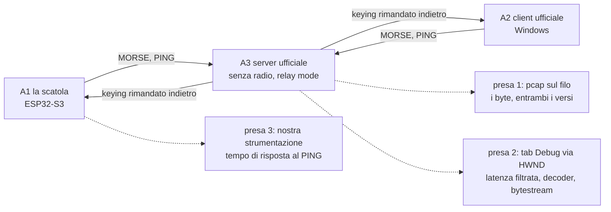

# Banco di prova CWNet - Plan

## Goal Capsule

**Obiettivo.** Chi tocca CWNet sa in pochi secondi, senza montare niente, se il cambiamento è ancora conforme al Remote CW Keyer di DL4YHF; e ogni sessione di collaudo su ferro lascia nel repo una prova riutilizzabile invece che conoscenza che evapora.

**Autorità di prodotto.** [STRATEGY.md](../../STRATEGY.md), track "Banco di prova" e metrica "Conformità CWNet". Il riferimento è il software di DL4YHF in esecuzione; il suo sorgente pubblicato dice cosa guardare, non cosa è vero.

**Blocchi aperti.** Nessuno per la pianificazione. La sessione zero (R1-R4) è il primo passo del lavoro, non un prerequisito esterno: finché non produce dati, i requisiti che poggiano sulle ipotesi in Dependencies restano provvisori.

## Product Contract

### Summary

Un banco a tre livelli che rende la conformità CWNet una domanda a risposta binaria invece che un'impressione. Il primo passo è una sessione di cattura su ferro che trasforma sette ipotesi in fatti e lascia i pcap nel repo. Da quei pcap nascono gli oracoli automatici; le funzioni pure si provano su host in CI; il tempo di risposta al PING resta l'unica grandezza che vuole la scatola su un link vero.

### Problem Frame

Il protocollo non è mai stato chiuso al 100% e il progetto si è arenato due volte sullo stesso punto: non è mai esistito un metodo di test valido e veloce. Il lavoro di ricostruzione con Wireshark è stato fatto davvero, e bene, ma non ha lasciato nulla di riutilizzabile: nel repo restano un dissector e un documento di protocollo, nessuna cattura. Il README del dissector propone come metodo di confronto fra il nostro client e quello ufficiale l'apertura di due pcap nella GUI e il confronto a occhio.

Nel frattempo la suite host è verde su 189 test che asseriscono byte mai confrontati con il riferimento. La verifica misura l'implementazione contro sé stessa, quindi non può accorgersi di una divergenza dal protocollo vero.

Il costo si paga tutto insieme e in ritardo: ogni modifica a `components/keyer_cwnet/` è un atto di fede fino alla prossima sessione manuale, e ogni sessione manuale riparte da zero.

### Key Decisions

**La sessione zero precede la progettazione del banco.** Tutto quello che sappiamo del riferimento viene dalla lettura del sorgente, non dall'osservazione. Si misura prima, si progetta poi. *(session-settled: user-directed — scelto contro il progettare il banco dalle sole letture di sorgente: "ad ora sono supposizioni, dobbiamo passare per test su ferro e software e vedere con Wireshark".)* Governa R1, R2, R3, R4.

**Due oracoli distinti, che non si sostituiscono.** Lo scopo di CWNet è il determinismo di ciò che si invia: quello che arriva deve essere esattamente quello che è partito. Da qui due confronti diversi. Il **determinismo** mette la nostra sequenza inviata contro quella tornata dal loop di relay: è la prova più severa, perché il server rimanda indietro solo ciò che ha saputo interpretare, quindi un comando sbagliato non fa tornare niente e il test fallisce subito. Il **formato sul filo** mette i nostri frame contro quelli del client ufficiale, e serve per ciò che il loop non distingue: l'impacchettamento. Quanti eventi per frame, dove si taglia, con quale cadenza si mandano i PING sono scelte che possono essere tutte legali e tutte diverse dalle sue, e solo la cattura ufficiale dice se una differenza è legittima o sbagliata. *(session-settled: user-directed — "lo scopo di CWNet è il determinismo perfetto di quello che si invia meno il PTT"; "potremo vedere ping diversi e impacchettare diversamente".)* Governa R1, R5, R6, R7.

**La tolleranza è un risultato, non un parametro.** Quanto scarto fra inviato e ricevuto sia accettabile si misura nelle prime sessioni; nessun numero viene fissato qui. Il PTT sta fuori dall'uguaglianza e si tara dopo i primi giri. Governa R7, R13.

**Ogni sessione di collaudo lascia un file nel repo.** È la regola che separa questo tentativo dai precedenti: il prodotto di una sessione non è ciò che l'operatore ha capito, è una fixture che da domani gira senza di lui. Governa R1, R5.

**I tre livelli sono imposti dal problema, non scelti per comodità.** Le funzioni pure sono deterministiche e si provano ovunque; le sequenze di ping e keying nascono dallo scambio fra i due capi e non si possono fabbricare; il nostro tempo di risposta al PING entra nella misura dell'altro capo e vuole la scatola su un link vero. Governa R5, R9, R10, R12.

**Il banco misura, non modifica il client.** Dove una conformità richiede di cambiare il firmware — il formato TX del keying, il filtro sulla latenza — il lavoro appartiene alla track "CWNet client" di STRATEGY.md ed è subordinato all'esito dell'ipotesi che lo giustifica. Governa R9, R11.

**Nessuna patch al binario di riferimento.** La telemetria interna si legge da fuori: il tab Debug è un `TRichEdit` con un HWND, e i flag diagnostici che stampano ciò che ci serve sono già voci di menu. Governa R3.

**Il banco è strumento, non prodotto.** Il server CWNet che serve al loop esiste solo come capo RX della prova, coerentemente con le Boundaries di STRATEGY.md.

### Actors

A1. **La scatola.** Il nostro firmware su ESP32-S3, nel ruolo di client CWNet.
A2. **Il client ufficiale.** Il Remote CW Keyer di DL4YHF su Windows, nel ruolo di client. È il metro di paragone per il formato sul filo: ciò che fa lui è per definizione corretto.
A3. **Il server ufficiale.** Lo stesso programma in modalità server, senza radio collegata. In quella condizione rimanda indietro il keying ai client connessi, il che chiude il loop e rende misurabile il determinismo senza hardware radio.
A4. **Lo sviluppatore.** Conduce la sessione zero e i collaudi successivi; è l'unico utente del banco.

### Key Flows

F1. **Sessione zero.** L'operatore avvia il server ufficiale senza radio, accende i flag diagnostici, connette il client ufficiale, emette una sequenza nota da sorgente deterministico, e cattura. Ripete la stessa sequenza con la scatola al posto del client ufficiale, sullo stesso server e con la stessa cattura attiva. Le due catture e la telemetria raccolta finiscono nel repo. Ogni ipotesi H1-H7 riceve un esito scritto.

F2. **Giro quotidiano.** Chi modifica `components/keyer_cwnet/` lancia la suite host: le funzioni pure e le fixture da pcap rispondono in secondi, in CI a ogni push, senza Windows e senza scatola.

F3. **Collaudo di accettazione.** Prima di dichiarare chiusa una parte del protocollo, la scatola gira contro il server ufficiale in relay mode, anche con la simulazione di rete degradata attiva. Si confronta ciò che è stato inviato con ciò che è tornato. La sessione produce nuove fixture con la stessa procedura di F1.

### Requirements

**Sessione zero**

R1. Una sessione di cattura su hardware e software reali produce almeno un pcap per ciascun capo (client ufficiale, nostra scatola) contro lo stesso server. Le catture vivono in `test_host/fixtures/cwnet/reference/` e `test_host/fixtures/cwnet/ours/`: solo la prima porta valori attesi per il confronto di formato, la seconda è materiale diagnostico.
R2. La sequenza è emessa da un sorgente deterministico a entrambi i capi ed è scritta prima della sessione. La manipolazione a mano è esclusa: sotto i 32 ms il codec risolve a 1 ms, quindi due esecuzioni manuali non producono gli stessi byte e il confronto frame per frame non sarebbe ottenibile.
R3. Accanto a ogni cattura viene salvato il contenuto del tab Debug del programma di riferimento, con i flag `VERBOSE`, `SHOW_KEYING_BYTESTREAM` e `SHOW_DECODER_OUTPUT` attivi.
R4. Ognuna delle sette ipotesi elencate in Dependencies riceve un esito registrato: confermata, smentita, o non osservabile in questa sessione.

**Oracolo automatico**

R5. Le catture committate sono rigiocabili da un programma senza intervento manuale e senza Wireshark in modalità grafica.
R6. Il verdetto pass/fail del confronto di formato è sui byte grezzi, non sui campi decodificati: il dissector nasce dalla stessa lettura di sorgente che ha prodotto H1-H7, quindi decodificherebbe entrambe le catture con la stessa mappa e dichiarerebbe accordo anche sbagliando. Il dissector serve a localizzare e nominare il frame e il campo che divergono. Prima di essere usato perde la registrazione `register_postdissector`, che oggi lo fa girare su ogni pacchetto con l'intero frame e produce campi `cwnet.*` spuri.
R7. Il keying rimandato indietro dal server viene rigiocato nel percorso di decodifica della scatola, e ciò che ne esce è confrontato con la sequenza inviata. È la misura del determinismo: lo scarto ammesso è quello stabilito dalle prime sessioni, non un valore fissato adesso.
R8. Un confronto fallito indica quale frame diverge e in quale campo, non soltanto che la cattura non corrisponde.
R9. Le fixture girano in CI insieme alla suite host esistente.

**Funzioni pure su host**

R10. Le asserzioni della suite host su byte di protocollo derivano dalla cattura di riferimento, non da scelte dell'implementazione.

**Prova dal vivo**

R11. Il tempo che la scatola impiega a rispondere a un PING REQUEST è strumentato e registrato, perché entra nel numero che l'altro capo usa per dimensionare il buffer e la coda del PTT. Non è una soglia da rispettare: il protocollo non definisce latenze massime.
R12. Il collaudo di accettazione include almeno una sessione con la simulazione di rete degradata del programma di riferimento attiva.

**Subordinati a un'ipotesi, e non lavoro del banco**

Questi due appartengono alla track "CWNet client" di STRATEGY.md. Sono elencati qui perché il banco è ciò che li sblocca e ciò che li verifica, ma sono modifiche al firmware e non vanno pianificate come infrastruttura di test.

R13. Confermate H1 e H2, il percorso TX del keying passa dal frame `CW_DOWN`/`CW_UP` con timestamp assoluto a 4 byte al frame `MORSE 0x10` con stream a 7 bit, e il codec in `cwnet_timestamp.c` smette di essere codice morto rispetto al TX.
R14. Confermata H5, il filtro peak-hold sulla latenza viene implementato nel client — oggi non esiste, `cwnet_client.c` conserva il valore istantaneo — e ha un test che ne verifica l'evoluzione di stato campione per campione a partire da una sequenza estratta da una cattura reale.

### Acceptance Examples

AE1. **Copre R4, R10.** Quando la cattura del client ufficiale mostra i frame di keying su un command byte, quel valore diventa l'atteso della suite host, anche se differisce da quello attualmente implementato.

AE2. **Copre R4, R14.** Quando la telemetria mostra il numero di latenza in GUI e la cattura permette di ricalcolare il valore istantaneo dagli stessi frame, la differenza fra i due numeri conferma o smentisce che il valore mostrato sia filtrato.

AE3. **Copre R7.** Quando una sequenza nota viene inviata e torna indietro dal loop di relay, ciò che la scatola decodifica coincide con ciò che ha inviato entro la tolleranza stabilita. Se il server non riconosce i nostri frame non torna indietro nulla, e il confronto fallisce prima ancora di riguardare il timing.

AE4. **Copre R6.** Quando i nostri frame e quelli del client ufficiale trasportano gli stessi eventi ma li impacchettano diversamente — confini di frame diversi, cadenza dei PING diversa — il confronto sui byte grezzi diverge e l'esito nomina il punto, così che si possa decidere se la differenza è legittima o è un difetto.

AE5. **Copre R11.** Quando la stessa sequenza è eseguita prima dal client ufficiale e poi dalla scatola sullo stesso server, un valore di latenza sistematicamente più alto per la scatola indica quanto il nostro tempo di risposta contribuisce alla misura. È diagnostica, non un criterio di fallimento.

AE6. **Copre R8.** Quando una modifica al codice fa divergere una fixture, l'esito nomina il frame e il campo, così che la causa sia leggibile senza aprire la cattura a mano.

AE7. **Copre R1, R5.** Quando la sessione zero è conclusa, un collaboratore che non c'era può rilanciare gli stessi confronti dal solo repo, senza Windows e senza hardware.

### Scope Boundaries

- Nessun prodotto lato stazione. Il server serve al loop, non è cosa da consegnare.
- Nessuna taratura del PTT in questo lavoro: sta fuori dall'uguaglianza fra inviato e ricevuto e si affronta dopo i primi giri.
- Nessuna modifica al binario di riferimento. Niente patch, niente hooking, niente reverse engineering: la telemetria si legge da fuori o si chiede all'autore.
- Nessuna ricompilazione dell'applicazione di riferimento. Il progetto è Borland C++ Builder 6 del 2002 con VCL e ogg/vorbis: fuori portata e senza ritorno.
- Nessuna copertura degli altri comandi del protocollo (audio, CI-V, spettro, tunnel seriali) in questo lavoro.
- Il timing scope e il decoder del programma di riferimento restano oracoli per l'occhio: utili al collaudo, fuori dal giro automatico.
- Le catture contengono i frame CONNECT, quindi username e nominativo in chiaro. Il repo è pubblico: è una scelta consapevole, non una svista.

### Dependencies / Assumptions

Le sette ipotesi sotto vengono dalla lettura del sorgente pubblicato dall'autore e **non sono ancora state osservate sul filo**. Sono l'elenco di ciò che la sessione zero deve falsificare, e i requisiti che ne dipendono restano provvisori finché non hanno un esito.

| # | Ipotesi | Cosa la verifica | Governa | Se smentita |
|---|---|---|---|---|
| H1 | Il keying viaggia sul comando MORSE `0x10`; `0x14` e `0x15` sono CI-V e spettro | il command byte nei frame del client ufficiale | R10, R13 | l'atteso della suite host viene dalla cattura, non dalla spec; R13 decade o cambia bersaglio |
| H2 | Il payload è uno stream a 7 bit con bit 7 = stato del tasto e bit 6..0 = attesa prima di applicarlo, non un timestamp assoluto a 4 byte | i byte del payload di keying | R10, R13 | come sopra; il codec a 7 bit resta senza impiego e va deciso se tenerlo |
| H3 | Un secondo key-up marca la fine dell'over dopo circa dieci dot o 500 ms | la coda dopo l'ultimo elemento | R10 | un elemento in meno da riprodurre nel TX |
| H4 | Il PING porta la terna t0/t1/t2 e `t2-t0` è il giro completo, non la tratta di andata | i tre timestamp nei tre frame | R11, R14 | tocca il client già in produzione, non solo le attese dei test |
| H5 | Il numero di latenza mostrato è un peak-hold asimmetrico, non il valore istantaneo | il valore in GUI accanto a quello ricalcolato dalla cattura | R14 | R14 decade: il valore istantaneo che già calcoliamo è corretto |
| H6 | Il server senza radio rimanda indietro il keying ai client connessi | la presenza di frame di keying in ingresso dopo aver manipolato | A3, R7, F1, F3 | **portante**: senza relay il loop non si chiude e R7 perde il suo banco. Il ripiego va deciso nella sessione stessa: un secondo capo (client ufficiale in ascolto sullo stesso server) o un server nostro minimo che rimandi indietro |
| H7 | Il nostro tempo di risposta al PING entra nella latenza calcolata dall'altro capo | il confronto fra `t2-t0` col client ufficiale e con la scatola | R11 | R11 resta strumentazione utile, senza il nesso con l'altro capo |

Altre dipendenze:

- Serve una macchina Windows con il Remote CW Keyer per la sessione zero e per ogni collaudo di accettazione. Il giro quotidiano non ne ha bisogno.
- Il programma di riferimento non scrive log su disco: la telemetria interna va letta dal tab Debug o richiesta all'autore.
- Il sorgente pubblicato è aggiornato a ottobre 2025 e i moduli di protocollo sono C puro; la GUI è VCL e non entra in gioco.
- `tshark` diventa una dipendenza della CI e oggi il workflow installa solo cmake, ninja e gcc.
- Il turnaround al PING della scatola è pavimentato dal ciclo del bg_task, `vTaskDelay(pdMS_TO_TICKS(10))`. Contro i 293-420 µs che l'autore misura su localhost il nostro contributo domina, ma su un numero che serve a dimensionare un buffer la quantizzazione a 10 ms non è un problema.

### Outstanding Questions

Nessuna domanda blocca la pianificazione. Le due che dipendono da una risposta dell'autore hanno un default dichiarato, così il banco procede comunque; se la risposta arriva, migliora.

**Rimandate a un brainstorming dedicato**

- OQ1. Cosa deve contenere la sequenza nota, e cosa significa "identico" fra inviato e ricevuto. È il punto da cui dipende la qualità di tutto il resto: la sequenza va derivata da H1-H7 perché ogni ipotesi riceva lo stimolo che le serve (H3 vuole una pausa oltre i 500 ms, H2 gap che attraversino le soglie del codec a 31 e 156 ms, H5 latenza che varia), e la tolleranza sullo scarto va definita e misurata. Da affrontare prima della sessione zero.
- OQ2. Come si registra la provenienza di una cattura — versione del riferimento, OS, configurazione del server, WPM, sorgente della sequenza, flag attivi — perché fra un anno una fixture che diverge sia arbitrabile. Conseguenza diretta di OQ1: la procedura si scrive quando la sequenza è decisa.

**Rimandate alla pianificazione**

- OQ3. Si compila `CwStreamEnc.c` dell'autore dentro `test_host` come oracolo differenziale? Coprirebbe le funzioni pure in modo più fitto di qualunque test scritto da noi, ma mette codice suo nel nostro repo e nel sorgente non c'è nessuna licenza né nota di copyright dichiarata. **Default: no**, si scrivono test nostri contro le catture; da riaprire solo se l'autore chiarisce la licenza.
- OQ4. Si chiede all'autore un'opzione per scrivere il contenuto del tab Debug su file? È un `fprintf` dentro la sua funzione di log e renderebbe la telemetria automatica per sempre. Ha già pubblicato i sorgenti su richiesta. **Default: si legge il `TRichEdit` da fuori** (R3), che non dipende da nessuno.
- OQ5. Come si estraggono i campi dal dissector per localizzare una divergenza, e quale forma prende l'esito.
- OQ6. Se convenga compilare il core di protocollo dell'autore headless su Linux come peer di riferimento in CI. `CwNet.c` è C puro e dipende da Windows solo per Winsock, quindi è fattibile, ma è lavoro che ha senso solo se la sessione zero mostra che le catture non bastano. Stessa questione di licenza di OQ3.

### Sources / Research

- Sorgente di riferimento: `Remote_CW_Keyer_Sources.zip` da qsl.net/dl4yhf, file datati fino al 2025-10-20. Moduli rilevanti: `CwNet.h` (comandi), `CwNet.c` (gestione PING e filtro latenza), `CwStreamEnc.h` e `CwStreamEnc.c` (formato dello stream di keying e codec a 7 bit).
- Modalità relay senza radio, dal manuale dell'autore: "If there is no remotely controlled radio connected to the server at all, the Morse code keying signal will be relayed back to all currently connected clients".
- Nel repo: [tools/wireshark/cwnet.lua](../../tools/wireshark/cwnet.lua) decodifica già i campi MORSE e PING; [tools/wireshark/README.md](../../tools/wireshark/README.md) descrive la procedura manuale che questo lavoro sostituisce; [docs/plans/2026-01-12-cwnet-protocol-implementation.md](2026-01-12-cwnet-protocol-implementation.md) è la spec ricostruita, coerente col dissector.
- Implementazione attuale: [components/keyer_cwnet/src/cwnet_client.c](../../components/keyer_cwnet/src/cwnet_client.c) per la costruzione dei frame di keying e il calcolo della latenza istantanea; [components/keyer_cwnet/src/cwnet_timestamp.c](../../components/keyer_cwnet/src/cwnet_timestamp.c) per il codec a 7 bit; [test_host/test_cwnet_client.c](../../test_host/test_cwnet_client.c) per le asserzioni attuali sui byte.
