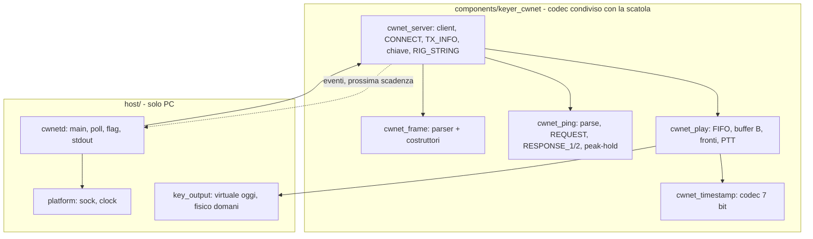
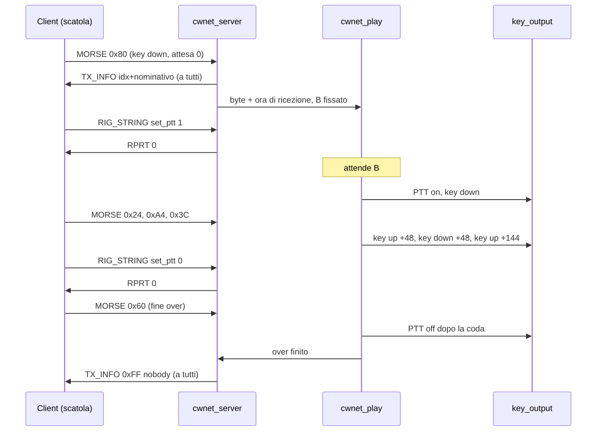
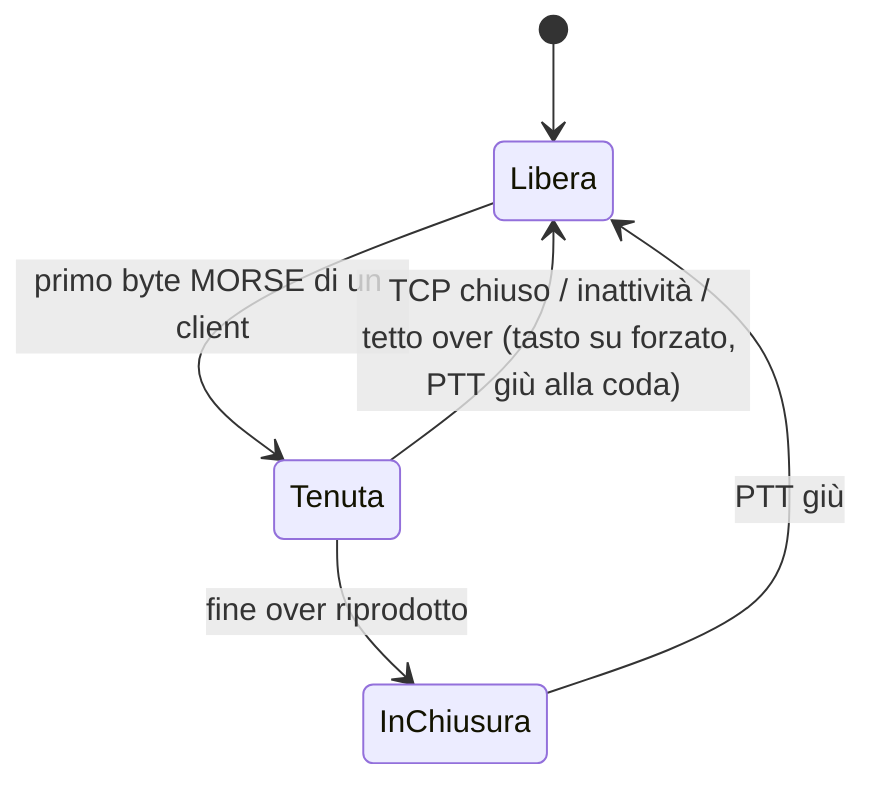

# Daemon di stazione CWNet - Plan

## Goal Capsule

- **Objective.** L'OM che manipola da remoto arriva sul tasto del rig di stazione attraverso un server nostro: la sua manipolazione esce con i tempi che ha mandato, il PTT segue quella manipolazione, e ogni client connesso sa chi è sulla chiave.
- **Means.** Un daemon in C su PC Linux o Mac, con il core del server puro e host-testabile sopra il codec di `keyer_cwnet` (KTD1, KTD2).
- **Autorità.** [STRATEGY.md](../../STRATEGY.md), Positioning e track "CWNet, i due capi"; la Decision [#60](https://github.com/iu3qez/RemoteCWKeyer-esp32/issues/60); la Work [#64](https://github.com/iu3qez/RemoteCWKeyer-esp32/issues/64). Sui byte del filo decide la cattura del client DL4YHF del 2026-09-05 (`test_host/cwnet_fixtures.h`); il sorgente del riferimento dice cosa guardare, non cosa è vero.
- **Profilo di esecuzione.** Codice C11 su host, provato dalla suite `test_host` in CI nelle due varianti. Il passo di banco con la scatola (R18) lo esegue il maintainer, non la CI.
- **Stop conditions.** Una issue `blocking` che copra questo lavoro: oggi nessuna ([#65](https://github.com/iu3qez/RemoteCWKeyer-esp32/issues/65) blocca la sola GUI, fuori da questo piano). Evidenza che una decisione di sessione non regge: fermarsi e riportarla, non aggirarla.
- **Tail ownership.** La PR chiude [#64](https://github.com/iu3qez/RemoteCWKeyer-esp32/issues/64) solo per la parte host della sua condizione; il passo di banco resta aperto sulla issue finché il maintainer non lo esegue e lo scrive.

---

## Product Contract

### Summary

Un programma C, `cwnetd`, che ascolta sulla porta CWNet e fa da server a chiunque si connetta: eco del CONNECT con permessi pieni, PING da iniziatore, annuncio di chi ha la chiave, riproduzione del MORSE ricevuto dopo un buffer dimensionato sulla latenza misurata, PTT derivato dalla manipolazione riprodotta, arbitrato della chiave fra più client. Il core del server vive in `components/keyer_cwnet/` come macchina a stati pura, pilotata da callback come il client, e la suite host lo fa parlare con la cattura del client DL4YHF pinnando i byte che manda. Intorno al core: un layer POSIX condivisibile con il client host, un'uscita virtuale per tasto e PTT, righe di stato su stdout.

### Problem Frame

Il lato stazione non ha un server nostro. Esiste solo `tools/cwnet/cwnet_echo.py`, un eco in Python per il loop del banco: non manipola niente e non porta policy. Il programma DL4YHF in modalità server porta policy sue, lette nel suo sorgente e registrate in [#60](https://github.com/iu3qez/RemoteCWKeyer-esp32/issues/60): PTT tenuto 500 ms, chiave ceduta a cronometro di 1 s che oscilla durante l'over, `set_ptt` applicato all'arrivo. Il maintainer ha deciso che i due capi sono nostri e le policy si decidono una volta sola.

### Key Decisions

- **Il server è un daemon su PC di stazione, in C, in questo repo.** *(session-settled: user-directed — scelto sopra il server sulla scatola, raccomandazione 2 di #60, e sopra il solo client: le policy di stazione non entrano nel path RT della scatola.)* Governa R1, R17.
- **Il programma DL4YHF è riferimento del filo, non del prodotto.** *(session-settled: user-directed — scelto sopra il copiare le sue policy di stazione: sono opinabili e i due capi sono nostri.)* Governa R6, R7, R8, R9, R10.
- **Tutti possono connettersi e manipolare; conta sapere chi trasmette.** *(session-settled: user-directed — scelto sopra la lista utenti con permessi del riferimento: «deve essere una cosa semplice come nel riferimento, l'importante è sapere CHI trasmette».)* Governa R2, R3, R5.
- **Repo unico, per ora.** *(session-settled: user-approved — scelto sopra un repo del daemon: ciò che i due capi condividono è la conoscenza del filo, e sta qui.)* Governa R17.
- **Oltre 1000 ms di peak-hold il link è non idoneo: lo scambio veloce dopo la TX viene prima della copertura di un link lento.** *(session-settled: user-directed — scelto sopra un tetto alto a 1500 ms e sopra nessun tetto: con due secondi di buffer il corrispondente sta già rispondendo quando il PTT scende, e la lentezza dello scambio dopo la TX è la critica principale che gli utenti fanno al programma originale.)* Governa R7, R12.
- **Niente GUI in questo piano.** La GUI è la Decision [#65](https://github.com/iu3qez/RemoteCWKeyer-esp32/issues/65), `blocking` per la sola GUI. Lo stato esce su stdout così l'opzione della pagina resta aperta. Governa R12.
- **Niente audio, CI-V né spettro dentro CWNet; niente scatola come server.** Boundaries di STRATEGY.md. Governa R15.

### Actors

- A1. **L'OM remoto**: il client della scatola oggi, il client host di [#68](https://github.com/iu3qez/RemoteCWKeyer-esp32/issues/68) domani. Manda CONNECT, MORSE, `set_ptt`; risponde ai PING; legge TX_INFO.
- A2. **La stazione**: il PC con il daemon, il rig, l'operatore che legge stdout.
- A3. **Il tester**: fa girare il loop del banco senza scatola e con la scatola, legge le righe di stato e l'uscita virtuale.

### Key Flows

- F1. **Connessione.** A1 apre il TCP e manda il CONNECT. Il daemon manda l'eco con i permessi, il PRINT di benvenuto e il TX_INFO corrente, poi parte il PING ogni 2 s. A1 è READY all'eco. Covered by R1, R2, R3, R4.
- F2. **Un over.** Il primo byte MORSE di A1 prende la chiave se è libera; TX_INFO a tutti. I byte entrano nella FIFO del titolare con l'ora di ricezione. La riproduzione parte al primo byte, ritardata del buffer B, e riproduce le attese codificate. Il PTT sale al primo key-down riprodotto e scende alla coda dopo l'ultimo key-up riprodotto. Il marker di fine over riprodotto e il PTT sceso rilasciano la chiave; TX_INFO «nobody» a tutti. Covered by R6, R7, R9.
- F3. **Due client.** Il MORSE di chi non ha la chiave è scartato in silenzio, nessun annuncio. Quando il titolare rilascia, il prossimo byte di chiunque prende la chiave. Covered by R6.
- F4. **Caduta a metà over.** Il TCP del titolare si chiude, o non arriva più niente: la chiave si rilascia con tasto su forzato e PTT giù dopo la coda; TX_INFO «nobody». Covered by R6, R16.
- F5. **Jitter.** Un byte arriva in ritardo sulla propria scadenza: l'elemento in corso si allunga, il ritardo si conta. Se il tasto è giù e non arriva niente per il tempo di grazia: tasto su, riga di fault, PTT giù alla coda; i byte successivi ripartono come un over nuovo con lo stesso B. Covered by R8.

### Requirements

**Connessione e protocollo**

- R1. Il daemon ascolta su una porta TCP, default 7355, e serve più client insieme (default 4); una connessione oltre il limite viene accettata e chiusa subito, senza bloccare l'accept.
- R2. A un CONNECT valido risponde con l'eco dei 92 byte con il campo permessi a TALK, TRANSMIT e CTRL_RIG (0x07), poi un PRINT di benvenuto, poi il TX_INFO dello stato corrente. Un CONNECT di lunghezza diversa chiude la connessione.
- R3. Ogni cambio del titolare della chiave è annunciato a tutti i client con un TX_INFO: byte indice del client (da 1) e nominativo con NUL; indice 0xFF e `-- nobody --` quando è libera; `NoCall #n` quando il nominativo nel CONNECT è vuoto. I byte coincidono con `ref_tx_info_moritz` e `ref_tx_info_nobody`.
- R4. Il daemon è l'iniziatore del PING verso ogni client ogni 2 s: REQUEST con `t0` dal suo orologio a 31 bit e id uguale all'indice del client; alla RESPONSE_1 risponde con la RESPONSE_2 che porta `t2`. La latenza è `t2 - t0`; un valore fuori da 0..2000 ms è scartato, né latenza né peak-hold lo vedono; il peak-hold sale subito e scende di un decimo dello scarto, come il riferimento.
- R5. Ogni stringa di controllo radio 0x06 riceve una risposta: `set_ptt 0|1` riceve `RPRT 0`; ogni altra stringa un codice negativo. Nessuna stringa viene applicata (R10).

**Chiave, riproduzione, PTT**

- R6. Il primo byte MORSE mentre la chiave è libera la prende; il MORSE degli altri client è scartato in silenzio. La chiave resta al titolare per tutto l'over e si rilascia quando il marker di fine over è stato riprodotto e il PTT è sceso. Reti di sicurezza, ciascuna con rilascio, tasto su forzato e PTT giù alla coda: chiusura del TCP del titolare; nessun byte per un tempo di inattività (default 5 s); un over più lungo di un tetto (default 120 s).
- R7. La riproduzione parte al primo byte di un over, ritardata di B; B è il peak-hold del titolare sopra un pavimento (default 100 ms), fissato al momento in cui prende la chiave e invariato per l'over. Il tetto di idoneità è 1000 ms: un client il cui peak-hold lo supera quando manda il primo byte MORSE non prende la chiave e non viene riprodotto; riceve un PRINT che dice il link non idoneo e il valore misurato, e stdout scrive una riga. Ogni fronte esce dopo l'attesa codificata nel byte, senza accumulo di errore; un'attesa spezzata su più byte con lo stesso stato esce come attese consecutive.
- R8. Ogni byte arriva B ms prima della propria scadenza, quindi una FIFO vuota alla scadenza di un fronte è lo stato normale: lo stato applicato resta. Un byte che arriva dopo la propria scadenza si applica subito, l'elemento in corso si allunga del ritardo e il ritardo viene contato. Se il tasto è giù e nessun byte arriva entro un tempo di grazia dall'ultimo fronte (default 500 ms), il tasto va su subito e viene scritta una riga di fault; i byte successivi ripartono come un over nuovo con lo stesso B. Un byte con lo stesso stato di quello applicato non produce un fronte.
- R9. Il PTT sale con il primo key-down riprodotto, anticipato di un lead configurabile (default 0 ms, mai oltre B), e scende una coda dopo l'ultimo key-up riprodotto (default 100 ms, il valore della scatola). Ogni rilascio della chiave lo abbassa al più tardi alla coda.
- R10. Le stringhe `set_ptt` del client non muovono il PTT.

**Uscite e stato**

- R11. Tasto e PTT passano da un'interfaccia di uscita con un backend virtuale che scrive ogni fronte come riga con l'istante in ms su un descrittore proprio (file o stderr) che non scarta mai, separato dalle righe di stato. Il trasporto fisico è fuori da questo piano (Scope Boundaries).
- R12. Lo stato esce su stdout a righe: connessione e disconnessione con nominativo e indirizzo, cambio del titolare, latenza e peak-hold per client, PTT, fault, B scelto a ogni over. Le stringhe che vengono dal client escono con i byte di controllo e le sequenze di escape rimossi; una stdout che non drena non ferma il loop.
- R13. La configurazione è da riga di comando con default uguali al riferimento o alla scatola: indirizzo di ascolto (default tutte le interfacce IPv4, il confine di fiducia è la LAN o la VPN; IPv6 fuori scopo) e porta, client massimi, pavimento di B e tetto di idoneità del link, coda e lead del PTT, inattività e tetto dell'over, tempo di grazia dell'underrun, timeout di handshake, tetto ai byte non inviati per client (default 16 KiB), backend di uscita e descrittore dei fronti.

**Robustezza**

- R14. Il parser dei frame consuma per intero un frame frammentato la cui lunghezza dichiarata supera il buffer interno, resta in sincronia e lo restituisce con uno stato «saltato», payload nullo e lunghezza zero: mai un puntatore con lunghezza oltre il buffer, mai un errore che faccia perdere il framing. Vale anche sulla scatola.
- R15. Comandi non gestiti (CI-V, spettro, audio) sono ignorati; un errore di parse chiude la connessione del client.
- R16. Un client che non risponde a tre PING consecutivi viene chiuso; un client che non completa il CONNECT entro il timeout di handshake (default 5 s) viene chiuso.

**Build, CI, banco**

- R17. Il daemon compila con CMake su Linux e macOS con le stesse flag strette di `test_host`; la CI compila il daemon su Ubuntu e macOS e fa girare i test del core nelle due varianti della suite host.
- R18. Il daemon completa un over con il client della scatola nel loop del banco, con `tools/cwnet/keyer_sim.c` come stimolo, seguendo una procedura scritta nel README di `tools/cwnet/`.

### Acceptance Examples

- AE1. Covers R2. **Given** un CONNECT con username `Moritz`, nominativo `Moritz`, permessi 0. **When** il core lo riceve. **Then** i primi byte inviati sono `ref_connect_echo`, poi un frame PRINT, poi `ref_tx_info_nobody`.
- AE2. Covers R6, R7, R9, F2. **Given** un client READY, B = 50 ms, coda 100 ms, orologio simulato. **When** riceve i byte di `ref_first_over` (sessione 12, la lettera A a 25 WPM). **Then** l'uscita virtuale riceve key-down a t+50, key-up a +48, key-down a +48, key-up a +144; il PTT sale con il primo key-down e scende 100 ms dopo l'ultimo key-up; `RPRT 0` esce due volte; `ref_tx_info_moritz` esce al primo byte MORSE e `ref_tx_info_nobody` dopo il rilascio.
- AE3. Covers R6, F3. **Given** due client READY, il primo con la chiave. **When** il secondo manda un byte MORSE. **Then** nessun fronte in uscita per quel byte e nessun TX_INFO.
- AE4. Covers R4. **Given** un client READY all'istante t0. **When** passano 2 s. **Then** esce una REQUEST `[0, idx, 0, 0, t0, 0, 0]`; alla RESPONSE_1 `[1, idx, 0, 0, t0, t1, 0]` esce `[2, idx, 0, 0, t0, t1, t2]` e la latenza è `t2 - t0`.
- AE5. Covers R6, F4. **Given** il titolare a metà over con il tasto giù riprodotto. **When** il suo TCP si chiude. **Then** il tasto va su, il PTT scende dopo la coda, `ref_tx_info_nobody` esce a tutti gli altri.
- AE6. Covers R8, F5. **Given** un key-down riprodotto e la FIFO vuota. **When** passano 500 ms senza byte. **Then** il tasto va su e una riga di fault viene emessa; il PTT scende alla coda. **Given** lo stesso key-down. **When** il key-up arriva 30 ms dopo la propria scadenza. **Then** il tasto va su all'arrivo, senza fault, e il ritardo di 30 ms è contato.
- AE8. Covers R7, R12. **Given** un client READY con peak-hold a 1200 ms e la chiave libera. **When** manda il primo byte MORSE. **Then** nessun fronte in uscita, la chiave resta libera e nessun TX_INFO esce; il client riceve un PRINT con «link non idoneo» e il valore; stdout ne scrive una riga.
- AE9. Covers R7, R8. **Given** un client READY, B = 100 ms, orologio simulato. **When** ogni byte di `ref_first_over` entra nella FIFO al proprio istante di ricezione, cioè il suo fronte più una latenza di andata simulata di 30 ms, non tutti insieme. **Then** i fronti escono agli stessi intervalli di AE2, nessun byte in ritardo, nessun fault.
- AE7. Covers R14. **Given** un frame lungo con lunghezza dichiarata 300 consegnato in due frammenti, seguito da un PING. **When** il parser li riceve. **Then** il primo esce con stato «saltato», payload nullo e lunghezza zero; il PING esce intatto; sotto ASan nessuna lettura fuori dal buffer.

### Success Criteria

- La suite host pinna i byte del daemon dove il client li guarda: eco del CONNECT, TX_INFO, PING, `RPRT`.
- Il loop senza scatola chiude: un client di prova in Python manda `ref_first_over` al daemon e l'uscita virtuale mostra i fronti attesi.
- Lo scarto fra gli istanti dei fronti sull'uscita virtuale e le attese codificate è misurato sul Mac e su Linux e scritto nel README, senza rivendicare una metrica.
- Il tempo di scambio dopo la TX, dall'ultimo key-up del client al PTT giù in stazione (B più la coda), è scritto nel README accanto al jitter: è la grandezza che gli utenti del programma originale criticano.

### Scope Boundaries

- Nessuna GUI: Decision [#65](https://github.com/iu3qez/RemoteCWKeyer-esp32/issues/65).
- Nessun operatore locale del server (indice 0, «The Sysop» del riferimento).
- Nessun rilancio del MORSE agli altri client: il riferimento non lo fa (H6 smentita il 2026-09-05).
- Nessun server HTTP, nessun audio, CI-V o spettro.
- Nessun target Windows per il daemon; il client host di [#68](https://github.com/iu3qez/RemoteCWKeyer-esp32/issues/68) ne condivide solo il layer di piattaforma.
- Nessuna lista utenti né permessi differenziati.

#### Deferred to Follow-Up Work

- **Uscita fisica verso il rig** (linee di controllo di una seriale USB o altro): Decision da aprire, `blocking` per il solo backend fisico. La ricerca (Sources) dice che il timer di latenza FTDI e la schedulazione USB dominano il jitter. Due criteri entrano nella Decision, qualunque sia il trasporto: lo stato di riposo del trasporto è tasto su e PTT giù anche se il daemon muore (SIGKILL, crash), e un tetto al key-down continuo vive fuori dal processo del daemon.
- **File di configurazione dichiarativo** accanto alle flag, quando i parametri crescono.
- **Unit systemd e launchd**: il daemon gira in foreground e non forka; le unit arrivano con il deploy di stazione.
- `tools/cwnet/cwnet_echo.py` annuncia lo username in TX_INFO, il riferimento annuncia il nominativo: correzione leggera in U7.

### Dependencies / Assumptions

- Il codec di `keyer_cwnet` compila per host senza modifiche: già vero in `test_host/CMakeLists.txt`.
- La cattura del 2026-09-05 resta il riferimento dei byte; le fixture in `test_host/cwnet_fixtures.h` bastano per AE1-AE5. Il CONNECT lato client si ricostruisce dai campi, non da una fixture.
- Il default della porta del client della scatola in `parameters.yaml` è 7355 dal 2026-09-08, come il riferimento.
- Il client della scatola diventa READY all'eco del CONNECT e manipola solo con TRANSMIT nell'eco (`cwnet_client.c`, `handle_connect_echo` e `cwnet_client_send_key_event`).

### Sources / Research

- Riferimento DL4YHF, letto nel sorgente pubblicato (`Remote_CW_Keyer_Sources.zip`, sha256 `d960d6b9…`): CONNECT lato server `CwNet.c:1275-1332`; PING `CwNet.c:1339-1526` e cadenza `CwNet.c:2236-2262`; TX_INFO `CwNet.c:432-452`, `760-775`, `2389-2394`; MORSE e presa della chiave `CwNet.c:2875-2903`; cessione a 1 s `CwNet.c:346-390`, `3545-3552`; `set_ptt` come PTT manuale `CwNet.c:4085-4110`, `KeyerThread.c:2238-2262`; riproduzione con ritardo di latenza `KeyerThread.c:2836-2981`, che parte al primo byte e non alla soglia di riempimento descritta nel commento; coda PTT `KeyerThread.c:2318-2340`; gate 0..2 s sull'RTT `CwNet.c:1436-1437`.
- Nostro client: `components/keyer_cwnet/include/cwnet_client.h` (commento di testa sul filo), `src/cwnet_client.c` (`handle_ping`, `handle_tx_info`, `handle_morse`, `rx_*`), `src/cwnet_frame.c` (parser, difetto di R14), `cwnet_client_on_data` (su errore di parse salta un byte e riprova: un errore sui frame lunghi farebbe risincronizzare dentro il payload), `src/cwnet_socket.c` (il layer di piattaforma della scatola, da rifare in POSIX).
- Seme e strumenti: `tools/cwnet/cwnet_echo.py`, `tools/cwnet/keyer_sim.c`, `tools/cwnet/README.md`.
- Metodo: [reference-source-as-differential-oracle](../solutions/architecture-patterns/reference-source-as-differential-oracle.md), [differential-oracle-count-is-not-a-gradient](../solutions/architecture-patterns/differential-oracle-count-is-not-a-gradient.md).
- Esterni, per KTD7 e KTD9: `clock_gettime(CLOCK_MONOTONIC)` su macOS 10.12+; `poll()` con timeout alla prossima scadenza e `TCP_NODELAY` (Rigtorp, "Tips for Using the Sockets API"); `SIGPIPE` ignorato a livello di processo; niente `daemon()` sotto launchd e systemd; FTDI AN232B-04 sul timer di latenza; `TIOCMBIS`/`TIOCMBIC` per le linee di controllo; il seam winsock (`SOCKET`, `closesocket`, `ioctlsocket`, `WSAPoll` difettoso prima di Windows 10 2004).

---

## Planning Contract

### Key Technical Decisions

- KTD1. **Core del server come macchina a stati pura in `keyer_cwnet`.** `cwnet_server.[ch]` possiede il motore di riproduzione (U4), lo fa avanzare nel proprio `poll` ed espone la prossima scadenza; il daemon parla con il solo server. Non tocca socket né orologio: riceve byte per client con `on_data`, tempo con una callback, e manda con una callback per client; gli eventi (titolare, latenza, fault) escono in una struttura di risultato, non in log. *(session-settled: user-approved — scelto sopra un daemon monolitico: è l'unico modo di far parlare il core con la cattura nella suite host, e replica il disegno di `cwnet_client_t`.)* Governa R1-R6, R15, R16.
- KTD2. **Il codec si estende, non si copia.** Costruttori di frame in `cwnet_frame.[ch]`; REQUEST, RESPONSE_2, gate dell'RTT e peak-hold in `cwnet_ping.[ch]`, usati anche dal client. Il gate è un cambiamento di comportamento sulla scatola, oggi filtra solo i negativi: si pinna con un test del client. La FIFO dei byte MORSE ricevuti, il pop e il predicato di fine over escono da `cwnet_client.c` e vivono in `cwnet_play.[ch]`; il client li chiama, i suoi test restano invariati. `cwnet_server.c` e `cwnet_play.c` restano fuori dalle SRCS del componente ESP-IDF: sono host-only e non devono portare `esp_timer` né `RT_*`. Ogni tocco a `keyer_cwnet/` porta un test host che pinna il riferimento (Definition of done). Governa R3, R4, R14.
- KTD3. **Riproduzione come nel codice del riferimento, non nel suo commento.** Parte al primo byte ritardato di B; B fissato all'over. Lo stato applicato resta finché non arriva il byte successivo, perché la FIFO è vuota per costruzione durante un elemento più lungo di B; un byte in ritardo allunga l'elemento e viene contato. Il tasto su forzato scatta solo con tasto giù e silenzio per il tempo di grazia: «corrupted CW timing is worse than silence» (ARCHITECTURE.md 8.1) vale per il tasto lasciato giù, non per un elemento allungato di qualche ms. Motore in un modulo suo, `cwnet_play.[ch]`, con orologio iniettato. Governa R7, R8.
- KTD4. **Chiave tenuta per l'over, con reti di sicurezza.** Rilascio a fine over riprodotto e PTT giù; inattività, tetto e chiusura TCP forzano il rilascio. Il cronometro di 1 s del riferimento, che oscilla l'annuncio, non viene copiato. Governa R6.
- KTD5. **PTT dalla manipolazione riprodotta.** Coda uguale a quella della scatola, lead opzionale possibile perché il fronte è noto B ms prima; `set_ptt` solo riscontrato. *(session-settled: user-approved — scelto sopra l'applicazione all'arrivo del riferimento: disallineata dalla riproduzione, e un client che muore lascia la stazione in TX.)* Governa R9, R10.
- KTD6. **Permessi fissi 0x07 nell'eco.** Nessuna lista utenti; nominativo vuoto annunciato come `NoCall #n`. Istanzia la Key Decision «tutti possono». Governa R2, R3, R5.
- KTD7. **Un thread, scadenze assolute.** `poll()` sui socket con timeout alla prossima scadenza di riproduzione; `CLOCK_MONOTONIC`; `TCP_NODELAY`; `SIGPIPE` ignorato; foreground, nessun fork; stdout non bloccante con scarto delle righe quando il lettore non drena; scadenze in ms a 64 bit, i 31 bit restano sul filo. Ricerca esterna load-bearing (Sources). Governa R1, R7, R12.
- KTD8. **Directory `host/` per i programmi host, layer di piattaforma condiviso.** `host/platform/` (socket, orologio) scritto per essere riusato dal client host di [#68](https://github.com/iu3qez/RemoteCWKeyer-esp32/issues/68), con il seam winsock nei nomi delle funzioni; `host/cwnetd/` il daemon; `host/CMakeLists.txt` il build. *(session-settled: user-approved — scelto sopra `tools/cwnet/`: il banco è strumento, il daemon è prodotto.)* Governa R1, R17.
- KTD9. **Uscita tasto e PTT dietro un'interfaccia.** Una struttura di funzioni con backend virtuale su un descrittore proprio, mai scartato, così la misura del jitter non perde fronti; il backend fisico arriva con la sua Decision. Governa R11.
- KTD10. **Il core non logga.** Nessun `RT_*` né `log_stream` nel core del server e nel motore di riproduzione: gli eventi tornano al chiamante, il daemon li stampa. Il daemon non linka `cwnet_client.c`. Governa R12.
- KTD11. **Il parser si indurisce sul posto, senza perdere il framing.** `cwnet_frame.c` consuma il frame frammentato oltre il buffer e lo restituisce «saltato»; l'errore resta riservato alla categoria 11. Un errore farebbe perdere il framing al client della scatola, che risincronizza saltando un byte e leggerebbe il payload come frame. Niente fork del codec per il daemon. Governa R14, R15.
- KTD12. **Configurazione da flag.** Default del riferimento e della scatola; il file arriva quando serve. Governa R13.
- KTD13. **CI: un job per `host/`.** Build su `ubuntu-latest` e `macos-latest` più un test di loopback; i test del core restano nella suite host esistente. Governa R17.

### High-Level Technical Design

Componenti e chi possiede cosa:



Un over, dal primo byte al rilascio:



Stati della chiave nel server:



Pseudo-schema del motore di riproduzione, direzionale:

```text
al primo byte di un over: deadline = ricezione + B; stato_pendente = bit7
a ogni deadline raggiunta:
  applica stato_pendente all'uscita (nessun fronte se lo stato non cambia); aggiorna PTT
  se FIFO vuota: lo stato resta; ultimo_fronte = deadline; attendi il byte successivo
  prossimo byte -> deadline += attesa_decodificata; stato_pendente = bit7
all'arrivo di un byte con deadline già passata: applicalo subito, conta il ritardo (R8)
se tasto giù e now - ultimo_fronte > grazia: tasto su, fault, over chiuso (R8)
fine over = due key-up consecutivi riprodotti
```

### Output Structure

```text
host/
  CMakeLists.txt            # build del daemon e del test di loopback, flag di test_host
  CLAUDE.md                 # brief del modulo (rigenerabile con map-tree)
  platform/
    sock.h  sock.c          # listen/accept/nonblocking/send/recv/close, poll; seam winsock nei nomi
    clock.h clock.c         # ms monotoni a 31 bit e us
  cwnetd/
    main.c                  # flag, loop poll, wiring core+play+output, stdout
    key_output.h key_output.c   # interfaccia + backend virtuale
    README.md               # uso, loop senza scatola, misura del jitter
  tests/
    loopback_test.c         # connessione locale end-to-end con byte di fixture
components/keyer_cwnet/
  include/cwnet_frame.h   src/cwnet_frame.c       # costruttori, parser che salta (U1)
  include/cwnet_ping.h    src/cwnet_ping.c        # REQUEST, RESPONSE_2, gate, peak-hold (U2)
  include/cwnet_server.h  src/cwnet_server.c
  include/cwnet_play.h    src/cwnet_play.c
test_host/
  test_cwnet_frame_parser.c  test_cwnet_ping.c   # estesi
  test_cwnet_server.c  test_cwnet_play.c
tools/cwnet/
  cwnet_send.py             # client di prova: CONNECT, PING, byte MORSE da fixture
```

### Assumptions

- Il pavimento di B, default 100 ms, è nostro: il riferimento parte da 250 ms configurati (`CwNet.c:164`) e usa 50 ms solo come minimo per i test in locale; 100 ms copre il jitter di un router domestico (5..47 ms nella misura del riferimento) senza pesare sullo scambio dopo la TX. Il tetto di idoneità a 1000 ms è una Key Decision del maintainer, non un anti-avvelenamento: per quello bastano il gate 0..2000 ms sull'RTT e il peak-hold. Entrambi sono flag.
- Tre PING senza risposta (6 s) chiudono il client: il riferimento non ha timeout; senza, un TCP semiaperto tiene la chiave finché non scatta l'inattività.
- I codici negativi per le stringhe 0x06 diverse da `set_ptt` si scelgono all'implementazione dalla tabella dei codici del riferimento (`HamlibResultCodes.h` non è nell'archivio; i valori usati in `CwNet.c` lo sono).

### Sequencing

Fase A (codec, tutta nella suite host): U1, U2 e U4 in parallelo; U3 dopo tutti e tre. Fase B (programma host): U5 in parallelo alla fase A; U6 dopo U3 e U5; U7 e U8 dopo U6.

### System-Wide Impact

- `components/keyer_cwnet/src/cwnet_frame.c` e `cwnet_ping.c` girano anche sulla scatola, su Core 1, dentro `cwnet_client.c` via `cwnet_socket.c` e `main/bg_task.c`. I costruttori non cambiano un byte sul filo; il parser cambia comportamento solo sui frame frammentati oltre il buffer (R14) e il gate dell'RTT è nuovo per il client (KTD2). Entrambi si pinnano nei test del client esistenti più due scenari nuovi (U1, U2).
- Il peak-hold del client alimenta solo diagnostica: `cwnet_socket_get_latency_peak_ms` letto da `keyer_webui/src/api_system.c` e da `bg_task.c`. L'estrazione in `cwnet_ping.c` conserva la forma intera del calcolo.
- `components/keyer_cwnet/CMakeLists.txt` elenca le SRCS in chiaro: i due file nuovi non vi entrano (KTD2). `test_host/CMakeLists.txt` e `test_main.c` si aggiornano a mano (U3, U4). `host/CMakeLists.txt` compila i sorgenti condivisi senza `test_host/stubs/`.
- Nessun ciclo: `cwnet_server` usa `cwnet_frame` e `cwnet_ping`; `cwnet_play` usa `cwnet_timestamp`; il server chiama il motore, gli eventi tornano per valore. `test_host` linka client e server nello stesso binario: i simboli nuovi in `cwnet_ping.c` non devono collidere con quelli del client.
- CI: il job esistente di `host-tests.yml` copre U1-U4; `firmware-build.yml` compila `keyer_cwnet` con le flag del componente e intercetta un file non gradito a ESP-IDF; il job nuovo `host-build` non ha bisogno del submodule né della deploy key (U8).
- Documentazione: module map di `CLAUDE.md`, `host/CLAUDE.md`, `components/keyer_cwnet/CLAUDE.md` per i due moduli nuovi e lo stato «saltato» del parser, `tools/cwnet/README.md` per `cwnet_send.py`.

### Risks & Dependencies

| Rischio | Dove morde | Nel piano |
|---|---|---|
| Il parser indurito desincronizza il client della scatola | `cwnet_client_on_data` salta un byte su errore e leggerebbe il payload come frame | R14 e KTD11: si salta il frame, l'errore resta alla categoria riservata; AE7 lo pinna con un PING dopo il frame saltato |
| Jitter del loop `poll()` contro dot da 20-48 ms | `host/cwnetd/main.c` | Misurato e scritto (Success Criteria, U7); nessuna soglia rivendicata; il backend fisico avrà il suo jitter USB in più |
| stdout che non drena blocca il loop di temporizzazione | KTD9, U6 | stdout non bloccante con scarto (KTD7, R12) |
| Wrap a 31 bit dei ms (24,8 giorni) nelle scadenze | U4, U5 | Scadenze a 64 bit; i 31 bit restano sul filo del PING (KTD7) |
| RTT ostile o wrap avvelena B | U2, R7 | Gate 0..2000 ms; un peak-hold oltre 1000 ms non gonfia B, rende il link non idoneo finché non scende |
| RESPONSE_1 con id altrui sposta il peak-hold di un altro client | R4, U3 | Peak-hold legato alla connessione su cui arriva la risposta; id e `t0` diversi dalla richiesta pendente ignorati (U3) |
| Peer non fidato: flood, handshake lasciato a metà, lettore lento, stringhe senza NUL, escape su stdout | U3, U5, U6 | Accetta e chiude oltre il limite (R1); timeout di handshake (R16); tetto ai byte non inviati per client con chiusura (U6); nessuna funzione di stringa sui byte grezzi, NUL richiesto nel payload (U3); sanificazione prima di stdout (R12) |
| `cwnet_send.py` è nostro: prova il daemon contro la nostra idea del filo | U6, U7 | I byte del daemon si pinnano sulle fixture della cattura (AE1-AE5); il loop senza scatola è uno smoke test, il passo con la scatola (R18) è la prova |
| Il passo di banco vuole il ferro e sta fuori dalla CI | R18 | Tail ownership: #64 resta aperta finché non è eseguito |
| Il daemon muore con il tasto giù | backend fisico, fuori piano | Criteri scritti nella Decision sull'uscita fisica (Deferred) |

---

## Implementation Units

### U1. Costruttori di frame e parser indurito

- **Goal.** `cwnet_frame` costruisce i frame che il server manda e rifiuta i frame frammentati oltre il buffer.
- **Requirements.** R3, R14 (KTD2, KTD11).
- **Dependencies.** Nessuna.
- **Files.** `components/keyer_cwnet/include/cwnet_frame.h`, `components/keyer_cwnet/src/cwnet_frame.c`, `test_host/test_cwnet_frame_parser.c`; `components/keyer_cwnet/src/cwnet_client.c` per usare i costruttori al posto della composizione inline.
- **Approach.**
  1. Un costruttore che scrive comando, categoria dalla lunghezza (0, corta, lunga) e payload in un buffer del chiamante, con la lunghezza scritta.
  2. Nel parser, quando un frame frammentato dichiara più del buffer interno, i byte si consumano fino alla lunghezza dichiarata e il frame esce con uno stato «saltato», payload nullo; l'errore resta alla categoria riservata; il ramo «tutto nel buffer di ingresso» resta senza copia.
  3. Il client sostituisce `make_cmd_byte` e le composizioni inline con il costruttore, senza cambiare un byte sul filo.
- **Patterns to follow.** `cwnet_client.c`, `send_connect` e `send_rig_string`, per il payload con NUL; le fixture in `test_host/cwnet_fixtures.h` per i byte attesi.
- **Test scenarios.**
  - Il costruttore con payload vuoto produce il solo byte comando; con 92 byte produce `0x41 0x5C` e il payload; con 300 byte produce categoria lunga e lunghezza little-endian.
  - Il costruttore con buffer troppo piccolo rifiuta senza scrivere.
  - Covers AE7. Frame lungo con lunghezza 300 in due frammenti, poi un PING: il primo esce «saltato» con payload nullo e lunghezza zero e `bytes_consumed` coerente, il PING esce intatto, nessuna lettura fuori dal buffer sotto ASan.
  - Frame di 256 byte esatti frammentato: ancora valido con il payload copiato.
  - Frame lungo di 65535 byte consegnato in una sola lettura: valido, puntatore nel buffer di ingresso, nessuna copia.
  - Categoria riservata: ancora errore; il client esistente risincronizza come oggi.
  - I test esistenti del client passano invariati dopo la sostituzione dei costruttori (`test_client_tx_first_over_with_ptt_matches_reference_capture_whole`).
- **Verification.** Suite host verde nelle due varianti; il test AE7 fallisce prima della modifica al parser e passa dopo.

### U2. PING da iniziatore e peak-hold condiviso

- **Goal.** `cwnet_ping` costruisce REQUEST e RESPONSE_2, filtra l'RTT e aggiorna il peak-hold per client e server.
- **Requirements.** R4 (KTD2).
- **Dependencies.** Nessuna.
- **Files.** `components/keyer_cwnet/include/cwnet_ping.h`, `components/keyer_cwnet/src/cwnet_ping.c`, `test_host/test_cwnet_ping.c`, `components/keyer_cwnet/src/cwnet_client.c` (`handle_ping` usa la funzione condivisa).
- **Approach.**
  1. Costruttore della REQUEST: tipo 0, id, `t0`, slot 1 e 2 a zero.
  2. Costruttore della RESPONSE_2 dalla RESPONSE_1: tipo 2, id e `t0`, `t1` copiati, `t2` dal chiamante.
  3. Funzione di peak-hold su un valore per riferimento, con il gate 0..2000 ms davanti che scarta anche la latenza istantanea; il client la chiama al posto delle sue quattro righe: è un cambiamento sulla scatola, dichiarato nella PR.
- **Patterns to follow.** Layout del payload in `cwnet_ping.h`; la REQUEST di `tools/cwnet/cwnet_echo.py`; `CwNet.c:2249-2258` e `:1436-1447` per i byte e il gate.
- **Test scenarios.**
  - Covers AE4. REQUEST con id 1 e t0 noto: 16 byte attesi; RESPONSE_2 costruita da una RESPONSE_1: `t0` e `t1` intatti, `t2` scritto.
  - Peak-hold: 100 poi 200 sale a 200; poi 100 scende a 190; poi 185 resta 190 (scarto sotto 10 ms).
  - Gate: RTT 2001 e RTT negativo (wrap a 31 bit fra `t0` e `t2`) non toccano né la latenza né il peak-hold, nel client come nel server.
  - I test del client sulla latenza passano invariati (`test_client_latency_peak_holds_and_decays_like_the_reference`).
- **Verification.** Suite host verde nelle due varianti.

### U3. Core del server

- **Goal.** `cwnet_server` porta un client dal CONNECT a READY, annuncia il titolare, arbitra la chiave, risponde ai PING e alle stringhe di controllo radio, consegna il MORSE del titolare al motore di riproduzione.
- **Requirements.** R1 (tabella client), R2, R3, R4, R5, R6 (presa e reti di sicurezza), R15, R16 (KTD1, KTD4, KTD6, KTD10).
- **Dependencies.** U1, U2, U4.
- **Files.** `components/keyer_cwnet/include/cwnet_server.h`, `components/keyer_cwnet/src/cwnet_server.c`, `test_host/test_cwnet_server.c`, `test_host/CMakeLists.txt`, `test_host/test_main.c`; `components/keyer_cwnet/CMakeLists.txt` resta senza il file nuovo, con un commento che dice perché (KTD2).
- **Approach.**
  1. Tabella statica di client con indice da 1, stato (accettato, confermato), nominativo, parser di frame, cronometro del PING, peak-hold.
  2. Callback iniettate: manda a un client, ora in ms; una struttura di risultato per pass con gli eventi (titolare cambiato, latenza, client chiuso, fault).
  3. `on_connected`, `on_data`, `on_disconnected` per client e un `poll(now)` che fa i PING, i timeout, fa avanzare il motore di riproduzione e il rilascio; `next_deadline()` restituisce il primo fra PING, timeout e prossimo fronte, per il timeout della `poll()` del daemon.
  4. La chiave: presa al primo byte MORSE se libera e se il peak-hold del client non supera il tetto di idoneità (R7); i byte del titolare vanno al motore di riproduzione (U4) con l'ora; gli altri si scartano; il rilascio arriva dal motore (over finito e PTT giù) o dalle reti di sicurezza.
  5. TX_INFO a tutti i client confermati a ogni cambio, con i byte di R3.
  6. Byte del peer mai trattati come stringhe C: i campi del CONNECT si copiano per 44 byte e si terminano, la stringa 0x06 deve avere il NUL dentro `payload_len` o il client si chiude; il PING passa da `cwnet_ping_parse`, che rifiuta le lunghezze sbagliate.
  7. La RESPONSE_1 vale solo se id e `t0` coincidono con la richiesta pendente di quella connessione; il peak-hold è della connessione, non dell'id.
  8. Oltre il limite di client: accetta e chiude; senza CONNECT entro il timeout di handshake: chiude.
- **Patterns to follow.** `cwnet_client.h` per la forma dell'API e del contesto; `test_cwnet_client.c:22-94` per le callback finte; `CwNet.c:1275-1332` e `:2875-2903` per il comportamento del riferimento sui byte.
- **Execution note.** Prima il test che alimenta il CONNECT e confronta l'eco con `ref_connect_echo`; poi il resto.
- **Test scenarios.**
  - Covers AE1. CONNECT di `Moritz`: eco uguale a `ref_connect_echo`, poi PRINT, poi `ref_tx_info_nobody`.
  - CONNECT di 91 byte: connessione chiusa, nessun byte inviato.
  - Nominativo vuoto: TX_INFO con `NoCall #1`.
  - Covers AE3. Due client, il secondo manda MORSE: nessun byte al motore, nessun TX_INFO.
  - Covers AE8. Peak-hold del client a 1200 ms al primo byte MORSE: chiave non presa, PRINT «link non idoneo» al client, nessun fronte; a 900 ms la chiave si prende e B vale 900.
  - Covers AE4. A t+2000 esce la REQUEST; RESPONSE_1 → RESPONSE_2 e latenza aggiornata; tre REQUEST senza risposta chiudono il client.
  - `set_ptt 1` → `RPRT 0`; stringa sconosciuta → codice negativo; nessun evento PTT.
  - Frame CI-V e spettro ignorati; byte con categoria riservata → client chiuso.
  - Il titolare si disconnette: rilascio, TX_INFO nobody agli altri.
  - Nessun byte per 5 s con over aperto: rilascio forzato con evento di fault.
  - CONNECT ricevuto in frammenti di un byte.
  - CONNECT con i due campi di 44 byte senza NUL: nessuna lettura fuori dal payload sotto ASan, TX_INFO con nome troncato e terminato.
  - Stringa 0x06 di 64 byte senza NUL: client chiuso, nessuna lettura fuori dal buffer.
  - RESPONSE_1 con id di un altro client o `t0` diverso: ignorata, peak-hold invariato.
  - Quinto client con limite 4: accettato e chiuso, gli altri quattro intatti.
  - Un byte di CONNECT poi silenzio per il timeout di handshake: client chiuso.
  - Frame MORSE di 65535 byte dal titolare: i primi 128 entrano nel motore, il resto è contato come scartato.
- **Verification.** Suite host verde nelle due varianti; ogni byte atteso viene da una fixture o dal layout del riferimento citato.

### U4. Motore di riproduzione e PTT

- **Goal.** `cwnet_play` trasforma i byte MORSE del titolare in fronti di tasto e PTT agli istanti giusti, con buffer B, e segnala fine over, underrun e rilascio.
- **Requirements.** R7, R8, R9, R10 (KTD3, KTD5, KTD10).
- **Dependencies.** Nessuna sul codice (usa `cwnet_timestamp`); U3 lo consuma.
- **Files.** `components/keyer_cwnet/include/cwnet_play.h`, `components/keyer_cwnet/src/cwnet_play.c`, `test_host/test_cwnet_play.c`, `test_host/CMakeLists.txt`, `test_host/test_main.c`; `components/keyer_cwnet/include/cwnet_client.h` e `src/cwnet_client.c` per usare la FIFO estratta (test in `test_host/test_cwnet_client.c` invariati); `components/keyer_cwnet/CMakeLists.txt` resta senza il file nuovo (KTD2).
- **Approach.**
  1. La FIFO di 128 byte con ora di ricezione, `rx_pop`, i ms bufferizzati e il predicato di fine over escono da `cwnet_client.c` e diventano il cuore del motore; il client le chiama attraverso il modulo nuovo (KTD2). Overflow scartato e contato.
  2. `start_over(B)` fissa il buffer; `push(byte, now)`; `next_deadline()` restituisce l'istante del prossimo fronte; `tick(now)` applica i fronti dovuti e restituisce gli eventi: fronte tasto, PTT su/giù, fine over, ritardo di un byte, fault di grazia, over finito.
  3. Schema del High-Level Technical Design: la scadenza avanza delle attese codificate, mai del tempo misurato; istanti e scadenze in ms a 64 bit, senza wrap.
  4. PTT: su al primo key-down meno il lead; giù dopo la coda dall'ultimo key-up; `force_release()` per le reti di sicurezza di U3 con tasto su e PTT giù alla coda.
- **Patterns to follow.** `cwnet_client.c`, `rx_pop` e `rx_has_end_of_over`; `KeyerThread.c:2887-2960` per il ritardo iniziale e l'avanzamento; `components/keyer_audio/src/ptt.c` per la coda.
- **Execution note.** Test-first con orologio simulato: ogni scenario è una lista di byte in ingresso con i loro istanti e una lista di fronti attesi.
- **Test scenarios.**
  - Covers AE2. `ref_first_over` (solo i frame MORSE via `ref_morse_frames`) con B = 50: fronti a +50, +98, +146, +290; PTT su a +50 e giù a +390; fine over al byte `0x60`.
  - Covers AE9. Gli stessi byte consegnati uno alla volta al proprio istante di ricezione (fronte più 30 ms), B = 100: stessi intervalli, contatore dei ritardi a zero, nessun fault. È il test che distingue la regola di R8 da «FIFO vuota = underrun».
  - Attesa spezzata (`0xFF 0xEA` dal caso C di `keyer_sim.c`): un solo fronte dopo la somma delle attese.
  - Covers AE6. Un key-down riprodotto, FIFO vuota, 500 ms di silenzio: tasto su, evento di fault, PTT giù alla coda; un byte che arriva dopo apre un over nuovo con lo stesso B.
  - Covers AE6. Key-up che arriva 30 ms dopo la propria scadenza: fronte all'arrivo, ritardo contato, nessun fault.
  - Elemento di 144 ms con B = 50 e byte che arrivano al proprio istante: nessun fronte spurio, nessun fault (la FIFO è vuota alla scadenza del key-down e questo è normale).
  - Lead 20 ms con B = 50: PTT su a +30, tasto a +50; lead oltre B viene limitato a B.
  - FIFO piena: byte scartato e contato, nessun fronte spurio.
  - `force_release` con tasto giù: tasto su subito, PTT giù dopo la coda, over chiuso.
  - Frame a due eventi `ref_two_event_frames` a 20 ms di dot: fronti a +22 e +40 dal primo.
  - I test del client sulla FIFO RX passano invariati dopo l'estrazione (`test_client_rx_decodes_every_event_of_a_morse_frame`, `test_client_rx_fifo_full_drops_and_counts`).
- **Verification.** Suite host verde nelle due varianti; gli istanti attesi sono derivati a mano dalle attese codificate, non dal codice.

### U5. Layer di piattaforma POSIX

- **Goal.** `host/platform` offre socket TCP non bloccanti e orologio monotono a chi gira su PC, con nomi già pronti per winsock.
- **Requirements.** R1, R17 (KTD7, KTD8).
- **Dependencies.** Nessuna.
- **Files.** `host/CMakeLists.txt`, `host/platform/sock.h`, `host/platform/sock.c`, `host/platform/clock.h`, `host/platform/clock.c`, `host/tests/loopback_test.c`.
- **Approach.**
  1. Handle opaco, `sock_init`/`sock_cleanup` vuoti su POSIX, `sock_listen`, `sock_accept` non bloccante (`accept` più `fcntl`, niente `accept4`), `sock_send` con gestione dell'invio parziale, `sock_recv`, `sock_close`, `sock_poll` sopra `poll()`, `sock_last_error`.
  2. `TCP_NODELAY` e `SO_REUSEADDR` su ogni socket; `SIGPIPE` ignorato dal daemon.
  3. `clock_now_ms` a 64 bit da `CLOCK_MONOTONIC`, con una funzione che ne ricava i 31 bit del filo; nessun `esp_timer` né stub di `test_host` nel build di `host/`.
  4. CMake con le flag di `test_host/CMakeLists.txt` e un target di test con `ctest`.
- **Patterns to follow.** `components/keyer_cwnet/src/cwnet_socket.c` per connect non bloccante e invio parziale; Sources per il seam winsock.
- **Test scenarios.**
  - Loopback: listen su porta effimera, connect, invio di `ref_connect_echo`, ricezione identica dall'altro capo.
  - Invio parziale simulato con buffer di invio piccolo: il chiamante riceve il conteggio e riprende.
  - Chiusura remota: `recv` segnala fine e il poll si sblocca.
  - Orologio: due letture a 10 ms di distanza differiscono di 9..12 ms.
- **Verification.** `ctest` verde su macOS e Linux; nessun warning con le flag strette.

### U6. Il daemon `cwnetd`

- **Goal.** Un eseguibile che collega server, riproduzione, uscita e piattaforma in un loop a scadenze, con flag e righe di stato.
- **Requirements.** R1, R11, R12, R13, R16 (KTD7, KTD9, KTD10, KTD12).
- **Dependencies.** U3, U4, U5.
- **Files.** `host/cwnetd/main.c`, `host/cwnetd/key_output.h`, `host/cwnetd/key_output.c`, `host/CMakeLists.txt`, `tools/cwnet/cwnet_send.py`.
- **Approach.**
  1. Flag di R13 con i default; `--help` li stampa.
  2. Loop: `sock_poll` con timeout alla `next_deadline()` del server; accept, `on_data`, `on_disconnected`; `server.poll(now)`, che fa avanzare anche il motore; eventi su stdout come righe di stato.
  3. Interfaccia di uscita con `set_key(bool, now)` e `set_ptt(bool, now)`; backend virtuale che scrive `key 1 123456` e `ptt 0 123556` sul descrittore scelto da flag (default stderr), bloccante e mai scartato.
  4. SIGINT e SIGTERM chiudono i client e rilasciano l'uscita; stdout non bloccante, una riga che non entra si scarta e si conta.
  6. Tetto ai byte non inviati per client, flag con default 16 KiB (R13): superato, il client si chiude senza fermare il loop. Le stringhe del client passano da una sanificazione che toglie byte di controllo ed escape prima di stdout.
  5. `cwnet_send.py`: client di prova con stdlib che manda CONNECT, risponde ai PING e invia i byte di una fixture o di un file, stampando TX_INFO e RPRT ricevuti.
- **Patterns to follow.** `tools/cwnet/cwnet_echo.py` per il client di prova e le flag; `cwnet_socket.c` per la macchina a stati del socket.
- **Test scenarios.**
  - Loop senza scatola: `cwnet_send.py` con `ref_first_over` contro il daemon con `--play-floor 50`: l'uscita virtuale mostra i quattro fronti e i due cambi di PTT; il client stampa `RPRT 0` due volte e i due TX_INFO.
  - Due `cwnet_send.py` insieme: il secondo non produce fronti.
  - Chiusura del client a metà over: riga di fault, tasto su, TX_INFO nobody.
  - SIGINT con un client connesso: uscita pulita, nessun fronte lasciato giù.
  - Nominativo con `ESC[2J` e byte di controllo: la riga su stdout li mostra escapati.
  - Client che smette di leggere: gli altri ricevono PING e TX_INFO senza ritardo; il lettore lento viene chiuso al tetto.
- **Verification.** Il loop senza scatola passa a mano su Mac e Linux; le righe di stato bastano a ricostruire un over senza altro strumento.

### U7. Banco, misura e correzioni leggere

- **Goal.** La procedura del loop con la scatola è scritta, il jitter dell'uscita virtuale è misurato, l'echo annuncia il nominativo.
- **Requirements.** R18, Success Criteria (KTD3).
- **Dependencies.** U6.
- **Files.** `host/cwnetd/README.md`, `tools/cwnet/README.md`, `tools/cwnet/cwnet_echo.py`, `tools/cwnet/cwnet_send.py`.
- **Approach.**
  1. README: avvio del daemon, scatola che punta al PC, `keyer_sim.c` per gli attesi, confronto fra fronti dell'uscita virtuale e attese codificate.
  2. Misura: `cwnet_send.py` manda una sequenza di 100 elementi; uno script confronta gli istanti dell'uscita con le attese e scrive media e massimo dello scarto nel README, su Mac e Linux.
  3. `cwnet_echo.py` annuncia il nominativo del CONNECT, `NoCall #n` se vuoto.
- **Test scenarios.**
  - `cwnet_echo.py` con un CONNECT di `Moritz`: TX_INFO uguale a `ref_tx_info_moritz` dopo il primo byte MORSE.
  - Il confronto dello scarto gira e produce due numeri.
- **Verification.** README con procedura e numeri; il maintainer esegue il passo con la scatola e lo scrive su [#64](https://github.com/iu3qez/RemoteCWKeyer-esp32/issues/64).

### U8. CI e mappa dei moduli

- **Goal.** La CI compila il daemon su Ubuntu e macOS e fa girare il test di loopback; la mappa dei moduli conosce `host/`.
- **Requirements.** R17 (KTD13).
- **Dependencies.** U5, U6.
- **Files.** `.github/workflows/host-tests.yml`, `host/CLAUDE.md`, `CLAUDE.md` (module map), `test_host/CLAUDE.md` se il blocco treecode cambia.
- **Approach.**
  1. Nuovo job `host-build` con matrice `ubuntu-latest`, `macos-latest`: configure, build, `ctest` in `host/`; nessuna dipendenza dal submodule.
  2. I test del core restano nel job esistente perché vivono in `test_host/`.
  3. `host/CLAUDE.md` con `map-tree`; una riga nel module map di `CLAUDE.md`.
- **Test scenarios.** Test expectation: none -- configurazione di CI e documentazione; la prova è il job verde.
- **Verification.** Entrambi i job verdi sulla PR.

---

## Verification Contract

| Cosa | Comando o gate | Unità | Segnale |
|---|---|---|---|
| Suite host, plain | `cd test_host && cmake -B build && cmake --build build && ./build/test_runner` | U1-U4 | tutti i test verdi, nessun test saltato |
| Suite host, sanitizer | `cmake -B build -DCMAKE_C_FLAGS="-fsanitize=address,undefined"` poi build e run | U1-U4 | verde, AE7 senza report ASan |
| Daemon e loopback | `cmake -S host -B host/build && cmake --build host/build && ctest --test-dir host/build` | U5, U6 | verde su macOS e Linux |
| Loop senza scatola | `host/build/cwnetd` più `python3 tools/cwnet/cwnet_send.py` con `ref_first_over` | U6, U7 | fronti e PTT di AE2 sull'uscita virtuale |
| CI host | `.github/workflows/host-tests.yml`, job esistente e `host-build` | tutte | verde su ogni push |
| CI firmware | `.github/workflows/firmware-build.yml` | U1, U2 | `keyer_cwnet` compila con le flag del componente |
| Banco con la scatola | procedura di `host/cwnetd/README.md` | U7 | un over completo, scritto su #64 |

---

## Definition of Done

- Host tests verdi in entrambe le varianti; nessun test saltato, disabilitato o in quarantena.
- Reference test: `test_cwnet_server.c` pinna `ref_connect_echo`, `ref_tx_info_moritz`, `ref_tx_info_nobody` e il layout del PING; `test_cwnet_play.c` pinna i fronti di `ref_first_over`; `test_cwnet_frame_parser.c` pinna i costruttori sulle intestazioni delle fixture.
- RT path: nessuna modifica su Core 0. `cwnet_frame.c` e `cwnet_ping.c` cambiano e girano sulla scatola su Core 1; i test del client esistenti restano verdi.
- Blocking issues aperte su questo lavoro: nessuna. La Decision sull'uscita fisica blocca solo il backend fisico, fuori da questo piano.
- Per unità: la Verification della unità è vera; i test elencati esistono con i nomi che dicono cosa pinnano.
- [#64](https://github.com/iu3qez/RemoteCWKeyer-esp32/issues/64): la parte host della condizione è vera nell'albero; la parte di banco resta aperta sulla issue finché il maintainer non la esegue.
- Pulizia: nessun codice di tentativi abbandonati nel diff; `cwnet_echo.py` annuncia il nominativo.
