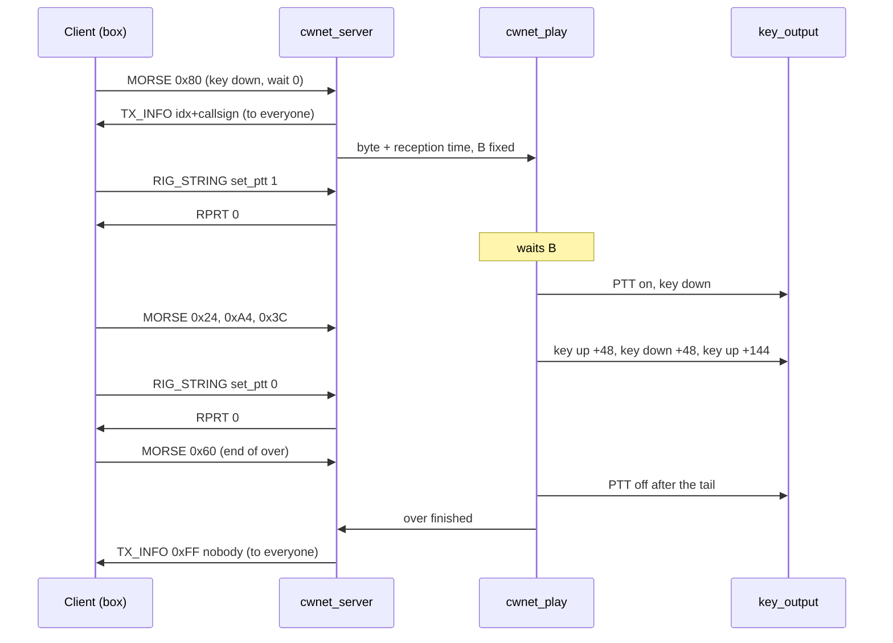
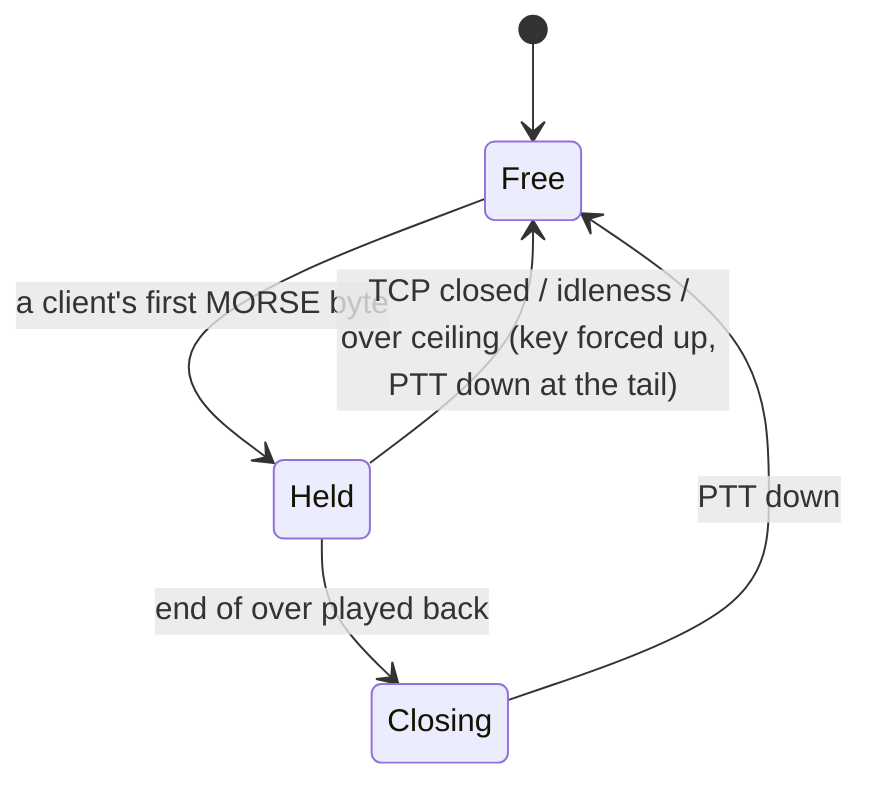

# CWNet station daemon - Plan

## Goal Capsule

- **Objective.** The OM keying remotely reaches the station rig's key through a server of ours: their keying comes out with the timing they sent, the PTT follows that keying, and every connected client knows who is on the key.
- **Means.** A C daemon on a Linux or Mac PC, with the server core pure and host-testable on top of the `keyer_cwnet` codec (KTD1, KTD2).
- **Authority.** [STRATEGY.md](../../STRATEGY.md), Positioning and the "CWNet, both ends" track; the Decision [#60](https://github.com/iu3qez/RemoteCWKeyer-esp32/issues/60); the Work [#64](https://github.com/iu3qez/RemoteCWKeyer-esp32/issues/64). On the wire bytes, the 2026-09-05 capture of the DL4YHF client decides (`test_host/cwnet_fixtures.h`); the reference source says what to look at, not what is true.
- **Execution profile.** C11 code on host, proven by the `test_host` suite in CI in both variants. The bench step with the box (R18) is run by the maintainer, not by CI.
- **Stop conditions.** A `blocking` issue covering this work: today none ([#65](https://github.com/iu3qez/RemoteCWKeyer-esp32/issues/65) blocks only the GUI, outside this plan). Evidence that a session decision does not hold: stop and report it, do not work around it.
- **Tail ownership.** The PR closes [#64](https://github.com/iu3qez/RemoteCWKeyer-esp32/issues/64) only for the host part of its condition; the bench step stays open on the issue until the maintainer runs it and writes it up.

---

## Product Contract

### Summary

A C program, `cwnetd`, that listens on the CWNet port and serves as server to whoever connects: echo of the CONNECT with full permissions, PING as initiator, announcement of who holds the key, playback of the received MORSE after a buffer sized on the measured latency, PTT derived from the played-back keying, key arbitration across multiple clients. The server core lives in `components/keyer_cwnet/` as a pure state machine, driven by callbacks like the client, and the host suite makes it talk to the DL4YHF client capture, pinning the bytes it sends. Around the core: a POSIX layer shareable with the host client, a virtual output for key and PTT, status lines on stdout.

### Problem Frame

The station side has no server of ours. Only `tools/cwnet/cwnet_echo.py` exists, a Python echo for the bench loop: it does not key anything and carries no policy. The DL4YHF program in server mode carries its own policy, read in its source and recorded in [#60](https://github.com/iu3qez/RemoteCWKeyer-esp32/issues/60): PTT held 500 ms, key ceded on a 1 s timer that oscillates during the over, `set_ptt` applied on arrival. The maintainer decided that both ends are ours and the policies are decided once.

### Key Decisions

- **The server is a daemon on the station PC, in C, in this repo.** *(session-settled: user-directed - chosen over the server on the box, recommendation 2 of #60, and over the client alone: station policies do not enter the box's RT path.)* Governs R1, R17.
- **The DL4YHF program is the wire's reference, not the product's.** *(session-settled: user-directed - chosen over copying its station policies: they are debatable and both ends are ours.)* Governs R6, R7, R8, R9, R10.
- **Anyone can connect and key; what matters is knowing who is transmitting.** *(session-settled: user-directed - chosen over the reference's user list with permissions: «it has to be as simple as in the reference, what matters is knowing WHO is transmitting».)* Governs R2, R3, R5.
- **One repo, for now.** *(session-settled: user-approved - chosen over a repo of its own for the daemon: what the two ends share is knowledge of the wire, and that lives here.)* Governs R17.
- **Past 1000 ms of peak-hold the link is unfit: fast turnaround after TX comes before covering a slow link.** *(session-settled: user-directed - chosen over a high ceiling at 1500 ms and over no ceiling: with two seconds of buffer the correspondent is already replying by the time PTT drops, and turnaround slowness after TX is the main complaint users make about the original program.)* Governs R7, R12.
- **No GUI in this plan.** The GUI is Decision [#65](https://github.com/iu3qez/RemoteCWKeyer-esp32/issues/65), `blocking` for the GUI alone. Status comes out on stdout so the page option stays open. Governs R12.
- **No audio, CI-V or spectrum inside CWNet; no box acting as server.** Boundaries from STRATEGY.md. Governs R15.

### Actors

- A1. **The remote OM**: the box's client today, the host client of [#68](https://github.com/iu3qez/RemoteCWKeyer-esp32/issues/68) tomorrow. Sends CONNECT, MORSE, `set_ptt`; answers PINGs; reads TX_INFO.
- A2. **The station**: the PC running the daemon, the rig, the operator reading stdout.
- A3. **The tester**: runs the bench loop without the box and with the box, reads the status lines and the virtual output.

### Key Flows

- F1. **Connection.** A1 opens the TCP and sends the CONNECT. The daemon sends the echo with the permissions, the welcome PRINT and the current TX_INFO, then the PING starts every 2 s. A1 is READY at the echo. Covered by R1, R2, R3, R4.
- F2. **An over.** A1's first MORSE byte takes the key if it is free; TX_INFO to everyone. The bytes enter the holder's FIFO with the reception time. Playback starts at the first byte, delayed by buffer B, and plays back the encoded waits. PTT rises at the first played-back key-down and falls at the tail after the last played-back key-up. The played-back end-of-over marker and PTT having fallen release the key; TX_INFO «nobody» to everyone. Covered by R6, R7, R9.
- F3. **Two clients.** MORSE from whoever does not hold the key is silently dropped, no announcement. When the holder releases, the next byte from anyone takes the key. Covered by R6.
- F4. **Drop mid-over.** The holder's TCP closes, or nothing more arrives: the key releases with key forced up and PTT down after the tail; TX_INFO «nobody». Covered by R6, R16.
- F5. **Jitter.** A byte arrives late past its own deadline: the element in progress stretches, the delay is counted. If the key is down and nothing arrives, nothing happens: that is tuning. Release comes when the PINGs declare the client dead (R16), and then key up, fault line and PTT down at the tail. Covered by R8, R16.

### Requirements

**Connection and protocol**

- R1. The daemon listens on a TCP port, default 7355, and serves multiple clients at once (default 4); a connection past the limit is accepted and closed immediately, without blocking the accept.
- R2. On a valid CONNECT it replies with the 92-byte echo with the permissions field set to TALK, TRANSMIT and CTRL_RIG (0x07), then a welcome PRINT, then the TX_INFO of the current state. A CONNECT of a different length closes the connection.
- R3. Every change of key holder is announced to all clients with a TX_INFO: client index byte (from 1) and callsign with NUL; index 0xFF and `-- nobody --` when free; `NoCall #n` when the callsign in the CONNECT is empty. The bytes match `ref_tx_info_moritz` and `ref_tx_info_nobody`.
- R4. The daemon is the initiator of the PING toward each client every 2 s: REQUEST with `t0` from its 31-bit clock and id equal to the client's index; on RESPONSE_1 it replies with the RESPONSE_2 carrying `t2`. Latency is `t2 - t0`; a value outside 0..2000 ms is dropped, neither latency nor peak-hold see it; peak-hold rises immediately and decays by a tenth of the gap, like the reference.
- R5. Every radio control string 0x06 gets a reply: `set_ptt 0|1` gets `RPRT 0`; any other string gets a negative code. No string is applied (R10).

**Key, playback, PTT**

- R6. The first MORSE byte while the key is free takes it; MORSE from other clients is silently dropped. The key stays with the holder for the whole over and releases when the end-of-over marker has been played back and PTT has fallen. Safety nets, each with release, key forced up and PTT down at the tail: the holder's TCP closing; the holder declared dead by the PINGs (R16); no byte for an idle time **with the key up** (default 5 s); an over longer than a ceiling (default 120 s). Idleness does not touch a key that is down: there the PING decides (R8).
- R7. Playback starts at the first byte of an over, delayed by B; B is the holder's peak-hold above a floor (default 100 ms), fixed at the moment it takes the key and unchanged for the over. The fitness ceiling is 1000 ms: a client whose peak-hold exceeds it when it sends the first MORSE byte does not take the key and is not played back; it gets a PRINT saying the link is unfit and the measured value, and stdout writes a line. Every edge comes out after the wait encoded in the byte, with no error accumulation; a wait split across several bytes with the same state comes out as consecutive waits.
- R8. Every byte arrives B ms before its own deadline, so an empty FIFO at an edge's deadline is the normal state: the applied state stays. A byte that arrives after its own deadline is applied immediately, the element in progress stretches by the delay and the delay is counted. A key down with no byte arriving **is not a fault and has no deadline**: it is what you see when the operator holds the key down, which happens at every tuneup and, at low power, must happen. Whether the client is still there is told by the PING, which the program answers and not the operator's hand: as long as it answers, the key stays as it was left. When the PINGs declare it dead (R16) the key releases with key up and PTT down at the tail, and that is the fault. Silence in the keying is never the signal: it is indistinguishable between someone holding down and someone who dropped, and the PING is what tells those two apart. A byte with the same state as the one already applied produces no edge.
- R9. PTT rises with the first played-back key-down, advanced by a configurable lead (default 0 ms, never past B), and falls a tail after the last played-back key-up (default 100 ms, the box's value). Every key release lowers it at the latest at the tail.
- R10. The client's `set_ptt` strings do not move the PTT.

**Outputs and status**

- R11. Key and PTT go through an output interface with a virtual backend that writes every edge as a line with the instant in ms on a descriptor of its own (file or stderr) that never drops, separate from the status lines. The physical transport is outside this plan (Scope Boundaries).
- R12. Status comes out on stdout as lines: connection and disconnection with callsign and address, holder change, latency and peak-hold per client, PTT, fault, B chosen at each over. Strings coming from the client come out with control bytes and escape sequences stripped; a stdout that does not drain does not stop the loop.
- R13. Configuration is from the command line with defaults equal to the reference or the box: listen address (default all IPv4 interfaces, the trust boundary is the LAN or the VPN; IPv6 out of scope) and port, max clients, B's floor and the link's fitness ceiling, PTT tail and lead, over idleness and ceiling, handshake timeout, ceiling on unsent bytes per client (default 16 KiB), output backend and edge descriptor.

**Robustness**

- R14. The frame parser fully consumes a fragmented frame whose declared length exceeds the internal buffer, stays in sync and returns it with a «skipped» state, null payload and zero length: never a pointer with a length past the buffer, never an error that loses framing. Holds on the box too.
- R15. Unhandled commands (CI-V, spectrum, audio) are ignored; a parse error closes the client's connection.
- R16. A client that does not answer three consecutive PINGs is closed; a client that does not complete the CONNECT within the handshake timeout (default 5 s) is closed.

**Build, CI, bench**

- R17. The daemon builds with CMake on Linux and macOS with the same strict flags as `test_host`; CI builds the daemon on Ubuntu and macOS and runs the core tests in both variants of the host suite.
- R18. The daemon completes an over with the box's client in the bench loop, with `tools/cwnet/keyer_sim.c` as the stimulus, following a procedure written in the README of `tools/cwnet/`.

### Acceptance Examples

- AE1. Covers R2. **Given** a CONNECT with username `Moritz`, callsign `Moritz`, permissions 0. **When** the core receives it. **Then** the first bytes sent are `ref_connect_echo`, then a PRINT frame, then `ref_tx_info_nobody`.
- AE2. Covers R6, R7, R9, F2. **Given** a READY client, B = 50 ms, tail 100 ms, simulated clock. **When** it receives the bytes of `ref_first_over` (session 12, the letter A at 25 WPM). **Then** the virtual output receives key-down at t+50, key-up at +48, key-down at +48, key-up at +144; PTT rises with the first key-down and falls 100 ms after the last key-up; `RPRT 0` comes out twice; `ref_tx_info_moritz` comes out at the first MORSE byte and `ref_tx_info_nobody` after release.
- AE3. Covers R6, F3. **Given** two READY clients, the first holding the key. **When** the second sends a MORSE byte. **Then** no edge comes out for that byte and no TX_INFO.
- AE4. Covers R4. **Given** a READY client at instant t0. **When** 2 s pass. **Then** a REQUEST `[0, idx, 0, 0, t0, 0, 0]` comes out; on RESPONSE_1 `[1, idx, 0, 0, t0, t1, 0]` a `[2, idx, 0, 0, t0, t1, t2]` comes out and latency is `t2 - t0`.
- AE5. Covers R6, F4. **Given** the holder mid-over with key down played back. **When** its TCP closes. **Then** the key goes up, PTT falls after the tail, `ref_tx_info_nobody` comes out to everyone else.
- AE6. Covers R8, F5, R16. **Given** a played-back key-down and an empty FIFO. **When** ten seconds pass with no MORSE byte but the client answers the PINGs. **Then** the key stays down, no fault, and on the key-up's arrival the element comes out as long as it was held. **Given** the same key-down. **When** the client stops answering and the PINGs declare it dead. **Then** the key releases, the key goes up and PTT falls at the tail. **Given** the same key-down. **When** the key-up arrives 30 ms after its own deadline. **Then** the key goes up on arrival, with no fault, and the 30 ms delay is counted.
- AE8. Covers R7, R12. **Given** a READY client with peak-hold at 1200 ms and the key free. **When** it sends the first MORSE byte. **Then** no edge comes out, the key stays free and no TX_INFO comes out; the client gets a PRINT with «link not fit» and the value; stdout writes a line for it.
- AE9. Covers R7, R8. **Given** a READY client, B = 100 ms, simulated clock. **When** every byte of `ref_first_over` enters the FIFO at its own reception instant, i.e. its edge plus a simulated one-way latency of 30 ms, not all at once. **Then** the edges come out at the same intervals as AE2, no byte late, no fault.
- AE7. Covers R14. **Given** a long frame with declared length 300 delivered in two fragments, followed by a PING. **When** the parser receives them. **Then** the first comes out with «skipped» state, null payload and zero length; the PING comes out intact; under ASan no read outside the buffer.

### Success Criteria

- The host suite pins the daemon's bytes where the client looks at them: CONNECT echo, TX_INFO, PING, `RPRT`.
- The loop without the box closes: a test client in Python sends `ref_first_over` to the daemon and the virtual output shows the expected edges.
- The gap between the edge instants on the virtual output and the encoded waits is measured on Mac and Linux and written in the README, without claiming a metric.
- The turnaround time after TX, from the client's last key-up to PTT down at the station (B plus the tail), is written in the README next to the jitter: it is the quantity that users of the original program criticize.

### Scope Boundaries

- No GUI: Decision [#65](https://github.com/iu3qez/RemoteCWKeyer-esp32/issues/65).
- No local server operator (index 0, the reference's «The Sysop»).
- No relaying of MORSE to other clients: the reference does not do it either (H6 disproved on 2026-09-05).
- No HTTP server, no audio, CI-V or spectrum.
- No Windows target for the daemon; the host client of [#68](https://github.com/iu3qez/RemoteCWKeyer-esp32/issues/68) shares only its platform layer.
- No user list and no differentiated permissions.

#### Deferred to Follow-Up Work

- **Physical output to the rig** (control lines of a USB serial or other): Decision to be opened, `blocking` for the physical backend alone. The research (Sources) says the FTDI latency timer and USB scheduling dominate the jitter. Two criteria enter the Decision, whatever the transport: the transport's rest state is key up and PTT down even if the daemon dies (SIGKILL, crash), and a ceiling on continuous key-down lives outside the daemon process.
- **Declarative configuration file** alongside the flags, once the parameters grow.
- **systemd and launchd units**: the daemon runs in the foreground and does not fork; the units arrive with the station deploy.
- `tools/cwnet/cwnet_echo.py` announces the username in TX_INFO, the reference announces the callsign: light fix in U7.

### Dependencies / Assumptions

- The `keyer_cwnet` codec builds for host without changes: already true in `test_host/CMakeLists.txt`.
- The 2026-09-05 capture stays the reference for the bytes; the fixtures in `test_host/cwnet_fixtures.h` suffice for AE1-AE5. The client-side CONNECT is reconstructed from the fields, not from a fixture.
- The box client's default port in `parameters.yaml` is 7355 as of 2026-09-08, like the reference.
- The box client becomes READY on the CONNECT echo and keys only with TRANSMIT in the echo (`cwnet_client.c`, `handle_connect_echo` and `cwnet_client_send_key_event`).

### Sources / Research

- DL4YHF reference, read in the published source (`Remote_CW_Keyer_Sources.zip`, sha256 `d960d6b9…`): server-side CONNECT `CwNet.c:1275-1332`; PING `CwNet.c:1339-1526` and cadence `CwNet.c:2236-2262`; TX_INFO `CwNet.c:432-452`, `760-775`, `2389-2394`; MORSE and key take `CwNet.c:2875-2903`; 1 s cession `CwNet.c:346-390`, `3545-3552`; `set_ptt` as manual PTT `CwNet.c:4085-4110`, `KeyerThread.c:2238-2262`; playback with latency delay `KeyerThread.c:2836-2981`, which starts at the first byte and not at the fill threshold described in the comment; PTT tail `KeyerThread.c:2318-2340`; 0..2 s gate on the RTT `CwNet.c:1436-1437`.
- Our client: `components/keyer_cwnet/include/cwnet_client.h` (header comment on the wire), `src/cwnet_client.c` (`handle_ping`, `handle_tx_info`, `handle_morse`, `rx_*`), `src/cwnet_frame.c` (parser, R14's defect), `cwnet_client_on_data` (on parse error skips a byte and retries: an error on long frames would resync inside the payload), `src/cwnet_socket.c` (the box's platform layer, to be redone in POSIX).
- Seed and tools: `tools/cwnet/cwnet_echo.py`, `tools/cwnet/keyer_sim.c`, `tools/cwnet/README.md`.
- Method: [reference-source-as-differential-oracle](../solutions/architecture-patterns/reference-source-as-differential-oracle.md), [differential-oracle-count-is-not-a-gradient](../solutions/architecture-patterns/differential-oracle-count-is-not-a-gradient.md).
- External, for KTD7 and KTD9: `clock_gettime(CLOCK_MONOTONIC)` on macOS 10.12+; `poll()` with timeout at the next deadline and `TCP_NODELAY` (Rigtorp, "Tips for Using the Sockets API"); `SIGPIPE` ignored at process level; no `daemon()` under launchd and systemd; FTDI AN232B-04 on the latency timer; `TIOCMBIS`/`TIOCMBIC` for the control lines; the winsock seam (`SOCKET`, `closesocket`, `ioctlsocket`, `WSAPoll` broken before Windows 10 2004).

---

## Planning Contract

### Key Technical Decisions

- KTD1. **Server core as a pure state machine in `keyer_cwnet`.** `cwnet_server.[ch]` owns the playback engine (U4), advances it in its own `poll` and exposes the next deadline; the daemon talks only to the server. It touches neither sockets nor the clock: it receives bytes per client via `on_data`, time via a callback, and sends via a per-client callback; events (holder, latency, fault) come out in a result structure, not in logs. *(session-settled: user-approved - chosen over a monolithic daemon: it is the only way to make the core talk to the capture in the host suite, and it mirrors the design of `cwnet_client_t`.)* Governs R1-R6, R15, R16.
- KTD2. **The codec is extended, not copied.** Frame constructors in `cwnet_frame.[ch]`; REQUEST, RESPONSE_2, RTT gate and peak-hold in `cwnet_ping.[ch]`, also used by the client. The gate is a behavior change on the box, today it filters only negatives: it is pinned with a client test. The FIFO of received MORSE bytes, the pop and the end-of-over predicate come out of `cwnet_client.c` and live in `cwnet_play.[ch]`; the client calls them, its tests stay unchanged. `cwnet_server.c` and `cwnet_play.c` stay out of the ESP-IDF component's SRCS: they are host-only and must not pull in `esp_timer` or `RT_*`. Every touch to `keyer_cwnet/` carries a host test that pins the reference (Definition of done). Governs R3, R4, R14.
- KTD3. **Playback as in the reference's code, not in its comment.** Starts at the first byte delayed by B; B fixed at the over. The applied state stays until the next byte arrives, because the FIFO is empty by construction during an element longer than B; a late byte stretches the element and is counted. The engine never raises the key on its own: a key down with no byte is tuning, not a fault, and silence in the keying does not distinguish someone holding down from someone who dropped. That distinction is made by the PING, which the program answers and not the hand, and release comes from there (R16) or from the over's ceiling. *(session-settled: user-directed - chosen over a grace period on keying silence: at low power holding the key down is procedure, and half a second would have cut it off. The real ceiling on continuous key-down lives outside the process, in the Decision on the physical output.)* «corrupted CW timing is worse than silence» (ARCHITECTURE.md 8.1) stays and applies to the played-back timing. Engine in its own module, `cwnet_play.[ch]`, with an injected clock. Governs R7, R8.
- KTD4. **Key held for the over, with safety nets.** Release at played-back end of over and PTT down; idleness, ceiling and TCP close force the release. The reference's 1 s timer, which oscillates the announcement, is not copied. Governs R6.
- KTD5. **PTT from the played-back keying.** Tail equal to the box's, optional lead possible because the edge is known B ms ahead; `set_ptt` only acknowledged. *(session-settled: user-approved - chosen over the reference's apply-on-arrival: misaligned from playback, and a client that dies leaves the station in TX.)* Governs R9, R10.
- KTD6. **Fixed 0x07 permissions in the echo.** No user list; empty callsign announced as `NoCall #n`. Instantiates the Key Decision "anyone can". Governs R2, R3, R5.
- KTD7. **One thread, absolute deadlines.** `poll()` on the sockets with timeout at the next playback deadline; `CLOCK_MONOTONIC`; `TCP_NODELAY`; `SIGPIPE` ignored; foreground, no fork; non-blocking stdout with line dropping when the reader does not drain; deadlines in ms at 64 bit, the 31 bits stay on the wire. Load-bearing external research (Sources). Governs R1, R7, R12.
- KTD8. **`host/` directory for the host programs, shared platform layer.** `host/platform/` (socket, clock) written to be reused by the host client of [#68](https://github.com/iu3qez/RemoteCWKeyer-esp32/issues/68), with the winsock seam in the function names; `host/cwnetd/` the daemon; `host/CMakeLists.txt` the build. *(session-settled: user-approved - chosen over `tools/cwnet/`: the bench is a tool, the daemon is a product.)* Governs R1, R17.
- KTD9. **Key and PTT output behind an interface.** A structure of functions with a virtual backend on a descriptor of its own, never dropped, so the jitter measurement loses no edges; the physical backend arrives with its own Decision. Governs R11.
- KTD10. **The core does not log.** No `RT_*` or `log_stream` in the server core and the playback engine: events return to the caller, the daemon prints them. The daemon does not link `cwnet_client.c`. Governs R12.
- KTD11. **The parser hardens in place, without losing framing.** `cwnet_frame.c` consumes the fragmented frame past the buffer and returns it «skipped»; the error stays reserved to category 11. An error would make the box client lose framing, since it resyncs by skipping a byte and would read the payload as a frame. No codec fork for the daemon. Governs R14, R15.
- KTD12. **Configuration from flags.** Defaults from the reference and the box; the file arrives when needed. Governs R13.
- KTD13. **CI: one job for `host/`.** Build on `ubuntu-latest` and `macos-latest` plus a loopback test; the core tests stay in the existing host suite. Governs R17.

### High-Level Technical Design

Components and who owns what:


An over, from the first byte to release:



Key states in the server:



Pseudo-schema of the playback engine, directional:

```text
at the first byte of an over: deadline = reception + B; pending_state = bit7
at every deadline reached:
  apply pending_state to the output (no edge if the state does not change); update PTT
  if FIFO empty: the state stays; last_edge = deadline; wait for the next byte
  next byte -> deadline += decoded_wait; pending_state = bit7
on arrival of a byte whose deadline has already passed: apply it immediately, count the delay (R8)
a key down with no byte has no deadline: the PING releases the key (R8, R16)
end of over = two consecutive played-back key-ups
```

### Output Structure

```text
host/
  CMakeLists.txt            # build of the daemon and the loopback test, test_host flags
  CLAUDE.md                 # module brief (regenerable with map-tree)
  platform/
    sock.h  sock.c          # listen/accept/nonblocking/send/recv/close, poll; winsock seam in the names
    clock.h clock.c         # 31-bit and us monotonic ms
  cwnetd/
    main.c                  # flags, poll loop, wiring core+play+output, stdout
    key_output.h key_output.c   # interface + virtual backend
    README.md               # usage, loop without the box, jitter measurement
  tests/
    loopback_test.c         # local end-to-end connection with fixture bytes
components/keyer_cwnet/
  include/cwnet_frame.h   src/cwnet_frame.c       # constructors, skipping parser (U1)
  include/cwnet_ping.h    src/cwnet_ping.c        # REQUEST, RESPONSE_2, gate, peak-hold (U2)
  include/cwnet_server.h  src/cwnet_server.c
  include/cwnet_play.h    src/cwnet_play.c
test_host/
  test_cwnet_frame_parser.c  test_cwnet_ping.c   # extended
  test_cwnet_server.c  test_cwnet_play.c
tools/cwnet/
  cwnet_send.py             # test client: CONNECT, PING, MORSE bytes from a fixture
```

### Assumptions

- B's floor, default 100 ms, is ours: the reference starts from 250 ms configured (`CwNet.c:164`) and uses 50 ms only as a minimum for local tests; 100 ms covers the jitter of a home router (5..47 ms in the reference's measurement) without weighing on the turnaround after TX. The 1000 ms fitness ceiling is a Key Decision of the maintainer, not an anti-poisoning measure: for that the 0..2000 ms gate on the RTT and the peak-hold suffice. Both are flags.
- Three PINGs without a reply (6 s) close the client: the reference has no timeout; without one, a half-open TCP holds the key until idleness kicks in.
- The negative codes for 0x06 strings other than `set_ptt` are chosen at implementation time from the reference's code table (`HamlibResultCodes.h` is not in the archive; the values used in `CwNet.c` are).

### Sequencing

Phase A (codec, all in the host suite): U1, U2 and U4 in parallel; U3 after all three. Phase B (host program): U5 in parallel with phase A; U6 after U3 and U5; U7 and U8 after U6.

### System-Wide Impact

- `components/keyer_cwnet/src/cwnet_frame.c` and `cwnet_ping.c` also run on the box, on Core 1, inside `cwnet_client.c` via `cwnet_socket.c` and `main/bg_task.c`. The constructors do not change a byte on the wire; the parser changes behavior only on fragmented frames past the buffer (R14) and the RTT gate is new for the client (KTD2). Both are pinned in the client's existing tests plus two new scenarios (U1, U2).
- The client's peak-hold feeds only diagnostics: `cwnet_socket_get_latency_peak_ms` read by `keyer_webui/src/api_system.c` and by `bg_task.c`. The extraction in `cwnet_ping.c` keeps the calculation's whole shape.
- `components/keyer_cwnet/CMakeLists.txt` lists the SRCS explicitly: the two new files do not go in it (KTD2). `test_host/CMakeLists.txt` and `test_main.c` are updated by hand (U3, U4). `host/CMakeLists.txt` compiles the shared sources without `test_host/stubs/`.
- No cycle: `cwnet_server` uses `cwnet_frame` and `cwnet_ping`; `cwnet_play` uses `cwnet_timestamp`; the server calls the engine, events return by value. `test_host` links client and server in the same binary: the new symbols in `cwnet_ping.c` must not collide with the client's.
- CI: the existing `host-tests.yml` job covers U1-U4; `firmware-build.yml` builds `keyer_cwnet` with the component's flags and catches a file unwelcome to ESP-IDF; the new `host-build` job needs neither the submodule nor the deploy key (U8).
- Documentation: `CLAUDE.md` module map, `host/CLAUDE.md`, `components/keyer_cwnet/CLAUDE.md` for the two new modules and the parser's «skipped» state, `tools/cwnet/README.md` for `cwnet_send.py`.

### Risks & Dependencies

| Risk | Where it bites | In the plan |
|---|---|---|
| The hardened parser desyncs the box client | `cwnet_client_on_data` skips a byte on error and would read the payload as a frame | R14 and KTD11: the frame is skipped, the error stays in the reserved category; AE7 pins it with a PING after the skipped frame |
| Jitter of the `poll()` loop against 20-48 ms dots | `host/cwnetd/main.c` | Measured and written (Success Criteria, U7); no threshold claimed; the physical backend will have its own USB jitter on top |
| stdout that does not drain blocks the timing loop | KTD9, U6 | Non-blocking stdout with dropping (KTD7, R12) |
| 31-bit wrap of ms (24.8 days) in the deadlines | U4, U5 | 64-bit deadlines; the 31 bits stay on the PING's wire (KTD7) |
| Hostile RTT or wrap poisons B | U2, R7 | Gate 0..2000 ms; a peak-hold past 1000 ms does not inflate B, it makes the link unfit until it drops |
| RESPONSE_1 with someone else's id shifts another client's peak-hold | R4, U3 | Peak-hold tied to the connection the reply arrives on; id and `t0` different from the pending request ignored (U3) |
| Untrusted peer: flood, handshake left half-done, slow reader, strings without NUL, escapes on stdout | U3, U5, U6 | Accept and close past the limit (R1); handshake timeout (R16); ceiling on unsent bytes per client with closure (U6); no string function on raw bytes, NUL required in the payload (U3); sanitization before stdout (R12) |
| `cwnet_send.py` is ours: it tests the daemon against our own idea of the wire | U6, U7 | The daemon's bytes are pinned on the capture's fixtures (AE1-AE5); the loop without the box is a smoke test, the step with the box (R18) is the proof |
| The bench step needs the hardware and sits outside CI | R18 | Tail ownership: #64 stays open until it is run |
| The daemon dies with the key down | physical backend, outside the plan | Criteria written in the Decision on the physical output (Deferred) |

---

## Implementation Units

### U1. Frame constructors and hardened parser

- **Goal.** `cwnet_frame` builds the frames the server sends and rejects fragmented frames past the buffer.
- **Requirements.** R3, R14 (KTD2, KTD11).
- **Dependencies.** None.
- **Files.** `components/keyer_cwnet/include/cwnet_frame.h`, `components/keyer_cwnet/src/cwnet_frame.c`, `test_host/test_cwnet_frame_parser.c`; `components/keyer_cwnet/src/cwnet_client.c` to use the constructors instead of inline composition.
- **Approach.**
  1. A constructor that writes command, category from the length (0, short, long) and payload into a caller buffer, with the length written.
  2. In the parser, when a fragmented frame declares more than the internal buffer, the bytes are consumed up to the declared length and the frame comes out with a «skipped» state, null payload; the error stays in the reserved category; the "all in the input buffer" branch stays copy-free.
  3. The client replaces `make_cmd_byte` and the inline compositions with the constructor, without changing a byte on the wire.
- **Patterns to follow.** `cwnet_client.c`, `send_connect` and `send_rig_string`, for the NUL-terminated payload; the fixtures in `test_host/cwnet_fixtures.h` for the expected bytes.
- **Test scenarios.**
  - The constructor with an empty payload produces only the command byte; with 92 bytes it produces `0x41 0x5C` and the payload; with 300 bytes it produces the long category and little-endian length.
  - The constructor with too small a buffer rejects without writing.
  - Covers AE7. A long frame with declared length 300 in two fragments, followed by a PING: the first comes out «skipped» with null payload and zero length and a consistent `bytes_consumed`, the PING comes out intact, no read outside the buffer under ASan.
  - A frame of exactly 256 bytes fragmented: still valid with the payload copied.
  - A long frame of 65535 bytes delivered in a single read: valid, pointer into the input buffer, no copy.
  - Reserved category: still an error; the existing client resyncs as it does today.
  - The client's existing tests pass unchanged after the constructor substitution (`test_client_tx_first_over_with_ptt_matches_reference_capture_whole`).
- **Verification.** Host suite green in both variants; test AE7 fails before the parser change and passes after.

### U2. PING as initiator and shared peak-hold

- **Goal.** `cwnet_ping` builds REQUEST and RESPONSE_2, filters the RTT and updates the peak-hold for client and server.
- **Requirements.** R4 (KTD2).
- **Dependencies.** None.
- **Files.** `components/keyer_cwnet/include/cwnet_ping.h`, `components/keyer_cwnet/src/cwnet_ping.c`, `test_host/test_cwnet_ping.c`, `components/keyer_cwnet/src/cwnet_client.c` (`handle_ping` uses the shared function).
- **Approach.**
  1. REQUEST constructor: type 0, id, `t0`, slots 1 and 2 at zero.
  2. RESPONSE_2 constructor from the RESPONSE_1: type 2, id and `t0`, `t1` copied, `t2` from the caller.
  3. Peak-hold function on a value by reference, with the 0..2000 ms gate in front that also discards the instantaneous latency; the client calls it in place of its four lines: it is a change on the box, stated in the PR.
- **Patterns to follow.** Payload layout in `cwnet_ping.h`; the REQUEST of `tools/cwnet/cwnet_echo.py`; `CwNet.c:2249-2258` and `:1436-1447` for the bytes and the gate.
- **Test scenarios.**
  - Covers AE4. REQUEST with id 1 and known t0: 16 bytes expected; RESPONSE_2 built from a RESPONSE_1: `t0` and `t1` intact, `t2` written.
  - Peak-hold: 100 then 200 rises to 200; then 100 falls to 190; then 185 stays 190 (gap under 10 ms).
  - Gate: RTT 2001 and negative RTT (31-bit wrap between `t0` and `t2`) touch neither the latency nor the peak-hold, in the client as in the server.
  - The client's latency tests pass unchanged (`test_client_latency_peak_holds_and_decays_like_the_reference`).
- **Verification.** Host suite green in both variants.

### U3. Server core

- **Goal.** `cwnet_server` takes a client from CONNECT to READY, announces the holder, arbitrates the key, answers the PINGs and the radio control strings, delivers the holder's MORSE to the playback engine.
- **Requirements.** R1 (client table), R2, R3, R4, R5, R6 (take and safety nets), R15, R16 (KTD1, KTD4, KTD6, KTD10).
- **Dependencies.** U1, U2, U4.
- **Files.** `components/keyer_cwnet/include/cwnet_server.h`, `components/keyer_cwnet/src/cwnet_server.c`, `test_host/test_cwnet_server.c`, `test_host/CMakeLists.txt`, `test_host/test_main.c`; `components/keyer_cwnet/CMakeLists.txt` stays without the new file, with a comment saying why (KTD2).
- **Approach.**
  1. Static client table with index from 1, state (accepted, confirmed), callsign, frame parser, PING timer, peak-hold.
  2. Injected callbacks: send to a client, time in ms; a per-pass result structure with the events (holder changed, latency, client closed, fault).
  3. `on_connected`, `on_data`, `on_disconnected` per client and a `poll(now)` that does the PINGs, the timeouts, advances the playback engine and the release; `next_deadline()` returns the first of PING, timeout and next edge, for the daemon's `poll()` timeout.
  4. The key: taken at the first MORSE byte if free and if the client's peak-hold does not exceed the fitness ceiling (R7); the holder's bytes go to the playback engine (U4) with the time; others are dropped; release comes from the engine (over finished and PTT down) or from the safety nets.
  5. TX_INFO to all confirmed clients on every change, with the bytes from R3.
  6. Peer bytes never treated as C strings: the CONNECT fields are copied for 44 bytes and terminated, the 0x06 string must have the NUL inside `payload_len` or the client is closed; the PING goes through `cwnet_ping_parse`, which rejects the wrong lengths.
  7. RESPONSE_1 only counts if id and `t0` match the pending request of that connection; the peak-hold belongs to the connection, not the id.
  8. Past the client limit: accept and close; without a CONNECT within the handshake timeout: close.
- **Patterns to follow.** `cwnet_client.h` for the shape of the API and the context; `test_cwnet_client.c:22-94` for the fake callbacks; `CwNet.c:1275-1332` and `:2875-2903` for the reference's behavior on the bytes.
- **Execution note.** First the test that feeds the CONNECT and compares the echo with `ref_connect_echo`; then the rest.
- **Test scenarios.**
  - Covers AE1. CONNECT from `Moritz`: echo equal to `ref_connect_echo`, then PRINT, then `ref_tx_info_nobody`.
  - CONNECT of 91 bytes: connection closed, no byte sent.
  - Empty callsign: TX_INFO with `NoCall #1`.
  - Covers AE3. Two clients, the second sends MORSE: no byte to the engine, no TX_INFO.
  - Covers AE8. Client's peak-hold at 1200 ms on the first MORSE byte: key not taken, PRINT «link not fit» to the client, no edge; at 900 ms the key is taken and B is 900.
  - Covers AE4. At t+2000 the REQUEST comes out; RESPONSE_1 → RESPONSE_2 and latency updated; three REQUESTs without a reply close the client.
  - `set_ptt 1` → `RPRT 0`; unknown string → negative code; no PTT event.
  - CI-V and spectrum frames ignored; byte with reserved category → client closed.
  - The holder disconnects: release, TX_INFO nobody to the others.
  - No byte for 5 s with the over open: forced release with a fault event.
  - CONNECT received in one-byte fragments.
  - CONNECT with the two 44-byte fields without NUL: no read outside the payload under ASan, TX_INFO with the name truncated and terminated.
  - 0x06 string of 64 bytes without NUL: client closed, no read outside the buffer.
  - RESPONSE_1 with another client's id or a different `t0`: ignored, peak-hold unchanged.
  - Fifth client with a limit of 4: accepted and closed, the other four intact.
  - One CONNECT byte then silence for the handshake timeout: client closed.
  - MORSE frame of 65535 bytes from the holder: the first 128 enter the engine, the rest is counted as dropped.
- **Verification.** Host suite green in both variants; every expected byte comes from a fixture or from the cited reference's layout.

### U4. Playback engine and PTT

- **Goal.** `cwnet_play` turns the holder's MORSE bytes into key and PTT edges at the right instants, with buffer B, and signals end of over, underrun and release.
- **Requirements.** R7, R8, R9, R10 (KTD3, KTD5, KTD10).
- **Dependencies.** None on code (uses `cwnet_timestamp`); U3 consumes it.
- **Files.** `components/keyer_cwnet/include/cwnet_play.h`, `components/keyer_cwnet/src/cwnet_play.c`, `test_host/test_cwnet_play.c`, `test_host/CMakeLists.txt`, `test_host/test_main.c`; `components/keyer_cwnet/include/cwnet_client.h` and `src/cwnet_client.c` to use the extracted FIFO (tests in `test_host/test_cwnet_client.c` unchanged); `components/keyer_cwnet/CMakeLists.txt` stays without the new file (KTD2).
- **Approach.**
  1. The 128-byte FIFO with reception time, `rx_pop`, the buffered ms and the end-of-over predicate come out of `cwnet_client.c` and become the engine's core; the client calls them through the new module (KTD2). Overflow dropped and counted.
  2. `start_over(B)` fixes the buffer; `push(byte, now)`; `next_deadline()` returns the instant of the next edge; `tick(now)` applies the due edges and returns the events: key edge, PTT up/down, end of over, byte delay, over finished. The engine has no fault event of its own: it never raises the key on its own.
  3. High-Level Technical Design's schema: the deadline advances by the encoded waits, never by measured time; instants and deadlines in ms at 64 bit, no wrap.
  4. PTT: up at the first key-down minus the lead; down after the tail from the last key-up; `force_release()` for U3's safety nets with key up and PTT down at the tail.
- **Patterns to follow.** `cwnet_client.c`, `rx_pop` and `rx_has_end_of_over`; `KeyerThread.c:2887-2960` for the initial delay and the advance; `components/keyer_audio/src/ptt.c` for the tail.
- **Execution note.** Test-first with a simulated clock: each scenario is a list of incoming bytes with their instants and a list of expected edges.
- **Test scenarios.**
  - Covers AE2. `ref_first_over` (only the MORSE frames via `ref_morse_frames`) with B = 50: edges at +50, +98, +146, +290; PTT up at +50 and down at +390; end of over at byte `0x60`.
  - Covers AE9. The same bytes delivered one at a time at their own reception instant (edge plus 30 ms), B = 100: same intervals, delay counter at zero, no fault. This is the test that tells R8's rule apart from "empty FIFO = underrun".
  - Split wait (`0xFF 0xEA` from case C of `keyer_sim.c`): a single edge after the sum of the waits.
  - Covers AE6. A played-back key-down and ten seconds with no byte while the PINGs answer: the key stays down, no fault, and the late key-up closes the element as long as it was held. The release with the key down belongs to the server, when the PINGs declare the client dead.
  - Covers AE6. Key-up arriving 30 ms after its own deadline: edge on arrival, delay counted, no fault.
  - Element of 144 ms with B = 50 and bytes arriving at their own instant: no spurious edge, no fault (the FIFO is empty at the key-down's deadline and this is normal).
  - Lead of 20 ms with B = 50: PTT up at +30, key at +50; a lead past B is clamped to B.
  - Full FIFO: byte dropped and counted, no spurious edge.
  - `force_release` with key down: key up immediately, PTT down after the tail, over closed.
  - Two-event frame `ref_two_event_frames` at 20 ms dot: edges at +22 and +40 from the first.
  - The client's RX FIFO tests pass unchanged after the extraction (`test_client_rx_decodes_every_event_of_a_morse_frame`, `test_client_rx_fifo_full_drops_and_counts`).
- **Verification.** Host suite green in both variants; the expected instants are derived by hand from the encoded waits, not from the code.

### U5. POSIX platform layer

- **Goal.** `host/platform` offers non-blocking TCP sockets and a monotonic clock to whatever runs on PC, with names already ready for winsock.
- **Requirements.** R1, R17 (KTD7, KTD8).
- **Dependencies.** None.
- **Files.** `host/CMakeLists.txt`, `host/platform/sock.h`, `host/platform/sock.c`, `host/platform/clock.h`, `host/platform/clock.c`, `host/tests/loopback_test.c`.
- **Approach.**
  1. Opaque handle, `sock_init`/`sock_cleanup` empty on POSIX, `sock_listen`, non-blocking `sock_accept` (`accept` plus `fcntl`, no `accept4`), `sock_send` with partial-send handling, `sock_recv`, `sock_close`, `sock_poll` on top of `poll()`, `sock_last_error`.
  2. `TCP_NODELAY` and `SO_REUSEADDR` on every socket; `SIGPIPE` ignored by the daemon.
  3. `clock_now_ms` at 64 bit from `CLOCK_MONOTONIC`, with a function that derives the wire's 31 bits from it; no `esp_timer` and no `test_host` stub in `host/`'s build.
  4. CMake with `test_host/CMakeLists.txt`'s flags and a test target with `ctest`.
- **Patterns to follow.** `components/keyer_cwnet/src/cwnet_socket.c` for non-blocking connect and partial send; Sources for the winsock seam.
- **Test scenarios.**
  - Loopback: listen on an ephemeral port, connect, send of `ref_connect_echo`, identical reception at the other end.
  - Simulated partial send with a small send buffer: the caller gets the count and resumes.
  - Remote close: `recv` signals end and the poll unblocks.
  - Clock: two readings 10 ms apart differ by 9..12 ms.
- **Verification.** `ctest` green on macOS and Linux; no warning with the strict flags.

### U6. The `cwnetd` daemon

- **Goal.** An executable that ties server, playback, output and platform together in a deadline loop, with flags and status lines.
- **Requirements.** R1, R11, R12, R13, R16 (KTD7, KTD9, KTD10, KTD12).
- **Dependencies.** U3, U4, U5.
- **Files.** `host/cwnetd/main.c`, `host/cwnetd/key_output.h`, `host/cwnetd/key_output.c`, `host/CMakeLists.txt`, `tools/cwnet/cwnet_send.py`.
- **Approach.**
  1. R13's flags with the defaults; `--help` prints them.
  2. Loop: `sock_poll` with timeout at the server's `next_deadline()`; accept, `on_data`, `on_disconnected`; `server.poll(now)`, which also advances the engine; events on stdout as status lines.
  3. Output interface with `set_key(bool, now)` and `set_ptt(bool, now)`; virtual backend writing `key 1 123456` and `ptt 0 123556` to the descriptor chosen by flag (default stderr), blocking and never dropped.
  4. SIGINT and SIGTERM close the clients and release the output; non-blocking stdout, a line that does not fit is dropped and counted.
  6. Ceiling on unsent bytes per client, flag with default 16 KiB (R13): once exceeded, the client is closed without stopping the loop. The client's strings go through a sanitization that strips control bytes and escapes before stdout.
  5. `cwnet_send.py`: test client with stdlib that sends CONNECT, answers the PINGs and sends the bytes of a fixture or a file, printing the TX_INFO and RPRT received.
- **Patterns to follow.** `tools/cwnet/cwnet_echo.py` for the test client and the flags; `cwnet_socket.c` for the socket's state machine.
- **Test scenarios.**
  - Loop without the box: `cwnet_send.py` with `ref_first_over` against the daemon with `--play-floor 50`: the virtual output shows the four edges and the two PTT changes; the client prints `RPRT 0` twice and the two TX_INFOs.
  - Two `cwnet_send.py` together: the second produces no edges.
  - Client closed mid-over: fault line, key up, TX_INFO nobody.
  - SIGINT with a client connected: clean exit, no edge left down.
  - Callsign with `ESC[2J` and control bytes: the stdout line shows them escaped.
  - Client that stops reading: the others get PING and TX_INFO without delay; the slow reader is closed at the ceiling.
- **Verification.** The loop without the box passes by hand on Mac and Linux; the status lines suffice to reconstruct an over with no other tool.

### U7. Bench, measurement and light fixes

- **Goal.** The procedure for the loop with the box is written, the virtual output's jitter is measured, the echo announces the callsign.
- **Requirements.** R18, Success Criteria (KTD3).
- **Dependencies.** U6.
- **Files.** `host/cwnetd/README.md`, `tools/cwnet/README.md`, `tools/cwnet/cwnet_echo.py`, `tools/cwnet/cwnet_send.py`.
- **Approach.**
  1. README: starting the daemon, the box pointing at the PC, `keyer_sim.c` for the expected values, comparison between the virtual output's edges and the encoded waits.
  2. Measurement: `cwnet_send.py` sends a sequence of 100 elements; a script compares the output's instants with the expected ones and writes the mean and max gap in the README, on Mac and Linux.
  3. `cwnet_echo.py` announces the CONNECT's callsign, `NoCall #n` if empty.
- **Test scenarios.**
  - `cwnet_echo.py` with a CONNECT from `Moritz`: TX_INFO equal to `ref_tx_info_moritz` after the first MORSE byte.
  - The gap comparison runs and produces two numbers.
- **Verification.** README with procedure and numbers; the maintainer runs the step with the box and writes it up on [#64](https://github.com/iu3qez/RemoteCWKeyer-esp32/issues/64).

### U8. CI and module map

- **Goal.** CI builds the daemon on Ubuntu and macOS and runs the loopback test; the module map knows `host/`.
- **Requirements.** R17 (KTD13).
- **Dependencies.** U5, U6.
- **Files.** `.github/workflows/host-tests.yml`, `host/CLAUDE.md`, `CLAUDE.md` (module map), `test_host/CLAUDE.md` if the treecode block changes.
- **Approach.**
  1. New `host-build` job with a `ubuntu-latest`, `macos-latest` matrix: configure, build, `ctest` in `host/`; no dependency on the submodule.
  2. The core tests stay in the existing job because they live in `test_host/`.
  3. `host/CLAUDE.md` with `map-tree`; one line in `CLAUDE.md`'s module map.
- **Test scenarios.** Test expectation: none -- CI configuration and documentation; the proof is the green job.
- **Verification.** Both jobs green on the PR.

---

## Verification Contract

| What | Command or gate | Unit | Signal |
|---|---|---|---|
| Host suite, plain | `cd test_host && cmake -B build && cmake --build build && ./build/test_runner` | U1-U4 | all tests green, no test skipped |
| Host suite, sanitizer | `cmake -B build -DCMAKE_C_FLAGS="-fsanitize=address,undefined"` then build and run | U1-U4 | green, AE7 with no ASan report |
| Daemon and loopback | `cmake -S host -B host/build && cmake --build host/build && ctest --test-dir host/build` | U5, U6 | green on macOS and Linux |
| Loop without the box | `host/build/cwnetd` plus `python3 tools/cwnet/cwnet_send.py` with `ref_first_over` | U6, U7 | AE2's edges and PTT on the virtual output |
| CI host | `.github/workflows/host-tests.yml`, existing job and `host-build` | all | green on every push |
| CI firmware | `.github/workflows/firmware-build.yml` | U1, U2 | `keyer_cwnet` builds with the component's flags |
| Bench with the box | procedure in `host/cwnetd/README.md` | U7 | a complete over, written up on #64 |

---

## Definition of Done

- Host tests green in both variants; no test skipped, disabled or quarantined.
- Reference test: `test_cwnet_server.c` pins `ref_connect_echo`, `ref_tx_info_moritz`, `ref_tx_info_nobody` and the PING's layout; `test_cwnet_play.c` pins `ref_first_over`'s edges; `test_cwnet_frame_parser.c` pins the constructors against the fixtures' headers.
- RT path: no change on Core 0. `cwnet_frame.c` and `cwnet_ping.c` change and run on the box on Core 1; the client's existing tests stay green.
- Blocking issues open on this work: none. The Decision on the physical output blocks only the physical backend, outside this plan.
- Per unit: the unit's Verification holds; the listed tests exist with names that say what they pin.
- [#64](https://github.com/iu3qez/RemoteCWKeyer-esp32/issues/64): the host part of the condition is true in the tree; the bench part stays open on the issue until the maintainer runs it.
- Cleanup: no abandoned-attempt code in the diff; `cwnet_echo.py` announces the callsign.
