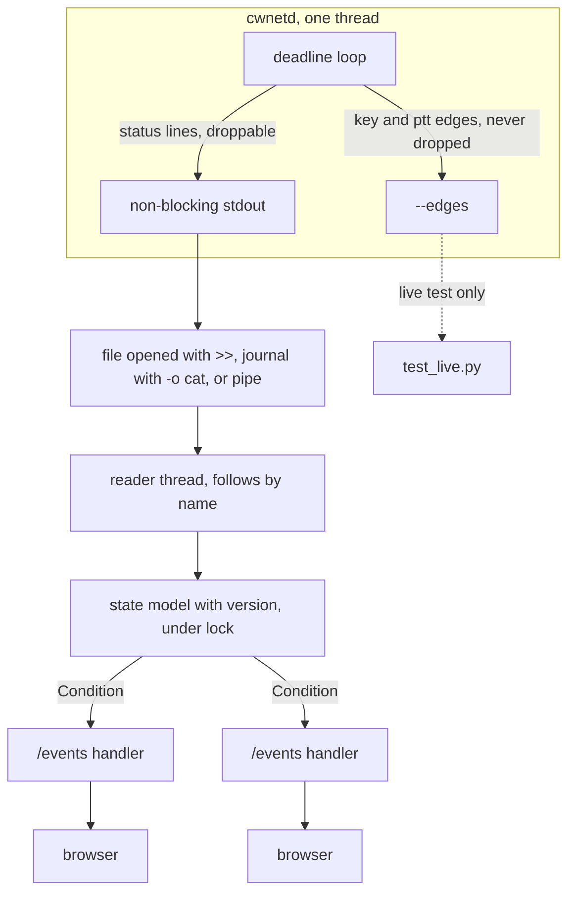
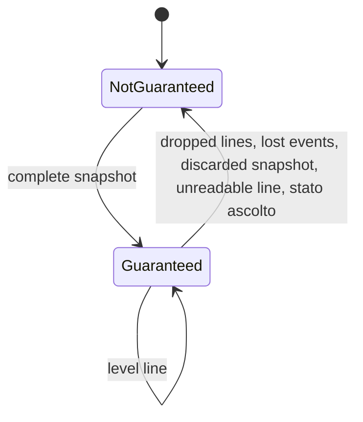

# Station panel for cwnetd - Plan

## Goal Capsule

- **Objective.** Whoever is at the station sees in a browser who is connected, who holds the key, whether PTT is on and which settings the daemon runs with, without following scrolling lines; when the page cannot guarantee what it shows, it says so.
- **Means.** A separate Python program follows the status lines of `cwnetd` and serves the page; the daemon adds only a PTT line and a periodic snapshot (KTD1, KTD2, KTD3).
- **Authority.** The Decision [#65](https://github.com/iu3qez/RemoteCWKeyer-esp32/issues/65), closed on 2026-09-18, and the Work [#86](https://github.com/iu3qez/RemoteCWKeyer-esp32/issues/86). The contract between the two programs is the vocabulary table in `host/cwnetd/README.md`, section "Reading a status line": a line the table does not describe does not exist. [STRATEGY.md](../../STRATEGY.md), track "CWNet, both ends".
- **Execution profile.** C11 on host for `host/cwnetd/main.c`; Python 3.9 or later, standard library only, for `host/panel/`. Proven by `unittest` in CI on Ubuntu and macOS and by a jitter measurement done by hand.
- **Stop conditions.** A `blocking` issue on this work: none today. The snapshot moves the jitter in the A/B comparison of U1, that is, the new binary's mean or max falls outside the spread of the previous binary: stop and report it, do not lengthen the period to hide it. A change that touches `components/`: out of plan. Evidence that a decision taken in session does not hold: stop and report it.
- **Tail ownership.** The PR closes #86 when the convergence test of U5 is green in CI. The jitter measurement is done by the implementer and written in the PR.

---

## Product Contract

### Summary

A Python program in `host/panel/` follows the status lines that `cwnetd` writes on stdout, from a file, from the journal or from a pipe, and serves a read-only page that updates by itself. The page shows clients, key holder, PTT, settings and recent events, and declares when the state is not guaranteed. The daemon adds two kinds of line: the level of the output PTT and a periodic snapshot of the complete state, over several lines. Playback timing, edges and `--edges` do not change.

### Problem Frame

At the station the daemon's state is read by following scrolling lines. To know who holds the key now you have to go back to the last `stato chiave` line that passed. The lines describe events, not levels, and they are droppable by construction: stdout is non-blocking, a line that does not fit is lost, and only the next line confesses it. PTT is not on stdout: it goes only to the `--edges` descriptor. The settings appear once, in the `stato ascolto` line at startup. A reader that loses a line or starts late therefore has a wrong state and no way to notice. Decision #65 ruled out a GUI inside the daemon, because its loop is its timing.

The output PTT is not a steady transmission indicator. With the default tail of 100 ms it drops at every word gap and, below about 36 WPM, between one letter and the next: the `long` fixture at 25 WPM produces 26 PTT edges in 7.5 s, about 532 ms on and 44 ms off per letter. Who is transmitting is told by the key holder, which stays the same for the whole over.

### Key Decisions

- **No GUI in the daemon: a separate program reads the status lines.** *(session-settled: user-approved - chosen over a page, a TUI or a native window inside the daemon: all three put work into the loop that times the keying.)* Governs R10, R11.
- **The daemon adds only a PTT line and a periodic snapshot.** *(session-settled: user-approved - chosen over a panel that rebuilds the state from events alone: a lost line would leave the wrong key holder on the page, with no signal.)* Governs R6, R10.
- **The page is served over HTTP to a browser.** *(session-settled: user-directed - chosen over the TUI in the terminal, which was the recommendation: the maintainer wants the page in the browser.)* Governs R5, R12.
- **Python with the standard library only.** *(session-settled: user-approved - chosen over C with ncurses: nothing to install at the station, `python3` is already on Linux and macOS.)* Governs R15, R16.
- **By default only on this PC; LAN or VPN with an explicit option; no password.** *(session-settled: user-approved - chosen over listening on the LAN by default and over authentication: the page commands nothing, but shows callsigns and client addresses.)* Governs R12, R13.
- **The panel follows a file or the journal and restarts without touching the daemon.** *(session-settled: user-approved - chosen over a direct pipe only: a pipe cannot be reopened, and a dead panel would leave the station without state until the daemon restarts.)* Governs R15.
- **The page also shows recent events.** *(session-settled: user-approved - chosen over state only: after a fault the page would show "chiave libera" without saying why.)* Governs R4.

### Requirements

**What the page shows**

- R1. For each client the page shows callsign, address and port, whether it has completed the CONNECT, latency, peak latency and whether the peak exceeds the link ceiling.
- R2. The page shows the key holder and whether the output PTT is on.
- R3. The page shows the settings the daemon runs with: maximum number of clients, minimum buffer, link ceiling, PTT tail and lead, idle, maximum over duration, handshake time, cap on outgoing bytes.
- R4. The page shows the last 50 events with their arrival time: faults, late bytes, disconnections with their reason, refused clients, unfit links, dropped lines, lost events, missing snapshots and every `stato` line the panel does not recognise.
- R5. The page updates by itself; a browser that connects or reconnects mid-session receives the complete state at once.

**When the page can be trusted**

- R6. After lost lines or a start mid-stream, at the first complete snapshot the page shows the real key holder and PTT, without restarting the daemon.
- R7. As long as the page cannot guarantee the state, it declares so.
- R8. The page distinguishes six states: waiting for the first live line, daemon alive, silent, stopped, input closed and panel unreachable; in the non-alive cases key holder and PTT stay visible as the last known state.
- R9. A daemon restart resets the page's state, which starts again from the new instance.

**The daemon**

- R10. The daemon writes on stdout every change of the output PTT level and, at a fixed period even when idle, a complete snapshot of the state; playback timing, edges and the `--edges` descriptor stay as they are today.
- R11. No reader of the status lines, slow, stopped or dead, slows the daemon's loop.

**Network exposure**

- R12. The panel listens on `127.0.0.1` by default, and on another address only if asked at startup.
- R13. The panel exposes only the page, its static files and the update channel: no files from disk, no commands, no action on the daemon.
- R14. A callsign with markup, escapes or control bytes appears on the page as text, never interpreted.

**Input and proof**

- R15. The panel reads from stdin or follows a file by name, also across a truncation (rotation with copytruncate) and a daemon restart onto a new file, and restarts at any time without touching the daemon.
- R16. The panel's tests run in CI on Ubuntu and macOS on every push, including a live run against the built `cwnetd`.

### Acceptance Examples

- AE1. Covers R6, R7.
  - **Given:** an over in progress, client 1 key holder, PTT on.
  - **When:** the daemon has lost the `stato chiave client 1 ...` line and the PTT line, and the next line arrives preceded by the confession `stato stdout N righe scartate`.
  - **Then:** the page declares the state not guaranteed until the next snapshot, then shows client 1 as key holder and PTT on, equal to the last `ptt` line of the `--edges` file.
- AE2. Covers R3, R6, R9.
  - **Given:** the panel starts on a file whose beginning is missing, `stato ascolto` line included.
  - **When:** the first complete snapshot arrives.
  - **Then:** the page shows settings, clients, key holder and PTT.
- AE3. Covers R7.
  - **Given:** a snapshot whose opening and closing lines arrived but not one client line.
  - **When:** the panel reads it.
  - **Then:** the snapshot is discarded whole and the page stays not guaranteed.
- AE4. Covers R8.
  - **Given:** the last snapshot declared a period of 5 s.
  - **When:** no line arrives for 16 s.
  - **Then:** the page says daemon silent and shows key holder and PTT as last known.
- AE5. Covers R14.
  - **Given:** a client connects with callsign `<b>X</b>` followed by an ESC byte.
  - **When:** the page shows it.
  - **Then:** it reads `<b>X</b>\x1B` as text.
- AE6. Covers R2.
  - **Given:** a client keys the `long` fixture at 25 WPM with the default PTT tail.
  - **When:** the page follows the over.
  - **Then:** the key holder stays the same for the whole over; PTT shows the level that arrives and can alternate between on and off; none of this makes the state not guaranteed.

### Success Criteria

- The closing test of #86 in `host/panel/tests/test_convergence.py` is green in CI on Ubuntu and macOS.
- In the A/B comparison of U1 the new binary stays within the spread of the previous binary, for mean and max, at the default period and with `--snapshot-ms 50 --extra-clients 1`. The README numbers are context, not the threshold: they come from other sessions and other machines, with 9 runs on macOS and 3 on Linux.

### Scope Boundaries

- No commands from the page and no change of settings at runtime: they are startup flags of the daemon.
- No authentication and no TLS.
- No real-time key on the page: edges come in tens per second and live on `--edges`, which the panel does not read.
- No latency history or graphs.
- The journal prefix is not parsed: the journal is read with `-o cat`.
- The `stato ascolto` line does not change format: `tools/cwnet/cwnet_jitter.py` waits for that line to know the daemon is ready.

#### Deferred to Follow-Up Work

- A core accessor for the exact "unfit link" state, in place of the deduction of KTD4.
- systemd and launchd service files for daemon and panel, already deferred by the daemon plan.

### Dependencies / Assumptions

- The station PC has `python3` 3.9 or later. Ubuntu 24.04 has 3.12, Debian 12 has 3.11; on macOS the one from the Xcode tools is 3.9, the Homebrew one is newer.

### Sources / Research

- `host/cwnetd/main.c`: `status_line()` and `write_line()` (droppable lines and confession), `install_signals()` (SIGPIPE ignored: a dead reader does not kill the daemon), `reconcile_output()` and `handle_events()` (where the output PTT changes), the computation of the `sock_poll` timeout (no deadline when idle, timeout -1), `sanitize()` (non-printable bytes as `\xNN`, name up to 188 characters), `CWNETD_LINE_MAX` = 256, the shutdown sequence (`stato arresto` before `key_output_close()`).
- `components/keyer_cwnet/include/cwnet_server.h`: side-effect-free accessors for key holder, name, ready, latency, peak, PTT; none for "unfit link".
- `tools/cwnet/cwnet_jitter.py`: reads stdout and stderr merged; `EDGE_RE` is anchored at the start of the line, so a `stato ptt ...` line is not mistaken for an edge.
- `thoughts/shared/handoffs/general/2026-09-10_2314_station-daemon-and-the-plan-that-was-not-committed.md`: fixtures delivered in one burst hid a live timing defect; a plan revision left outside git was implemented in its old version.
- Python: [`http.server`](https://docs.python.org/3/library/http.server.html) is not for production and `SimpleHTTPRequestHandler` serves the directory; `ThreadingHTTPServer` sets `daemon_threads = True` (verified in the 3.14 source); [`socketserver`](https://docs.python.org/3/library/socketserver.html) for `block_on_close` and `shutdown()`. Host header check against DNS rebinding as in the fix of [GHSA-9h52-p55h-vw2f](https://github.com/modelcontextprotocol/python-sdk/security/advisories/GHSA-9h52-p55h-vw2f).

---

## Planning Contract

### Key Technical Decisions

- KTD1. **The snapshot spans several lines, tied by a sequence number.** `CWNETD_LINE_MAX` is 256 bytes; minus the newline and the `vsnprintf()` margin, a line carries at most 254 characters, and 8 clients with callsigns do not fit. The snapshot is an opening line, a settings line, one line per occupied slot and a closing line.
  - Opening and closing carry the same sequence number; the opening says how many client lines follow.
  - The count and the client lines come from the same enumeration, done once before the opening: the `g_conn` slots with an open socket. `pronto` means READY in the core; `attesa` means socket open and not READY, including a slot the core has already closed with a lost event. Two different sources for count and lines would let a snapshot with a lost line pass as complete.
  - Each client line carries its position `i/k`.
  - The name comes last, preceded by its length in characters. A name shorter than declared was truncated by the line cap; a longer one is a line glued after a short write (KTD8), therefore unreadable.
  - The panel applies a snapshot only if it receives it whole, with the positions in order and no other lines in between; otherwise it discards it.

  `CWNETD_LINE_MAX` does not change. Governs R6, R7, R10.
- KTD2. **The snapshot is one more loop deadline, not a tick.** The deadline is absolute, last snapshot plus the period, and the `sock_poll` timeout becomes the minimum of the core's deadline and the snapshot's; when idle the snapshot is the only wake-up. When late, only one is written and it is rescheduled from now. The snapshot is written at the end of the loop pass, after `cwnet_server_poll()` and `handle_events()`, all in one call: no event line ends up in between. If the core's next deadline falls within 2 ms, the snapshot is deferred to the next pass, and the deferral never exceeds one period: up to eleven writes in a row must not precede a due edge. Default period 5 s, flag `--snapshot-ms`. The period bounds the window of KTD8 to 5 s and puts the daemon-silent threshold at 15 s; when idle it costs three lines every 5 s, about 4 MB a day in a file. Today's -1 timeout protects nothing: signals interrupt `poll()` because `install_signals()` does not use `SA_RESTART`. Governs R8, R10, R11.
- KTD3. **The PTT line comes from the output level, not from server events.** At the end of `handle_events()`, after `reconcile_output()`, and after `key_output_close()` at shutdown, if `g_out.ptt_on` differs from the last level written, the daemon writes `stato ptt 0` or `stato ptt 1`. These are the only places where that level changes: one comparison in `handle_events()` covers the four sites that call it. A server event can end up among the lost ones, and neither the correction in `reconcile_output()` nor the release at shutdown goes through events. `key_output` does not change: the comparison lives in `main.c`, which owns stdout. Governs R2, R10.
- KTD4. **"Unfit link" is deduced from the peak over the ceiling.** The core does not expose the state, and a new accessor in `components/keyer_cwnet/` would bring along a CWNet reference test for display-only information. The deduction misses one case: the client that answered PINGs but never inside the measurement window. The event line `stato link non idoneo` stays in the event list. Governs R1.
- KTD5. **The daemon instance is the start instant in seconds plus the pid, in the snapshot's opening line.** The pid alone repeats in a container. An instance different from the known one resets the panel's state even when the `stato ascolto` line was lost. Governs R9.
- KTD6. **The vocabulary has a version.** The opening line carries `v1`. If the version is not the one the panel knows, the page says so in a banner and carries on with what it recognises. Unknown `stato` lines go to the event list. Lines without the `stato ` prefix are ignored: they are edges that arrived through `2>&1` or startup `cwnetd:` messages. A `key` or `ptt` line does turn on a banner, though: with a pipe or with the journal, edges mixed into the status mean that a slow panel can stall `edge_write()` and the station with it ("Two outputs, and why" in the daemon README). On a regular file the risk does not exist. Governs R4, R7, R11.
- KTD7. **The model separates level lines from event lines.**
  - These update the state: `accettato`, `connesso`, `disconnesso`, `chiave`, `latenza`, `ptt`, `ascolto` and the snapshot.
  - These go only to the event list: fault, late bytes, over, unfit link, refused, lost events, edges not draining, stalled reader, failed accept and poll, slot still in use.
  - `disconnesso` does both. A fault does not imply anything about the key state.
  - A complete snapshot replaces the client table and the global state; clients that do not appear in it are removed.
  - A client is the pair index and address: `accettato` with a different address on the same index opens a new client.
  - Lines with the name in the middle are read anchored on the right, on the address, because a name can contain ` da `, `:` and `#`.
  - Each line is recognised by full match, not by prefix: `stato stdout N righe scartate in totale`, written at shutdown, is not a new confession.
  - Four lines carry the path of the edges file: `stato uscita BACKEND fronti PERCORSO` at startup, `stato uscita fronti (PERCORSO) non drena: ...`, `stato uscita fronti (PERCORSO) rifiuta: ...` and the summary `stato uscita fronti (PERCORSO): N attese ...` at shutdown. In all of them the page shows only the backend and whether edges go to a file, never the path, which on a LAN page would reveal user names and directories of the PC.

  Governs R1, R2, R3, R4, R6, R13.
- KTD8. **A not-guaranteed state is cleared only by a complete snapshot.** The state becomes not guaranteed:
  - before the first snapshot;
  - on `stato stdout N righe scartate` with N greater than the last seen;
  - on `stato eventi persi`;
  - on a discarded snapshot;
  - on an unreadable `stato` line;
  - on `stato ascolto`.

  A short write to a socket, as with journald, counts the line as dropped but lets the written bytes out: the confession that follows is glued to the half line. So a line that contains `stato stdout ` past its start is split there: the part before is unreadable, the part after is re-read only if it is a complete confession, `stato stdout N righe scartate`, the only thing `status_line()` writes right after a failed write. Any other tail stays unreadable and makes the state not guaranteed. Re-reading any tail would give a callsign like `x stato arresto` the power to put the page in "stopped" until the daemon restarts. A callsign containing `stato stdout` makes the event lines that name it unreadable; the snapshot reads it correctly thanks to the declared length (KTD1).

  A gap in the sequence between two complete snapshots goes only to the event list: the snapshot that arrives has already corrected everything. Guarantee written in the page and in the README: the state can be wrong without a signal until the line that follows a loss, so at most one snapshot period. Governs R6, R7.
- KTD9. **Liveness and guarantee are two separate things.** In the panel's model liveness has five values, the first five rows of the table in High-Level Technical Design; the guarantee follows KTD8. The page shows the state as certain only if the daemon is alive and the state is guaranteed; in the other cases key holder and PTT stay visible as last known. Lines already present in the file at opening count for the state, not for liveness.
  - Before the first snapshot the period is 5 s, the daemon's default.
  - Stopped is left only with a new instance: `stato ascolto`, or a snapshot of another instance. Lines the daemon writes after `stato arresto` are applied without leaving it; among them, `stato ptt 0` is the release at shutdown.
  - Liveness is updated by a panel clock independent of the lines, because with stdin the reader thread stays blocked in read exactly when the daemon is silent. Every liveness change increments the state version, otherwise `/events` does not send it.
  - The browser adds "panel unreachable": if nothing arrives for two keepalives, or the channel does not open, `panel.js` greys out the whole page. Without it, a dead panel would leave the last "alive and guaranteed" on screen.
  - Banners stack and never hide one another. On top are the ones that say "do not trust", in this order: panel unreachable; daemon stopped, silent or input closed; state not guaranteed. Below, visible but less prominent, the configuration warnings: edges mixed into the stream and vocabulary version.

  Governs R7, R8.
- KTD10. **The file is followed like `tail -F`, by name.**
  - When inode or device change, the panel reads the tail of the old file and then opens the new one.
  - When the size drops below the read position, it starts again from the beginning.
  - It skips NUL bytes and holds back a line without a newline.
  - At opening it starts from the last 64 KiB and discards the first partial line.
  - Polling every 200 ms, no inotify: the same on Linux and macOS.

  The README documents `cwnetd >> file`, because with `>` and a copytruncate the file fills with NULs, and `journalctl -f -n 0 -o cat -u cwnetd`. The file is rotated only with copytruncate: `cwnetd` never reopens stdout, so with a rename rotation it keeps writing to the renamed file, and the panel, moved to the new empty file, would say "silent" about a live daemon until it restarts. The inode change is for a daemon restarted onto a new file, not for rotation. Governs R15.
- KTD11. **HTTP with `ThreadingHTTPServer` and a fixed-route handler.** The handler derives from `BaseHTTPRequestHandler`, never from `SimpleHTTPRequestHandler`, which would serve the directory. Routes: the page, a JS file, a CSS file, the `/events` channel; GET only, exact match on the path without query.
  - `/events` is Server-Sent Events: each message carries the complete state in JSON, at most 10 per second, plus a keepalive comment every 5 s.
  - A reader thread owns the state under a lock with a version counter; the handlers wait on a `Condition` and do not hold the lock while they write to the socket.
  - `ThreadingHTTPServer` is used as it is: it sets `daemon_threads = True`, so shutdown does not wait for open streams.
  - `ThreadingHTTPServer` opens one thread per accepted connection, with no cap, and `BaseHTTPRequestHandler.timeout` is `None` (verified): a connection that never completes the request holds a thread forever, before any route and any check. Hence: a handler timeout of 10 s, which also covers a blocked SSE write; at most 32 open connections, beyond that the connection is closed at once; at most 16 `/events` streams, beyond that 503. The connection cap needs a subclass that counts on accept and on close. With the cap full the page is unreachable for at most one handler timeout: that is the price of a global cap, accepted because the page commands nothing.
  - `log_message` is replaced by a function that writes nothing. It also covers `send_error()`, which calls it for every 404, 421 and 503, and it makes the escaping of control characters independent of the installed Python patch level.

  Governs R5, R11, R13.
- KTD12. **Host header on an allow-list and no HTML built from data.** When listening on loopback, `localhost`, `127.0.0.1` and `[::1]` are accepted, with the port; on another address, a literal IP and the names given with `--allow-host` are accepted. The comparison ignores case. Any other Host gets 421, and so does a missing or malformed Host: the check fails closed. The page writes every daemon text with `textContent`, the JS lives in its own file, and responses carry `Content-Security-Policy: default-src 'self'` and `X-Content-Type-Options: nosniff`. Governs R12, R13, R14.
- KTD13. **Three levels of tests, and the reference is not the stream itself.**
  1. Model: lines in a list and an injected clock.
  2. Input and HTTP: a real writer appends at the recorded pace, scaled, splits lines, truncates, renames and inserts NULs; the check reads what comes out of `/events`.
  3. Live: the built `cwnetd`, `cwnet_send.py` clients, `--snapshot-ms 250`, `--edges` to a file. The expected PTT is the last `ptt` line of the `--edges` file, which never drops; the expected key holder is the client the scenario makes key.

  Three rules keep a test from passing without proving anything:
  - Convergence is checked with the key taken and PTT on: at rest even an empty model converges. The key is held down with the `key_down_only` fixture plus `--hold`, because `--hold` alone holds the connection and not the key, and the over of `first_over` is shorter than the convergence.
  - A loss is simulated the way the daemon makes it: the variant generator puts `stato stdout N righe scartate`, with cumulative N, in front of the first surviving line, also inside a snapshot. A variant that removes lines without a confession proves only convergence within one period, not the declaration of a not-guaranteed state.
  - Each variant is seen failing once against a model that ignores the snapshot. In the live run started with an over in progress, the `stato chiave` and `stato ptt` lines must not be in the backlog the panel re-reads: a relay in the test copies the daemon's lines to the followed file only after the key has been taken.

  The live run's convergence limit is the sum of the chain, not a number of periods: two snapshot periods, plus the file polling (200 ms, KTD10), plus the minimum interval between two `/events` messages (100 ms, KTD11), plus a named CI margin. With `--snapshot-ms 250` two periods alone make 500 ms, less than the 550 the chain needs before any runner delay. Governs R6, R16.
- KTD14. **A new CI job, `panel-tests`.** *(session-settled: user-approved - chosen over tests run by hand: without CI the test #86 asks for exists but nobody runs it on every push.)* The job lives in `.github/workflows/host-tests.yml` next to `host-build`, does not need the submodule, builds `host/` for the live run and runs `unittest discover`. Matrix: Ubuntu with Python 3.9, the minimum; Ubuntu and macOS with the current Python. The job fails if zero tests ran or if a live test was skipped. Governs R16.

### High-Level Technical Design

The data flow. The panel reads only stdout; `--edges` serves only the live test, as a reference that never drops.



The grammar of the new lines. It is indicative: the final token names are fixed by U1 in the README table, which is the contract.

```text
stato ptt <0|1>
stato snap inizio v1 istanza <start_s>-<pid> seq <n> client <k> chiave <index|libera> ptt <0|1> periodo <ms>
stato snap manopole max-clients <n> B>= <ms> tetto <ms> coda <ms> lead <ms> idle <ms> over-max <ms> handshake <ms> out-cap <bytes>
stato snap client <i>/<k> <index> <pronto|attesa> <ip:port|?> lat <ms> peak <ms> nome <length> <escaped name>   (k lines)
stato snap fine seq <n>
```

The state guarantee (KTD8):



Liveness (KTD9), independent of the guarantee:

| Liveness | When | Key holder and PTT on the page |
|---|---|---|
| waiting | no line read live since the panel started | last known from the file, greyed |
| alive | at least one line in the last three periods | certain if guaranteed, otherwise marked not guaranteed |
| silent | no line for more than three periods, read from the last snapshot | last known, greyed |
| stopped | `stato arresto` arrived | last known, greyed |
| input closed | EOF on stdin | last known, greyed |
| panel unreachable | decided by the browser: nothing for two keepalives, or a channel that does not open | the whole page greyed |

The first five rows are the liveness values in the Python model. The sixth is computed by `panel.js` in the browser and does not go through the model.

### Output Structure

```text
host/panel/
  cwnetd_panel.py          entry point: flags, reader thread, server
  state.py                 parser and state model, pure
  follow.py                stdin and file followed by name
  web.py                   HTTP, /events, Host header
  static/
    index.html
    panel.js
    panel.css
  README.md
  tests/
    __init__.py            empty: without it, unittest discover with -t does not import the folder
    test_state.py
    test_follow.py
    test_web.py
    test_convergence.py    closing test of #86
    test_live.py           live run against cwnetd
    record_stream.py       records a real session
    fixtures/
      session.txt          recorded stream, with a provenance header
```

### Sequencing

The plan enters the branch as the first commit, before the code that answers to it. Then U1, which writes the README table first; U2 starts from that table. U3 depends on nothing. U4 joins U2 and U3. U5 records from U1's daemon and proves everything. U6 closes.

### System-Wide Impact

- **Daemon.** One more deadline in the loop and a few more status lines; core, edges, `--edges` and firmware do not change. Whoever reads stdout by eye sees `stato snap` lines every 5 s; the README says so and `--snapshot-ms` spaces them out.
- **Tools.** `tools/cwnet/cwnet_jitter.py` is not confused by the new lines; `stato ascolto` stays as it is.
- **CI.** First Python code in CI: one more job, without the submodule.
- **CLAUDE.md Definition of done.** No change in `components/keyer_cwnet/`, therefore no new CWNet reference test.

### Risks & Dependencies

| Risk | Mitigation |
|---|---|
| The snapshot moves the loop's jitter | Deferral near a deadline (KTD2); A/B comparison with the previous binary at the default and with `--snapshot-ms 50 --extra-clients 1`; stop condition if the new one falls outside the spread of the old |
| stdout connected to a socket, as with journald, writes half a line and the confession gets glued to it | Split on the glued confession and declared name length (KTD1, KTD8) |
| journald rate limit: lines lost without a confession | The next snapshot corrects within one period; the sequence gap shows up in the events |
| With `--listen` on LAN or VPN anyone who reaches the address sees callsigns, client addresses and settings | Loopback by default; the README says to open only towards a trusted segment; the edges path never reaches the page (KTD7) |
| Slow or half-open connections exhaust threads and descriptors before any check | Handler timeout and a cap on open connections (KTD11) |
| `2>&1` in a pipe to the panel: a slow panel stalls the station | The README forbids it; the panel shows a banner if it sees edges in the stream (KTD6) |
| The live run in CI is unstable because of runner timing | The state is checked, not the timing; the convergence limit is the sum of the chain plus a named margin (KTD13) |
| The macOS runner has no Python 3.9 | The minimum is tested only on Ubuntu; macOS uses the current Python |

---

## Implementation Units

### U1. The daemon writes the PTT line and the periodic snapshot

- **Goal.** `cwnetd` writes on stdout every change of the output PTT level and, at a fixed period, a complete snapshot of the state.
- **Requirements.** R2, R10, R11 (KTD1, KTD2, KTD3, KTD5, KTD6).
- **Dependencies.** None.
- **Files.** `host/cwnetd/main.c`, `host/cwnetd/README.md`, `tools/cwnet/cwnet_jitter.py`.
- **Approach.**
  1. The README before the code. The vocabulary table receives `stato ptt` and the `stato snap` lines, with version `v1` and the meaning of each field. It also receives the lines the daemon already writes and the table does not describe: `stato arresto`, `stato stdout N righe scartate` and its `in totale` variant, `lettore fermo`, `slot ancora in uso`, `accept fallita`, `poll fallita`, `uscita fronti ... rifiuta`. The panel recognises only what the table describes.
  2. Flag `--snapshot-ms` following the pattern of `args_t`, `OPT_*`, `parse_ulong()` and `usage()`; default 5000, minimum 50.
  3. The snapshot deadline enters the computation of the `sock_poll` timeout, with the deferral near a core deadline (KTD2); when idle the timeout is no longer -1.
  4. The snapshot enumerates the `g_conn` slots once and takes count and lines from there (KTD1); it reads the state only through the accessors of `cwnet_server.h`. `main.c` gains no knowledge of the wire.
  5. PTT line as in KTD3.
  6. Instance computed once at startup (KTD5).
  7. `cwnet_jitter.py` gets a way to pass `--snapshot-ms` to the daemon, which today it starts with fixed flags, and an option `--extra-clients N`: after `stato ascolto` and before the measured client keys, it starts N `cwnet_send.py` that complete the CONNECT and answer PINGs without sending MORSE, for the whole duration of the measurement.
- **Patterns to follow.** `status_line()` for every line. The `stato uscita` line, kept separate from `stato ascolto` so that a long path does not truncate the configuration: the same reason the snapshot's settings get a line of their own.
- **Test scenarios.** `main.c` has no unit tests: the automatic proof of the new lines is `test_live.py` in U5. By hand, before U5:
  - Idle daemon with `--snapshot-ms 1000`: one snapshot per second, zero client lines, `chiave libera`, `ptt 0`.
  - A `cwnet_send.py --fixture first_over`: during the over `stato ptt 1` appears, after the tail `stato ptt 0`; the level matches the last `ptt` line of `--edges`.
  - Two clients connected: no event line between `stato snap inizio` and `stato snap fine`; there are as many client lines as the opening declares.
  - Callsign of 47 non-printable bytes: the client line stays within 254 characters, and the declared length says whether the name was truncated.
  - Client accepted that does not send the CONNECT: it appears in the snapshot as `attesa`, and the opening's count includes it.
  - SIGINT with PTT on: `stato arresto`, then `stato ptt 0`.
  - SIGINT with the daemon idle: it exits at once, without waiting for the snapshot.
- **Verification.** Builds with the flags of `host/CMakeLists.txt` on macOS and Linux; `ctest` of `host/` green. A/B comparison on the same machine and in the same session: the previous binary and the new one run the same number of times as the README table for that system, at the default period and with `--snapshot-ms 50 --extra-clients 1`; mean and max of the new one stay within the spread of the old one, and both series go in the PR.

### U2. Parser and state model

- **Goal.** A pure transformation from the lines, with an injected clock, to the state the page shows.
- **Requirements.** R1, R2, R3, R4, R6, R7, R8, R9, R13, R14 (KTD1, KTD4, KTD6, KTD7, KTD8, KTD9).
- **Dependencies.** U1, step 1: the README table.
- **Files.** `host/panel/state.py`, `host/panel/tests/test_state.py`.
- **Approach.**
  1. A per-line parser returns a typed event or "unreadable".
  2. The model holds the client table, key holder, PTT, settings, the last 50 events (a single constant, which the page uses too), guarantee and liveness; it receives lines with their instant and a time step for liveness.
  3. The snapshot accumulates in a separate buffer and is applied only at the closing line (KTD1); any other line that arrives in between cancels it.
  4. The state is serialised into a JSON-ready dictionary, the only format U4 sends.
- **Execution note.** Test-first: the model decides what is true, and its cases are written before the code.
- **Patterns to follow.** Style of `tools/cwnet/*.py`: `#!/usr/bin/env python3`, standard library only. Docstrings and comments in English (CLAUDE.md, "Language").
- **Test scenarios.**
  - Covers AE3. Snapshot with opening and closing but one client line missing: discarded, state not guaranteed.
  - Complete snapshot after event lines that contradict it: the snapshot wins; a client absent from the snapshot disappears.
  - Event line between opening and closing: snapshot cancelled.
  - `stato stdout 3 righe scartate` after a confession of 3 already seen: nothing changes; with 4: not guaranteed.
  - `stato eventi persi 1`: not guaranteed until the next snapshot.
  - Snapshots with sequence 5 and then 7, both complete: guaranteed, and a "missing snapshots" event in the list.
  - Name with ` da `, `:`, `#`, `<b>` and `\x1B` in `stato connesso` and in `stato disconnesso ...: MOTIVO`: name and reason read whole, name returned as text.
  - Client line with a name shorter than the declared length: name marked truncated, the rest of the line applied. Name longer than declared: line unreadable, snapshot discarded.
  - Client lines with positions `2/3` before `1/3`: snapshot discarded.
  - Half line `stato chiave client 1 IU3` followed without a newline by `stato stdout 1 righe scartate`: the first part unreadable, the confession applied, state not guaranteed.
  - Client with callsign `x stato arresto` that takes the key: the line `stato chiave client 1 x stato arresto` does not change liveness; the key holder stays readable or the line becomes unreadable, never "stopped".
  - `stato stdout 7 righe scartate in totale` after a confession of 7: no new confession.
  - `stato uscita virtual fronti /Users/x/fronti.log`, then the three `uscita fronti (/Users/x/fronti.log)` lines for `non drena`, `rifiuta` and the summary at shutdown: in the state, in the events and in `/events` the backend and "file" appear, never the path.
  - A `ptt 1 123` line in the stream: ignored for the state, mixed-edges banner turned on.
  - `stato arresto`, then other lines of the same instance: stays stopped; then `stato ascolto`: leaves stopped, state reset, not guaranteed.
  - `accettato` on the same index with a different address: new client, fields reset.
  - `stato ascolto` mid-stream: state reset, settings read, not guaranteed until the snapshot.
  - Snapshot with a different instance: state reset and snapshot applied.
  - Version `v2` in the opening: version banner, recognised lines still applied.
  - A `key 1 123` or `cwnetd: ...` line: ignored. An unknown `stato qualcosa` line: in the event list, state unchanged.
  - Covers AE4. Period 5 s and no line for 16 s: silent, key holder and PTT as last known.
  - `stato arresto` followed by `stato ptt 0`: stopped, PTT off.
  - Peak 1200 ms with ceiling 1000 ms: link marked unfit; peak 900 ms: not.
  - `stato fault client 1 ...` with the key held by client 1: fault in the list, key holder unchanged.
  - Lines read from the file's backlog: state applied, liveness "waiting".
- **Verification.** `test_state.py` green with Python 3.9 and with the current Python.

### U3. Input: stdin and file followed by name

- **Goal.** A reader delivers complete lines to the model from stdin or from a file that gets truncated, rotated or filled with NULs.
- **Requirements.** R8, R15 (KTD9, KTD10).
- **Dependencies.** None: it delivers lines, U2 interprets them.
- **Files.** `host/panel/follow.py`, `host/panel/tests/test_follow.py`.
- **Approach.**
  1. A polling step callable on its own, so the tests do not race the clock, which returns the complete lines and whether they come from the backlog or live.
  2. Binary read, per-line decoding with `errors='replace'`.
  3. Stdin in a thread of its own, with EOF reported to the model once.
- **Test scenarios.**
  - Existing file of 200 KiB: the last 64 KiB are read, first partial line discarded, lines marked as backlog.
  - A line written in two halves: delivered once, at the newline.
  - Truncation to zero while following: it starts again from the beginning, no line lost or duplicated after the truncation.
  - Daemon restarted onto a new file with the same name, after the old one was renamed: first the lines left in the old one, then those the new daemon writes in the new one.
  - Block of NULs in the file: skipped, the following lines arrive.
  - Non-UTF-8 bytes in a line: line delivered with the replacement character, the next one intact.
  - Stdin closed: EOF signalled once.
- **Verification.** `test_follow.py` green on Ubuntu and macOS.

### U4. HTTP server, update channel and page

- **Goal.** An executable `cwnetd_panel.py` joins reader, model and server and serves the page.
- **Requirements.** R5, R11, R12, R13, R14 (KTD11, KTD12).
- **Dependencies.** U2, U3.
- **Files.** `host/panel/web.py`, `host/panel/cwnetd_panel.py`, `host/panel/static/index.html`, `host/panel/static/panel.js`, `host/panel/static/panel.css`, `host/panel/tests/test_web.py`.
- **Approach.**
  1. Flags: `--follow FILE` (without it, stdin), `--listen ADDR` with default `127.0.0.1`, `--port` with default 7356, `--allow-host NAME` repeatable.
  2. The reader thread applies the lines to the model under the lock, increments the version and wakes the handlers. A separate clock thread performs the liveness time step every second (KTD9).
  3. Fixed-route handler, timeout, caps, logging off, security headers and Host check (KTD11, KTD12).
  4. Page in Italian, for the operators at the station: client table, key holder and PTT prominent, settings, event list, banners for state not guaranteed, daemon silent or stopped, input closed, mixed edges and vocabulary version, stacked in the order of KTD9. The key holder is the steady "transmitting" indicator; PTT shows the real level (AE6). Only `textContent`; `EventSource` reconnects by itself; the `panel.js` watchdog greys out the page if the panel does not answer.
- **Patterns to follow.** `argparse` with `description=__doc__`, as in `tools/cwnet/cwnet_send.py`.
- **Test scenarios.**
  - Server on port 0 in a thread; `GET /`: 200 with CSP and `nosniff`.
  - `GET /../README.md`, `GET /static/../state.py`, `POST /`: 404 or 405, never the content of a file.
  - A client just connected to `/events`: the first message is the complete state.
  - Two clients on `/events` and a level line in the model: both receive the new version. One stops reading: the other keeps receiving and the reader thread does not stop.
  - A client closes mid-stream: no unhandled exception, its thread ends.
  - Seventeenth open stream: 503.
  - Forty open connections that never send the request: from the 33rd to the 40th they are closed at once, and the handler threads do not exceed 32. After the 10 s timeout the others are closed, and a `GET /` gets 200.
  - Host `evil.example` while listening on loopback: 421. Host `127.0.0.1:port`: 200. Host `LOCALHOST:port`: 200. Missing Host: 421. Listening on a LAN IP with Host equal to that IP: 200.
  - Request with `\x1b` and CR-LF in the path and in the Host: nothing reaches stderr.
  - Panel on stdin with no lines for more than three periods: `/events` sends the silent state without a line arriving.
  - Three conditions together (different vocabulary version, mixed edges, daemon silent): the three banners are all present in the `/events` state, and the `panel.js` order puts "silent" above the other two.
  - Covers AE5. Callsign `<b>X</b>\x1B`: in the `/events` JSON it is an identical string; `panel.js` uses neither `innerHTML` nor `insertAdjacentHTML`.
  - Shutdown with two open streams: the process exits within one second.
- **Verification.** The page opened in a browser, with the daemon in the README's loop without the box, shows clients, key holder and PTT during an over and the banner when the daemon stops.

### U5. Recording, convergence test and live run

- **Goal.** The condition of #86 is proven by a test in CI.
- **Requirements.** R2, R6, R7, R9, R16 (KTD13).
- **Dependencies.** U1, U2, U3, U4.
- **Files.** `host/panel/tests/record_stream.py`, `host/panel/tests/fixtures/session.txt`, `host/panel/tests/test_convergence.py`, `host/panel/tests/test_live.py`.
- **Approach.**
  1. `record_stream.py` starts the built `cwnetd` with `--snapshot-ms 250` and `--edges` to a file, and writes every stdout line with its arrival instant. Scenario: two `cwnet_send.py` with different callsigns, one with a space and `<b>`; a key held down with `key_down_only` and `--hold`; a client that drops mid-over; a third client refused with `--max-clients 2`.
  2. The fixture carries a provenance header: command, commit, date, period, and the PTT level of `--edges` at every checkpoint. It is our own recording: it proves the panel against our daemon, not wire conformance, and the DL4YHF provenance rules of `test_host/cwnet_fixtures.h` do not apply.
  3. `test_convergence.py` builds the variants from explicit lists of removed lines, with the confession inserted the way the daemon writes it (KTD13), has them written at the recorded pace to a file followed by the panel (U3), and checks what comes out of `/events` (U4).
  4. `test_live.py` repeats the scenario live against the `cwnetd` named by an environment variable, with the relay for the start mid-over (KTD13). In CI the variable is always set and the job fails if the test was skipped (KTD14).
- **Execution note.** Each variant is written before the code that makes it pass and is seen failing against a model that ignores the snapshot: a variant that passes that way too proves nothing.
- **Test scenarios.**
  - Covers AE1. Key line and PTT line removed mid-over: not guaranteed, then at the next snapshot the real key holder and PTT.
  - Covers AE2. Start cut mid-line, `stato ascolto` included: at the first complete snapshot settings, clients, key holder and PTT.
  - Spliced restart without `stato ascolto`: new instance, state reset, no client of the old instance.
  - Cut in the middle of a snapshot: the partial snapshot is discarded, the next one is applied.
  - Confession of dropped lines with no other visible loss: not guaranteed until the snapshot.
  - Lines removed without a confession: convergence within one period, and no assertion on the declaration of a not-guaranteed state.
  - Live: with the key held down `/events` gives the right key holder and PTT equal to the last `ptt` line of `--edges`; after the tail, PTT off.
  - Live with the panel started while the key is already down, with no `stato chiave` and `stato ptt` in the backlog: convergence within the limit of KTD13.
  - Covers AE6. Live with the `long` fixture: in every `/events` message during the over the key holder is the same client, and the state stays guaranteed even when PTT alternates.
- **Verification.** `test_convergence.py` and `test_live.py` green in CI on Ubuntu and macOS. The fixture is regenerated with `record_stream.py`, and the test fails if the vocabulary version in the fixture is not the panel's.

### U6. CI, documentation and module map

- **Goal.** The panel's tests run on every push, whoever arrives at the station knows how to start it, and the module map knows `host/panel/`.
- **Requirements.** R15, R16 (KTD10, KTD14).
- **Dependencies.** U1, U2, U3, U4, U5.
- **Files.** `.github/workflows/host-tests.yml`, `host/panel/README.md`, `host/cwnetd/README.md`, `host/CLAUDE.md`, `CLAUDE.md`.
- **Approach.**
  1. Job `panel-tests` as in KTD14, with the comment block on why, in the style of the existing jobs.
  2. `host/panel/README.md`: starting with `cwnetd >> file` and `--follow`, with rotation only by copytruncate and why (KTD10), with the journal, with a pipe and what is lost in that case; the ban on `2>&1` towards a pipe or the journal (KTD6); listening on the LAN, `--allow-host` and what whoever reaches the address sees; what the banners mean; the guarantee of KTD8.
  3. `host/cwnetd/README.md`: `--snapshot-ms` in the Flags section and a pointer to the panel.
  4. `host/CLAUDE.md` regenerated with `treecode:map-tree`: the "No GUI" paragraph reports the decision of #65 instead of "until #65 is decided", and `host/panel/` enters the abstractions. One line in the module map of `CLAUDE.md`.
- **Test scenarios.** Test expectation: none -- CI configuration and documentation; the proof is the green job with a non-zero number of tests.
- **Verification.** All jobs of `host-tests.yml` green on the PR, including `panel-tests` on every matrix entry.

---

## Verification Contract

| What | Command or gate | Units | Signal |
|---|---|---|---|
| Daemon and loopback | `cmake -S host -B host/build && cmake --build host/build && ctest --test-dir host/build` | U1 | green on macOS and Linux, no warnings |
| Panel tests | `CWNETD=host/build/cwnetd python3 -m unittest discover -s host/panel/tests -t host/panel` | U2, U3, U4, U5 | green, non-zero tests run, none skipped |
| Jitter, A/B | `python3 tools/cwnet/cwnet_jitter.py --cwnetd <binary>`, then with `--handover`, for the previous binary and for the new one, at the default period and with `--snapshot-ms 50 --extra-clients 1` | U1 | mean and max of the new one within the spread of the old |
| Host suite | `cd test_host && cmake -B build && cmake --build build && ./build/test_runner`, plain and with ASan/UBSan | none, regression | green: `components/` does not change |
| CI | `.github/workflows/host-tests.yml`: `host-tests`, `host-build`, `panel-tests` | all | green on every push |
| Page by hand | the README's loop without the box plus the panel in a browser | U4 | clients, key holder and PTT during an over; banner when the daemon stops |

---

## Definition of Done

- No open `blocking` issue on this work: #65 is closed with its Decision.
- Host tests green in both CI variants and `panel-tests` green with a non-zero number of tests run; no test skipped, disabled or quarantined.
- CWNet: no change in `components/keyer_cwnet/`, therefore no new reference test. If the implementation needs one, stop: it is out of plan.
- RT path: no change on Core 0 or in the firmware.
- [#86](https://github.com/iu3qez/RemoteCWKeyer-esp32/issues/86): the condition is true in the tree; the PR names the test in `test_convergence.py` that removes the key line and the live one that compares PTT with `--edges`.
- The two series of the jitter A/B comparison, previous binary and new binary, are written in the PR.
- The vocabulary table in the README describes every line the daemon writes, including the new ones.
- Per unit: the unit's Verification holds, and the listed tests exist with names that say what they prove.
- Cleanup: no code from abandoned attempts in the diff.
