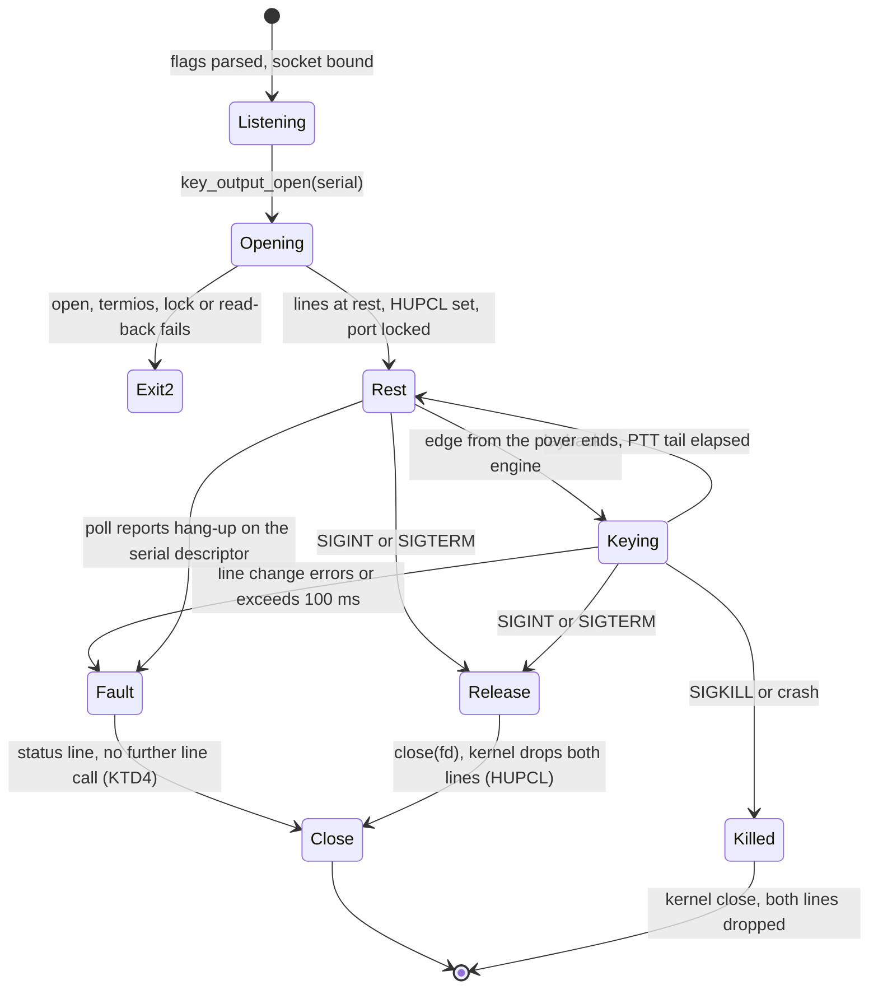

# cwnetd serial key and PTT output - Plan

## Goal Capsule

- **Objective:** an over that a remote operator sends to the station keys the station transmitter, and with the default wiring the transmitter is at key up and PTT off whenever `cwnetd` is not running.
- **Means:** a `serial` backend of `host/cwnetd/key_output.h` that drives the control lines of a USB serial port (KTD1, KTD2).
- **Authority:** issue [#99](https://github.com/iu3qez/RemoteCWKeyer-esp32/issues/99), decision [#98](https://github.com/iu3qez/RemoteCWKeyer-esp32/issues/98), this plan, then `docs/plans/2026-09-08-2158-feat-station-daemon-plan.md` for everything this plan does not change. `CLAUDE.md` (FAULT philosophy, Definition of done) binds all of them.
- **Stop conditions:** stop and ask if the work needs a change under `components/keyer_cwnet/`, if any open issue is labelled `blocking`, or if the bench shows the transmitter keyed at rest with default wiring.
- **Execution profile:** C on Linux and macOS, host only. U1-U5 run on any machine. U6 needs the maintainer, the station PC, a USB serial interface and a logic analyser.
- **Who finishes:** `ce-work` or a human implements U1-U5 and opens the PR. The maintainer runs U6 and closes #99 on its evidence.

---

## Product Contract

### Summary

`cwnetd --output serial` keys the rig on a serial port's DTR and RTS lines. The default follows the convention of N1MM Logger+ and the DL4YHF program: DTR is the CW key, RTS is PTT, asserted is active. Either function can move to the other line or be inverted. The port rests at key up and PTT off from open, and every stop or fault returns it there.

### Problem Frame

`cwnetd` plays an over into `key_output_t`, but the only backend is `virtual`, which writes each edge as a text line (`host/cwnetd/README.md`, "Flags"). The station therefore keys no transmitter. Decision #98 chose the serial port's control lines, the transport the reference server and most stations already use.

A serial output adds failure modes the virtual one never had. Opening a USB serial port raises DTR and RTS. A crash leaves the lines to the kernel. A line change is a blocking USB control transfer. A transmitter keyed by any of these is the worst outcome the project names: "a key stuck down is worse than corrupted timing" (`host/cwnetd/main.c`, header comment).

### Requirements

**Lines and convention**

- R1. `--output serial` drives the CW key and PTT on the control lines of the serial device the operator names.
- R2. The default mapping is DTR = CW key, RTS = PTT, asserted = active.
- R3. Each function's line is configurable: the key on DTR or RTS, PTT on DTR, RTS or none, and each can be inverted. Key and PTT on the same line is refused at start-up.

**Rest and release**

- R4. With non-inverted lines, the transmitter is at key up and PTT off whenever the daemon is not running: after a normal stop, SIGINT, SIGTERM, SIGKILL, a crash or an unplug of the adapter.
- R5. Right after the port opens, both functions go to rest before the daemon does anything else, and a line assigned to no function is cleared and never touched again.
- R6. A start that fails before the daemon is serving (address in use, a bad flag, a missing device) never changes a line after the device is opened, and exits non-zero.
- R7. An output failure is a FAULT: a line change that returns an error or takes longer than 100 ms, or a device that disappears. The daemon releases what it can, writes a status line that names the failure, and exits non-zero. It does not re-open the port.

**Observability**

- R8. The `--edges` descriptor receives every edge in the unchanged `key|ptt 0|1 MS` shape, with every backend, including the edge whose line change failed.
- R9. A status line names the backend, the device and the line mapping, and the station panel shows an output fault.

**Operator documentation**

- R10. `host/cwnetd/README.md` tells the station operator:
  - how to wire and name the port;
  - that on Linux the first open after plug-in raises both lines (every open, when a line is inverted), and on macOS every open raises them;
  - what inversion does on stop and crash;
  - which other programs must not hold the port.

### Key Decisions

- **Serial control lines are the physical output.** (session-settled: user-directed, chosen over CAT commands and an ESP32 output board, #98: the reference and most stations already have the cable.) Governs R1.
- **The common convention is the default.** (session-settled: user-directed, chosen over defining a mapping of our own: the operator asked to follow the standard, not reinvent it.) Governs R2.
- **Lines are fully configurable, inversion included.** (session-settled: user-directed, chosen over dropping inversion: interfaces wired either way must work.) Governs R3. With inversion, R4 does not hold: a dropped line is active, so every stop keys the inverted function. This narrows the parent plan's rest-on-death criterion (`docs/plans/2026-09-08-2158-feat-station-daemon-plan.md`, "Deferred to Follow-Up Work") to non-inverted lines, and R10 states the consequence to the operator.
- **No key-down timeout inside the daemon.** (session-settled: user-directed, chosen over a watchdog like the reference's 10 s one: tuning holds the key down on purpose.) The ceiling on continuous key-down lives outside the process, in the rig's own transmit timer, as the parent plan already requires. `--over-max` (120 s) is unchanged.
- **Running as root warns, it does not refuse.** (session-settled: user-directed 2026-09-24, chosen over refusing to start and over no check.) Neither `TIOCEXCL` nor `flock` stops a root opener (Linux `tty_io.c:1339` exempts `CAP_SYS_ADMIN`; XNU exempts the superuser; `flock` is advisory), so a second `cwnetd` started as root raises the lines under a running one. With `--output serial` and `geteuid() == 0`, the daemon writes one warning line at start-up that names this, and runs. Governs R9.

### Success Criteria

- A logic analyser on DTR and RTS at the station PC, during an over from the DL4YHF client, shows every edge of the `--edges` file, in order. The delay per edge is measured and written in `host/cwnetd/README.md`, "Measured numbers".
- `kill -9` during a key-down leaves both lines low on the analyser within one control transfer.
- The width of the rise at open is measured on Linux and macOS, after plug-in and on a restart, and written next to those numbers.

### Scope Boundaries

- Linux and macOS only. Windows is #94.
- No CAT keying and no microcontroller output (#98).
- A port shared with a CAT program is out of scope: the port is the daemon's alone.
- No automatic re-open after an unplug: a re-open raises the lines again, so the operator restarts the daemon.
- The rise at the first open after plug-in cannot be removed in software on either OS, nor the rise at every open on macOS or with an inverted line on Linux (Sources: Linux `tty_port.c`, IOSerialFamily). The plan documents it and measures it. It does not claim to prevent it.

#### Deferred to Follow-Up Work

- Service units that start `cwnetd` at boot and would restart it after a FAULT: #93.
- A serial layer in `host/platform/` shared with the Windows build (#94) and the host client (#68), once a second consumer exists.

---

## Planning Contract

### Key Technical Decisions

- KTD1. **The backend lives in `host/cwnetd/`, not `host/platform/`.** `cwnetd` is its only consumer, and `platform/` today holds the socket and clock seam for Windows. Promoting it waits for #94.
- KTD2. **The port goes to rest at once, and stays at B0 when no used line is inverted.** The sequence:
  1. Open non-blocking and close-on-exec.
  2. Set the two lines to their rest levels in one call.
  3. In termios, set `HUPCL` and `CLOCAL`. When no used line is inverted, also set the speed to B0. With an inverted line, leave the speed unchanged.
  4. Take `TIOCEXCL` and an exclusive `flock`.
  5. Read the lines back with `TIOCMGET`. A mismatch is a start-up failure.

  Why B0: Linux raises DTR and RTS on every open while the saved speed is not B0 (`tty_port.c:504-507`). usb-serial keeps the saved termios across closes until the adapter is re-plugged (`tty_io.c:1462-1481`, `tty_io.c:3265-3274`). Leaving B0 set therefore limits the Linux rise to the first open after plug-in. Setting B0 drops both lines on FTDI and CH341 (`ftdi_sio.c:2744-2754`, `ch341.c:567-574`), which is rest for plain lines but active for inverted ones, hence the exception. The daemon never sets a real speed afterwards: a change from B0 to a real rate raises both lines (`ftdi_sio.c:2761-2763`).

  `HUPCL` is what makes the kernel drop both lines on the last close, SIGKILL included (`tty_port.c:355-356`). fldigi clears the lines right after open for the same reason (`serial.cxx:85-119`). Governs R4, R5, R10.
- KTD3. **Line changes run on the loop thread and are timed.** Each change is a synchronous USB control transfer with a 5000 ms driver timeout (`ftdi_sio.c:1136`, `usb.h:1894`). One call over 100 ms, the PTT tail, is a FAULT (R7). This keeps the parent plan's one-thread rule (its KTD7). A writer thread would keep PINGs flowing through a stall, but the line state would still be unknown, and the FAULT philosophy stops the daemon in that case anyway.
- KTD4. **The output reports failure through `key_output_t`, and a failed output drives no line again.** The hooks return nothing today (`key_output.h`), so the interface gains a failure record: which call failed, its errno and its duration.
  - Once the record is set, the serial backend makes no further line call: not for later edges in the same batch, not from `reconcile_output()`, not from `key_output_release()`.
  - The reason: `key_output_set_key()` updates `key_down` before the hook runs. After a failed key-up, a release would skip the key-up and drop PTT under a key that may still be down.
  - It also stops edges held back behind a stalled call from going out back to back.
  - On the fault path the lines are released only by closing the descriptor, where `HUPCL` drops both together.
  - The loop reads the record after each batch of edges. When it is set, the loop runs the existing shutdown tail with a fault status line and a non-zero exit code.
  - The virtual backend never sets the record.
- KTD5. **The edge line is written for every edge, after the line change.** The serial backend drives the line first, because that is the timing that matters. It then hands the unchanged edge line to `out->line`. The line is written even when the change failed, so the trace shows where it stopped (R8).
  - The measured durations go on a snapshot line of their own, never onto the edge line: `tools/cwnet/cwnet_jitter.py` anchors its pattern at the end of the line.
  - Every backend emits that snapshot line, with zeros for virtual, so the panel tests exercise it.
  - The snapshot and the `stato uscita` line change shape, so the status vocabulary goes from `v1` to `v2`: `CWNETD_VOCABULARY` in `host/cwnetd/main.c`, `VOCABULARY` in `host/panel/state.py`, and README "Reading a status line", in the same PR.
- KTD6. **The output opens after the listening socket.** `key_output_open()` moves after `sock_listen()` in `main()`, for every backend. The four early exits that today return with an open output (`sigaction`, `sock_init`, `cwnet_server_init`, `sock_listen`) then have nothing to release (R6). The `stato uscita` status line keeps its content. Whether its position among the start-up lines matters to the panel is checked in U4.
- KTD7. **Flags name a function and a line.** `--serial DEVICE`, `--key-line LINE`, `--ptt-line LINE`, where LINE is `dtr`, `rts`, `dtr-inv`, `rts-inv`, or `none` for PTT only. The defaults are `dtr` and `rts`. The values are checked in `key_output_open()`, as `--output` is today, and `--help` prints the defaults from the same struct.
- KTD8. **The backend's OS calls go through a table the host test replaces.** `open`, `ioctl`, `tcgetattr`, `tcsetattr`, `flock` and the clock sit behind one table of function pointers, set to the real calls in the daemon. A pty cannot stand in: Linux ptys refuse the modem-line ioctls. The host test proves the order of calls, the rest state, the mapping, inversion and the fault paths. Only the bench (U6) proves what a real adapter does. The project's no-mock rule is about the keying stream. This table is the daemon's boundary with the OS.

### High-Level Technical Design

The serial output's life, from start-up to exit:

What a line carries, per function state and wiring:

| Function state | Plain line (`dtr`, `rts`) | Inverted line (`dtr-inv`, `rts-inv`) |
|---|---|---|
| Rest (key up, PTT off) | low | high |
| Active (key down, PTT on) | high | low |
| After any close, including SIGKILL | low = rest | low = **active** |

The last row is why R4 holds only for plain lines.

---

## Implementation Units

### U1. Line mapping and flags

- **Goal:** the daemon accepts and validates the serial configuration, and a pure function turns a function state into the line levels to set and clear.
- **Requirements:** R1, R2, R3.
- **Dependencies:** none.
- **Files:**
  - `host/cwnetd/key_output.h`
  - `host/cwnetd/key_output_serial.c` (new, mapping part)
  - `host/cwnetd/main.c` (flags, `--help`)
  - `host/tests/key_output_serial_test.c` (new)
  - `host/CMakeLists.txt`
- **Approach:**
  1. Add the configuration (device, key line, PTT line) to the struct that `key_output_open()` receives, following KTD7.
  2. Parse `--serial`, `--key-line` and `--ptt-line` in `parse_args()` like `--output` and `--edges`, as unchecked strings with defaults in the `args` struct.
  3. Write the mapping as a pure function from (key state, PTT state, configuration) to the two line levels. Use it for rest, for every edge and for release.
  4. With `--output serial` and an effective uid of 0, write the root warning of Key Decisions to stderr at start-up, and continue.
- **Patterns to follow:**
  - `args_t`, `opts[]` and `usage()` in `host/cwnetd/main.c`, where defaults come from one struct.
  - The `loopback_test` target in `host/CMakeLists.txt`.
- **Test scenarios:**
  - Default configuration: rest gives DTR low and RTS low; key down gives DTR high; PTT on gives RTS high.
  - `--key-line rts --ptt-line dtr`: key down raises RTS only.
  - `--key-line dtr-inv`: rest gives DTR high, key down gives DTR low.
  - `--ptt-line none`: PTT on changes no line, and the unused RTS stays low at rest.
  - Key and PTT on the same line: refused, with an error naming both flags.
  - `--key-line none`: refused.
  - An unknown LINE value: refused, and the message lists the accepted values.
  - `--output serial` without `--serial`: refused before anything is opened.
  - The root warning: a pure check from (backend, effective uid) returns the warning for serial and uid 0, and nothing for virtual or a non-zero uid.
- **Verification:** the new ctest target passes; `--help` prints the three flags with their defaults.

### U2. Serial backend: open, rest, edges, close, failure

- **Goal:** `key_output_open("serial")` opens and locks the port at rest, drives the lines on each edge, records failures, and releases on close.
- **Requirements:** R4, R5, R7, R8.
- **Dependencies:** U1.
- **Files:**
  - `host/cwnetd/key_output_serial.c`
  - `host/cwnetd/key_output.c` (backend dispatch, `key_output_backends()`)
  - `host/cwnetd/key_output.h` (failure record, KTD4)
  - `host/tests/key_output_serial_test.c`
- **Approach:**
  1. Put the OS calls behind the table of KTD8, with the real calls as default.
  2. Implement the open sequence of KTD2. On any failure, close the descriptor and return false with a message that tells ENOENT, EACCES, EBUSY/EWOULDBLOCK and ENOTTY apart.
  3. In `apply_key` and `apply_ptt`: compute the levels with U1's function, set and clear in one call, time it with the injected clock, record a failure (KTD3, KTD4), then write the edge line (KTD5).
  4. In close: release through `key_output_release()`, then close the descriptor.
- **Execution note:** write the call-order tests first. The order of the first three calls after open is the safety property.
- **Patterns to follow:** the virtual backend in `host/cwnetd/key_output.c`, and the rule in `key_output.h` that a backend sees only real transitions.
- **Test scenarios:**
  - Open succeeds with plain lines: the recorded calls are open, then one line call to rest, then termios with HUPCL, CLOCAL and B0, then the exclusive lock, then the read-back. Nothing sets a line to active before the rest call.
  - Open succeeds with an inverted line: the same order, and termios keeps the speed it found.
  - Open with an inverted key line: the rest call sets that line high.
  - The read-back disagrees with the rest levels: open fails and closes the descriptor.
  - The lock fails because another process holds the port: open fails with a message naming the device.
  - termios fails: open fails, and no line call follows the rest call.
  - A key edge: exactly one line call, then exactly one edge line in the virtual backend's format.
  - The same edge sequence through the virtual and serial backends: identical edge lines.
  - A line call returns EIO: the failure record holds the call, EIO and the duration, and the edge line is still written.
  - A line call that the injected clock times at 101 ms: a failure is recorded. At 100 ms: none.
  - Close after key down and PTT on: key up, then PTT off, then close, in that order.
  - A key-up line call returns EIO, a PTT-off edge follows in the same batch, then release and close: no line call after the failed one, the PTT-off edge line is still written, and the descriptor is closed.
  - A line call timed at 5000 ms that then succeeds, followed by three queued edges: no line call after the slow one.
  - Close twice: the second close changes no line.
- **Verification:** the ctest target passes, plain and with ASan/UBSan, on Linux and macOS in `host-build`.

### U3. Daemon integration: open order and the output FAULT

- **Goal:** the daemon opens the output only once it is serving, and stops on an output failure with a status line and a non-zero exit.
- **Requirements:** R6, R7, R9.
- **Dependencies:** U2.
- **Files:**
  - `host/cwnetd/main.c`
- **Approach:**
  1. Move `key_output_open()` after `sock_listen()` (KTD6), and extend the `stato uscita` line with the device and the mapping when the backend is serial.
  2. After `handle_events()` and `reconcile_output()` in each loop pass, check the failure record (KTD4). When it is set, write a `stato fault` line with the output reason and leave through the existing shutdown tail. Exit with a code distinct from a clean stop.
  3. Add the serial descriptor to the loop's poll set with no requested events. POLLHUP, POLLERR or POLLNVAL on it sets the failure record as "device gone" (R7). The poll wrapper in `host/platform/sock.h` takes socket handles today, so it needs a way to carry this descriptor on POSIX.
  4. Add the per-change duration counter (count, maximum, number over 100 ms) as its own snapshot line for every backend, and bump the vocabulary to `v2` (KTD5).
- **Patterns to follow:**
  - `edge_write()` and its loss accounting in `host/cwnetd/main.c`.
  - The existing `stato fault` line format in `host/cwnetd/README.md`, "Reading a status line".
- **Test scenarios:**
  - `cwnetd --output serial --serial /nonexistent` exits non-zero and prints the ENOENT message. It prints no `stato uscita` line.
  - `cwnetd --port <a port in use> --output serial --serial <device>` exits non-zero without opening the device. Covered by the order in `main()`; checked on the bench in U6.
  - The virtual backend: the start-up status lines the panel tests read are unchanged in content.
- **Verification:**
  - `host-build` green.
  - `panel-tests` green: they run the real `cwnetd` with the virtual backend.

### U4. Panel: the output fault and the serial mapping

- **Goal:** the station panel shows an output fault and the serial mapping.
- **Requirements:** R9.
- **Dependencies:** U3.
- **Files:**
  - `host/panel/state.py`
  - `host/panel/tests/test_state.py`, `host/panel/tests/test_web.py`
  - `host/panel/static/panel.js` (only if a new text id is needed)
- **Approach:**
  1. Parse the extended `stato uscita` line. The backend field stays one token.
  2. Add the duration snapshot line to the snapshot grammar and accept it in the snapshot accumulator. Set `VOCABULARY` to `v2` (KTD5).
  3. Map the output-fault reason to a banner id, following #90's rule that `state.py` decides and `panel.js` only looks the id up.
- **Patterns to follow:**
  - `_banners()` and the status-line parsing in `host/panel/state.py`.
  - `test_every_id_the_model_can_send_has_an_entry_in_its_page_table` in `host/panel/tests/test_web.py`.
- **Test scenarios:**
  - A `stato uscita serial ...` line with a device and a mapping: the model exposes backend, device and mapping.
  - A `stato fault` line with an output reason: the model sends the output-fault banner id.
  - The page table has an entry for the new id.
- **Verification:** the panel suite passes on Python 3.9 and the current 3.x.

### U5. Operator documentation

- **Goal:** the station operator can wire, start and stop the serial output without keying the rig by surprise.
- **Requirements:** R10.
- **Dependencies:** U3.
- **Files:**
  - `host/cwnetd/README.md`
  - `host/cwnetd/key_output.h` (header comment that still calls the physical transport an unopened Decision)
  - `host/CLAUDE.md`
- **Approach:** in `host/cwnetd/README.md`:
  1. Update "Flags" from `--help`. Replace the sentence "the physical transport (serial or GPIO to the rig) is behind a Decision not yet opened (KTD9)" with the serial backend and #98.
  2. Extend "Two outputs, and why" with how each rest rule holds for a serial port, and where it stops holding (SIGSTOP or a sleeping PC: the lines keep their state, and only the rig's timer ends a key-down).
  3. Add a section, "Serial output at the station", covering:
     - the convention and the pinout (DB9 pin 4 DTR, pin 7 RTS);
     - start the daemon with the rig off or its keying input disabled: on Linux at the first start after plug-in, and at every start when a line is inverted; on macOS at every start;
     - `/dev/cu.*` on macOS and `/dev/serial/by-id/` on Linux;
     - ModemManager (`ID_MM_DEVICE_IGNORE`) and brltty must not hold the port;
     - with an inverted line, every stop and every crash leaves that function active.
- **Test expectation:** none, documentation only. U6 follows the new section as written and reports where it is wrong.
- **Verification:** `--help` and the "Flags" table agree, and the section names every item in R10.

### U6. Bench on the station PC

- **Goal:** evidence that a real adapter follows the edges, rests on every exit, and how wide the open rise is.
- **Requirements:** Success Criteria, R4, R6.
- **Dependencies:** U1-U5 merged or on the branch under test.
- **Files:** `host/cwnetd/README.md` ("Measured numbers").
- **Approach:** the maintainer, on the station PC (Linux) and the MacBook (macOS), with an FTDI adapter and, if available, a rig's own USB port:
  1. Put the logic analyser on DTR and RTS.
  2. Plug the adapter in, start `cwnetd`, and record the open rise.
  3. Stop and restart `cwnetd` without re-plugging, and record the rise, or its absence, at that open. On Linux with plain lines, also confirm that line changes still work at B0.
  4. Key an over from the DL4YHF client and record the trace against `--edges`.
  5. Send `kill -9` during a key-down and record the lines falling.
  6. Start with the listen port already in use and record that the lines do not move.
  7. Unplug the adapter during an over and record the `stato fault` line.
  8. Unplug the adapter at rest and record when the `stato fault` line appears.
- **Execution note:** follow the U5 section as written. Any step the section gets wrong goes back into U5 before the numbers are recorded.
- **Test expectation:** none, the unit is the measurement.
- **Verification:** "Measured numbers" has a serial entry per OS:
  - the delay per edge;
  - the open-rise width, after plug-in and on a restart;
  - the kill -9 result.

  The #99 closing comment names the commit.

---

## Verification Contract

| Gate | Command | Proves |
|---|---|---|
| Host build and tests | `cmake -S host -B host/build && cmake --build host/build && ctest --test-dir host/build --output-on-failure` | U1, U2 |
| Same, with sanitizers | the above with `-DCMAKE_C_FLAGS="-fsanitize=address,undefined"` in a separate build directory | U1, U2 |
| Panel suite | `python -W error -m unittest discover -s host/panel/tests -t host/panel -v` | U3, U4 |
| Core host suite | `cd test_host && cmake -B build && cmake --build build && ./build/test_runner`, plain and with ASan/UBSan | nothing under `components/` changed |
| CI | `host-build` on ubuntu-latest and macos-latest, `panel-tests`, `host-tests` | the same, on both OSes |
| Bench | U6 | Success Criteria |

---

## Definition of Done

- The Definition of done in `CLAUDE.md` holds: host tests green in both CI variants, no open `blocking` issue, nothing on the firmware RT path touched.
- U1-U5 are in one PR, with this plan committed as its first commit.
- The PR fixes #99's "What would make it right". Today it asks for "no transition on either line" at open, which neither OS allows (Scope Boundaries). The corrected text asks for a measured and documented rise instead.
- U6's numbers are in "Measured numbers", and #99 is closed with a comment naming the commit.
- No code from abandoned attempts is left in the diff.

---

## Risks

| Risk | Where | Handling |
|---|---|---|
| An open raises DTR and RTS for about one control transfer: on Linux the first after plug-in, or every one with an inverted line; on macOS every one | Linux `tty_port.c:504-507`; macOS `IOSerialBSDClient.cpp:2408-2417`, closed drivers in current macOS | Operator procedure in U5, width measured in U6 |
| Another process holds the port, so the kernel never drops the lines on a crash | ModemManager, brltty, a CAT program | The exclusive lock catches a second `cwnetd`; U5 documents the rest |
| A stalled line change freezes the loop for up to 5000 ms before the fault | KTD3 | Documented; the 100 ms fault bounds everything but the stall itself |
| SIGSTOP or a sleeping PC keeps the lines where they are | kernel: no close happens | Only the rig's own timer ends a key-down; U5 says so |
| A cp210x adapter's line state after `IFC_ENABLE` is chip firmware, not visible in host code | `cp210x.c:781` | U6 records it if a cp210x is on the bench |

---

## Sources

- Linux v6.16: `drivers/tty/tty_port.c`, `drivers/tty/tty_io.c`, `drivers/usb/serial/{usb-serial,ftdi_sio,cp210x,ch341}.c`, `drivers/usb/class/cdc-acm.c`.
- XNU `xnu-12377.121.6` `bsd/kern/tty.c`; `IOSerialFamily-93.200.2` `IOSerialBSDClient.cpp`.
- Hamlib 4.7.2 `src/serial.c`, `src/rig.c`; fldigi 4.2.13 `src/rigcontrol/serial.cxx`, `src/cw/cw.cxx`.
- N1MM Logger+ interfacing: https://n1mmwp.hamdocs.com/setup/interfacing/ (DB9 pin 4 DTR = CW, pin 7 RTS = PTT).
- DL4YHF Remote CW Keyer manual: https://www.qsl.net/dl4yhf/Remote_CW_Keyer/Remote_CW_Keyer.htm (server keys on DTR or RTS, each invertible).
- Parent plan: `docs/plans/2026-09-08-2158-feat-station-daemon-plan.md` (KTD3, KTD7, KTD9, "Deferred to Follow-Up Work").
- Plan provenance: `thoughts/shared/handoffs/general/2026-09-10_2314_station-daemon-and-the-plan-that-was-not-committed.md`.
